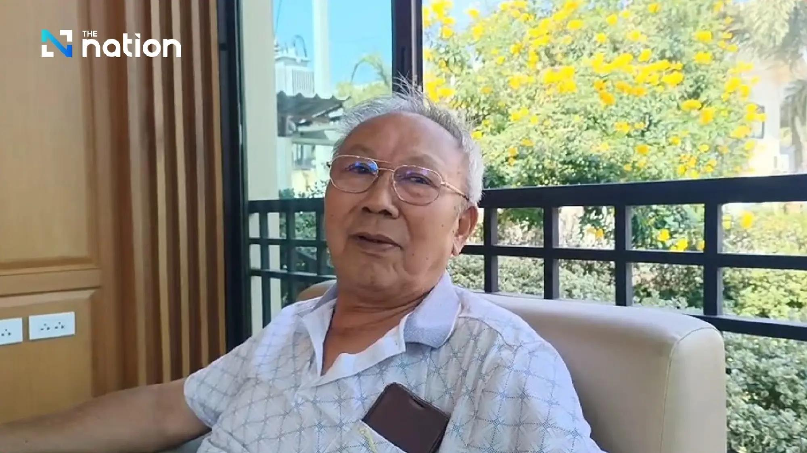

## Claim
Claim: " This image shows Israelis who have stopped fighting the wars in Gaza and Lebanon and moved to become 'settlers' in Pai District, Mae Hong Son Province, Thailand, in February 2025."

## Actions
```
web_search("Israelis settlers Pai District Mae Hong Son Thailand")
image_search("Israelis settlers Pai District Mae Hong Son Thailand")
```

## Evidence
### Evidence from `web_search`
The Bangkok Post ([https://www.bangkokpost.com/thailand/general/2966381/no-israeli-settlement-or-business-dominance-found-in-northern-thailands-pai](https://www.bangkokpost.com/thailand/general/2966381/no-israeli-settlement-or-business-dominance-found-in-northern-thailands-pai)) reported on February 23, 2025, that police found no evidence of Israeli settlements or business dominance in Pai District, Mae Hong Son, Thailand, and that 4,573 Israelis visited Pai. The Nation ([https://www.nationthailand.com/news/tourism/40046434](https://www.nationthailand.com/news/tourism/40046434)) published an article on February 18, 2025, refuting claims of an Israeli "promised land" in Pai district, stating that Israeli tourists visit legally and mentioning a Chabad House. Khaosod English ([https://www.khaosodenglish.com/featured/2025/02/23/why-some-thais-fear-israelis-turning-pai-into-an-occupied-land/](https://www.khaosodenglish.com/featured/2025/02/23/why-some-thais-fear-israelis-turning-pai-into-an-occupied-land/)) discussed fears among some Thais that Israelis are turning Pai into an occupied land, with the Prime Minister assuring the public that the fears are unsubstantiated, and that there are only about 40 to 50 Jewish families residing in Pai.

The articles include images of Pai District, Israeli tourists, and police presence. , , , , , , , , 


## Elaboration
The evidence indicates that there were concerns and discussions about Israelis in Pai District, Mae Hong Son, Thailand, in February 2025. The Bangkok Post ([https://www.bangkokpost.com/thailand/general/2966381/no-israeli-settlement-or-business-dominance-found-in-northern-thailands-pai](https://www.bangkokpost.com/thailand/general/2966381/no-israeli-settlement-or-business-dominance-found-in-northern-thailands-pai)) reported that police found no evidence of Israeli settlements. The Nation ([https://www.nationthailand.com/news/tourism/40046434](https://www.nationthailand.com/news/tourism/40046434)) refuted claims of an Israeli "promised land" in Pai. Khaosod English ([https://www.khaosodenglish.com/featured/2025/02/23/why-some-thais-fear-israelis-turning-pai-into-an-occupied-land/](https://www.khaosodenglish.com/featured/2025/02/23/why-some-thais-fear-israelis-turning-pai-into-an-occupied-land/)) discussed fears among some Thais that Israelis are turning Pai into an occupied land.

The evidence does not explicitly confirm or deny the claim that the image shows Israelis who have stopped fighting wars and moved to become settlers. However, the evidence does show that there were concerns about Israelis in Pai District, and the image could be related to those concerns.

The claim's veracity cannot be fully determined without additional information. Specifically, it is unclear whether the people in the image are Israelis, and if so, whether they are settlers.


## Actions
```
reverse_search()
```

## Evidence
### Evidence from `reverse_search`
The Bangkok Post ([https://www.bangkokpost.com/thailand/general/2964833/israelis-under-immigration-microscope-in-pai](https://www.bangkokpost.com/thailand/general/2964833/israelis-under-immigration-microscope-in-pai)) reported on an investigation into Israelis in Pai, Mae Hong Son, Thailand, and mentions the image  was taken at a gathering at the Chabad of Pai, and shows Israeli residents and tourists. The Pattaya Mail ([https://www.pattayamail.com/thailandnews/jewish-community-in-thailand-israeli-tourists-speak-out-amid-pai-controversy-clarify-their-visit-and-dispel-misconceptions-491671](https://www.pattayamail.com/thailandnews/jewish-community-in-thailand-israeli-tourists-speak-out-amid-pai-controversy-clarify-their-visit-and-dispel-misconceptions-491671)) discusses Israeli tourists in Pai, including the image , who clarified their visit and denied any political agenda or plans to settle in the area. The article also mentions Chabad centers.


## Elaboration
The image in the claim is confirmed to be related to Israelis in Pai District, Mae Hong Son, Thailand. The Bangkok Post ([https://www.bangkokpost.com/thailand/general/2964833/israelis-under-immigration-microscope-in-pai](https://www.bangkokpost.com/thailand/general/2964833/israelis-under-immigration-microscope-in-pai)) states that the image was taken at a gathering at the Chabad of Pai, and shows Israeli residents and tourists. The Pattaya Mail ([https://www.pattayamail.com/thailandnews/jewish-community-in-thailand-israeli-tourists-speak-out-amid-pai-controversy-clarify-their-visit-and-dispel-misconceptions-491671](https://www.pattayamail.com/thailandnews/jewish-community-in-thailand-israeli-tourists-speak-out-amid-pai-controversy-clarify-their-visit-and-dispel-misconceptions-491671)) reports that Israeli tourists clarified their visit and denied any political agenda or plans to settle in the area.

Based on the evidence, the claim is not supported. The evidence suggests that the people in the image are tourists and residents, not settlers.


## Final Judgement
The image depicts a gathering at the Chabad of Pai, with Israeli residents and tourists. While the claim suggests the image shows Israelis who have become settlers, the evidence indicates that the individuals are tourists and residents who have denied any plans to settle. Therefore, the claim is not factually accurate. `false`

### Verdict: FALSE

### Justification
The image in the claim shows a gathering at the Chabad of Pai, with Israeli residents and tourists, as reported by the [Bangkok Post](https://www.bangkokpost.com/thailand/general/2964833/israelis-under-immigration-microscope-in-pai). The [Pattaya Mail](https://www.pattayamail.com/thailandnews/jewish-community-in-thailand-israeli-tourists-speak-out-amid-pai-controversy-clarify-their-visit-and-dispel-misconceptions-491671) further clarifies that these individuals are tourists who have denied any plans to settle. Therefore, the claim that the image depicts Israelis who have become settlers is false.
