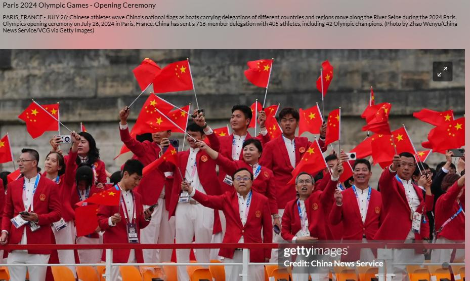
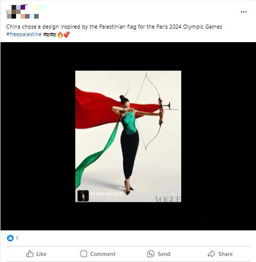

## Claim
Claim: " This image shows an athlete of China which has chosen a design of the Palestinian flag for the Paris 2024 Olympics."

## Actions
```
web_search("China Paris 2024 Olympics Palestinian flag design")
```

## Evidence
### Evidence from `web_search`
The image in the claim is from the September 2023 issue of Vogue China Magazine and was taken for the promotion of the Hangzhou Asian Games, not the Paris 2024 Olympics. The image is miscaptioned and the colors are similar to the Palestinian flag. China's uniform for the Paris Olympics features red and white colors.

The sources are: [Source](https://srilanka.factcrescendo.com/english/china-has-not-chosen-a-design-inspired-by-the-palestinian-flag-for-the-paris-olympics-2024/) and [Source](https://factly.in/an-old-photo-from-vogue-china-magazine-is-being-falsely-shared-as-showing-chinese-athletes-wearing-the-colours-of-the-palestinian-flag/).      


## Elaboration
The claim is false. The image is from Vogue China Magazine and was taken for the promotion of the Hangzhou Asian Games, not the Paris 2024 Olympics. The colors in the image are similar to the Palestinian flag, but the uniform for the Paris Olympics features red and white colors.


## Final Judgement
The claim is demonstrably false. The image is from Vogue China Magazine and was taken for the promotion of the Hangzhou Asian Games, not the Paris 2024 Olympics. The colors in the image are similar to the Palestinian flag, but the uniform for the Paris Olympics features red and white colors. `false`

### Verdict: FALSE

### Justification
The image in the claim is from the September 2023 issue of Vogue China Magazine and was taken for the promotion of the Hangzhou Asian Games, not the Paris 2024 Olympics, as stated by [Fact Crescendo](https://srilanka.factcrescendo.com/english/china-has-not-chosen-a-design-inspired-by-the-palestinian-flag-for-the-paris-olympics-2024/) and [Factly](https://factly.in/an-old-photo-from-vogue-china-magazine-is-being-falsely-shared-as-showing-chinese-athletes-wearing-the-colours-of-the-palestinian-flag/). The colors in the image are similar to the Palestinian flag, but the uniform for the Paris Olympics features red and white colors.
