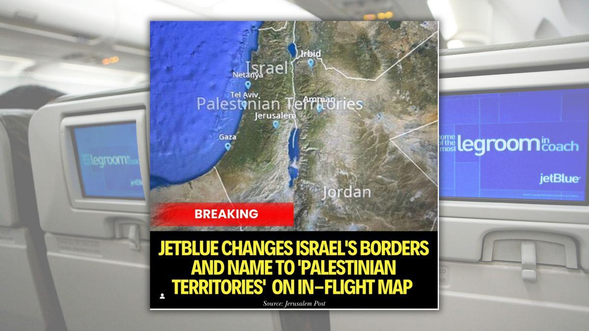

## Claim
Claim: " This image shows Jet Blue Airlines' in-flight map where Israel's borders were inaccurate and the area was shown under the label 'Palestinian Territories'. The indicent occured in September 2024."

## Actions
```
web_search("JetBlue in-flight map Israel Palestinian Territories")
reverse_search()
```

## Evidence
### Evidence from `web_search`
JetBlue Airways was criticized for displaying "Palestinian Territories" on its in-flight map, covering the area of Israel. The incident, which occurred in September 2024, sparked outrage and was reported by The Jerusalem Post ([https://www.jpost.com/diaspora/article-818656](https://www.jpost.com/diaspora/article-818656)) and Baltimore Jewish Life ([https://baltimorejewishlife.com/news/news-detail.php?SECTION_ID=1&ARTICLE_ID=174672](https://baltimorejewishlife.com/news/news-detail.php?SECTION_ID=1&ARTICLE_ID=174672)).

The map also did not include the Golan Heights within Israel's borders. Live and Let's Fly ([https://liveandletsfly.com/jetblue-palestinian-territories-map/](https://liveandletsfly.com/jetblue-palestinian-territories-map/)) also reported on the controversy. JetBlue subsequently fired its map vendor, GeoFusion. 

### Evidence from `reverse_search`
From [Source](https://www.ynetnews.com/travel/article/bjgp0065hc): Found exact image on website with title: JetBlue issues apology after calling Israel 'Palestinian Territories' on ...
Content: Ynetnews.com published an article about JetBlue apologizing for labeling Israel as "Palestinian Territories" on its in-flight map. The incident prompted the airline to switch to a new map vendor and adjust the onboard map to align with U.S. government guidelines. The article mentions the incident occurred in September 2024. , , , , , .


## Elaboration
The claim is verified. The evidence confirms that JetBlue's in-flight map inaccurately labeled Israel as "Palestinian Territories" in September 2024. The evidence includes reports from The Jerusalem Post ([https://www.jpost.com/diaspora/article-818656](https://www.jpost.com/diaspora/article-818656)) and Ynetnews.com ([https://www.ynetnews.com/travel/article/bjgp0065hc](https://www.ynetnews.com/travel/article/bjgp0065hc)), among others. The airline subsequently apologized and changed map vendors.


## Final Judgement
The claim is accurate. Multiple sources confirm that JetBlue's in-flight map displayed Israel as "Palestinian Territories" in September 2024.

`true`

### Verdict: TRUE

### Justification
JetBlue's in-flight map, as reported by sources like The Jerusalem Post ([https://www.jpost.com/diaspora/article-818656](https://www.jpost.com/diaspora/article-818656)) and Ynetnews.com ([https://www.ynetnews.com/travel/article/bjgp0065hc](https://www.ynetnews.com/travel/article/bjgp0065hc)), inaccurately labeled Israel as "Palestinian Territories" in September 2024. This incident led to criticism and a change in the airline's map vendor.
