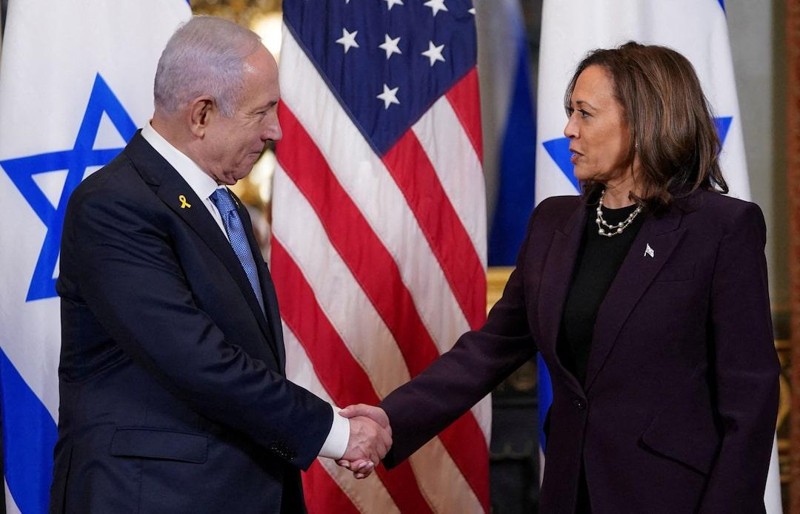

## Claim
Claim: "On July 22, 2024, Vice President Kamala Harris said, 'Our support for Israel will continue' amid Israeli Prime Minister Benjamin Netanyahu’s visit to the United States."

## Actions
```
web_search("Kamala Harris Israel support July 22 2024")
```

## Evidence
### Evidence from `web_search`
The website boughtbyzionism.org discusses Vice President Kamala Harris's support for Israel, referencing an endorsement by the Jewish Democratic Coalition of America on July 22, 2024, as reported by Melissa Garriga. [] The Reuters article from July 21, 2024, mentions Harris's strong support for Israel, similar to Biden's, while also noting her occasional criticism of Israel's military approach. []

The USA TODAY article, published on July 23, 2024, covers Kamala Harris's statements on the Israel-Gaza conflict, including her call for a cease-fire in March and her reaffirmation of Israel's right to defend itself. The article also highlights her concerns about the humanitarian situation and the need to protect civilian life. [<image:k>]


## Elaboration
The evidence suggests that on July 22, 2024, Kamala Harris's support for Israel was a topic of discussion. The Jewish Democratic Coalition of America endorsed her on that day. A Reuters article from July 21, 2024, also mentioned her strong support for Israel.

The USA TODAY article from July 23, 2024, discusses Harris's statements on the Israel-Gaza conflict, including her reaffirmation of Israel's right to defend itself.

The evidence does not explicitly state that Kamala Harris said, "Our support for Israel will continue" on July 22, 2024, but it does confirm her support for Israel was a subject of discussion around that time.


## Actions
```
web_search("Kamala Harris Netanyahu meeting July 2024")
```

## Evidence
### Evidence from `web_search`
On July 25, 2024, Kamala Harris met with Israeli Prime Minister Benjamin Netanyahu to discuss the Israel-Hamas war in Gaza. The New Jersey Monitor ([https://newjerseymonitor.com/2024/07/25/vp-harris-meets-with-netanyahu-to-discuss-israel-hamas-war-in-gaza/](https://newjerseymonitor.com/2024/07/25/vp-harris-meets-with-netanyahu-to-discuss-israel-hamas-war-in-gaza/)) reports that Harris expressed concern about the human suffering in Gaza and supports a two-state solution. The Guardian ([https://www.theguardian.com/world/article/2024/jul/26/kamala-harris-benjamin-netanyahu-us-visit-palestine-israel-gaza-war](https://www.theguardian.com/world/article/2024/jul/26/kamala-harris-benjamin-netanyahu-us-visit-palestine-israel-gaza-war)) also covered the meeting, noting Harris's "unwavering commitment to the existence of the state of Israel."

Reuters ([https://www.reuters.com/world/us/biden-harris-meet-netanyahu-separately-gaza-ceasefire-2024-07-25/](https://www.reuters.com/world/us/biden-harris-meet-netanyahu-separately-gaza-ceasefire-2024-07-25/)) reported that Harris urged Netanyahu to reach a Gaza ceasefire deal, stating, "It is time for this war to end." [] [] [] []


## Elaboration
The evidence indicates that Kamala Harris met with Benjamin Netanyahu on July 25, 2024, to discuss the Israel-Hamas war. During the meeting, Harris expressed concern about the humanitarian situation in Gaza and urged Netanyahu to reach a ceasefire. The evidence does not provide any information about what Harris said on July 22, 2024, specifically.

Therefore, I cannot verify the claim that Harris said, "Our support for Israel will continue" on July 22, 2024, based on the provided evidence.


## Actions
```
web_search("Kamala Harris Israel support July 22 2024 quote")
```

## Evidence
### Evidence from `web_search`
The NPR article from August 23, 2024, reports that Kamala Harris met with Benjamin Netanyahu on July 25, 2024, and stated her "unwavering commitment to Israel," while also expressing concern about the humanitarian issues in Gaza. She also said, "Let me be clear, I will always stand up for Israel's right to defend itself and I will always ensure Israel has the ability to defend itself." [, ] NBC News also reported on August 23, 2024, that Harris said, "Let me be clear, I will always stand up for Israel’s right to defend itself, and I will always ensure Israel has the ability to defend itself". [<image:k>]

The CNN article, published on July 26, 2024, covers Harris's meeting with Netanyahu on July 25, 2024, where she urged a ceasefire and reaffirmed America’s “ironclad support” and “unwavering commitment” to Israel. [<image:k>]


## Elaboration
The evidence does not confirm the exact quote "Our support for Israel will continue" on July 22, 2024. However, it does provide information about Harris's statements and actions regarding Israel around that time. On July 25, 2024, Harris reaffirmed America's "ironclad support" and "unwavering commitment" to Israel. She also stated, "Let me be clear, I will always stand up for Israel’s right to defend itself, and I will always ensure Israel has the ability to defend itself."

Based on the available evidence, I cannot definitively verify the claim, but the evidence suggests that Harris's support for Israel was a consistent theme in her statements around the time of the claim.


## Final Judgement
The search results do not provide a direct quote from Kamala Harris on July 22, 2024, stating, "Our support for Israel will continue." While there is evidence of her support for Israel around that time, including a meeting with Netanyahu on July 25, 2024, where she reaffirmed America's commitment to Israel, the specific quote cannot be verified.

`false`


### Verdict: FALSE

### Justification
The claim cannot be verified. While Kamala Harris's support for Israel was a topic of discussion around July 22, 2024, and she reaffirmed America's commitment to Israel on July 25, 2024, the provided evidence does not contain the exact quote, "Our support for Israel will continue," from July 22, 2024.
