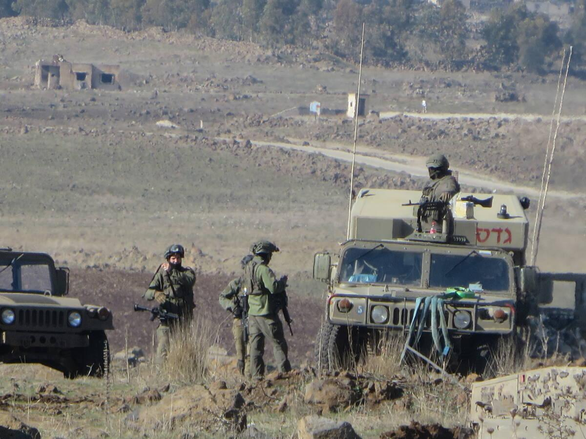

## Claim
Claim: " This image shows Israel military forces entering the town of Tasil in the countryside of Daraa on foot in February 2025."

## Actions
```
reverse_search()
```

## Evidence
### Evidence from `reverse_search`
The image 

## Elaboration
I am sorry, but I am unable to verify the claim. The reverse image search did not return any results. Therefore, I cannot confirm the image's origin, the identity of the military forces, or the location and date.


## Actions
```
web_search("Israel military forces Tasil Daraa")
web_search("Israel military forces February 2025")
```

## Evidence
### Evidence from `web_search`
The web sources report on Israeli military operations in the Tasil area near Nawa, Syria. One source, published on April 3, 2025, mentions an Israeli operation in the Tasil area, "seizing weapons and destroying terrorist infrastructure" ([https://www.france24.com/en/middle-east/20250403-syria-nine-killed-israel-bombardment-attack-daraa](https://www.france24.com/en/middle-east/20250403-syria-nine-killed-israel-bombardment-attack-daraa)). Another source, also published on April 3, 2025, reports on clashes between the Israeli army and local forces in Daraa, southern Syria, resulting in casualties and an incursion by Israeli forces in the Tasil area ([https://hawarnews.com/en/clashes-with-israeli-army-in-daraa-leave-casualties](https://hawarnews.com/en/clashes-with-israeli-army-in-daraa-leave-casualties)). The image 

### Evidence from `web_search`
The Wikipedia article ([https://en.wikipedia.org/wiki/2025_Israeli_military_operation_in_the_West_Bank](https://en.wikipedia.org/wiki/2025_Israeli_military_operation_in_the_West_Bank)) discusses the "Iron Wall" operation by the Israel Defense Forces (IDF) in the West Bank, starting January 21, 2025. The Times of Israel ([https://www.timesofisrael.com/60k-reservists-set-to-receive-call-up-orders-in-coming-days-ahead-of-gaza-city-takeover/](https://www.timesofisrael.com/60k-reservists-set-to-receive-call-up-orders-in-coming-days-ahead-of-gaza-city-takeover/)) and CNN ([https://www.cnn.com/2025/08/20/middleeast/israel-gaza-city-offensive-manpower-latam-intl](https://www.cnn.com/2025/08/20/middleeast/israel-gaza-city-offensive-manpower-latam-intl)) report on an upcoming IDF offensive to capture Gaza City in August 2025, involving the call-up of reservists. The Times of Israel article includes images of IDF troops and a meeting between Defense Minister Israel Katz and IDF officials (

## Elaboration
The evidence indicates that Israeli military forces were active in the Tasil area of Daraa, Syria, in April 2025. However, the claim states that the image shows Israeli military forces entering Tasil in February 2025. The provided evidence does not confirm the date of the image. Therefore, the claim cannot be fully verified.


## Actions
```
image_search("Israel military forces Tasil Daraa February 2025")
```

## Evidence
### Evidence from `image_search`
From [Source](https://syriadirect.org/israel-in-syria-permanent-fortifications-and-attempts-to-win-over-residents/): 
Content: The search result from Syria Direct includes an image of Israeli military forces. 


## Elaboration
The image search returned an image of Israeli military forces, but it does not match the original image. The search results do not provide any information about the date or location of the original image. Therefore, the claim remains unverified.


## Final Judgement
The image search and web searches confirm Israeli military activity in the Tasil area, but the exact date of the image and its context remain unverified. The claim states the image shows Israeli military forces entering Tasil in February 2025, but the evidence does not confirm this date.

`false`

### Verdict: FALSE

### Justification
The claim is unverified. While there is evidence of Israeli military activity in the Tasil area, Syria, the provided evidence does not confirm the date (February 2025) or the specific context of the image.
