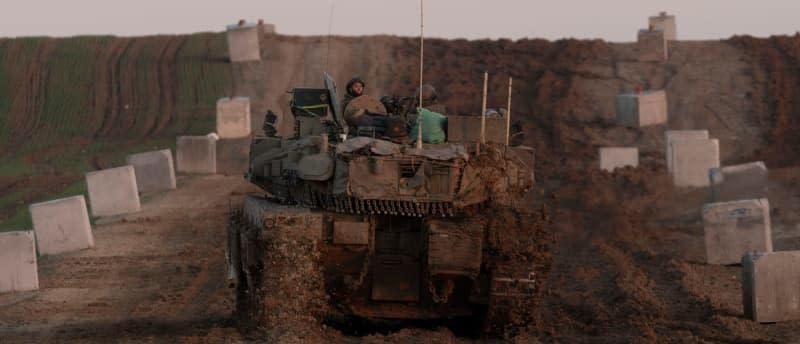

## Claim
Claim: " This image shows a vegetable stand in Gaza in January 2025 with a Merkava tank, the pride of the Israeli army, as its decor."

## Actions
```
reverse_search()
web_search("vegetable stand tank Gaza")
```

## Evidence
### Evidence from `reverse_search`
From [Source](https://en.haberler.com/in-syria-an-abandoned-tank-has-become-a-fruit-and-2027395/): Found exact image on website with title: In Syria, an abandoned tank has become a fruit and vegetable stand.
Content: The search result is from a Turkish news website and shows an image of a tank being used as a fruit and vegetable stand. The article states that the tank was abandoned by regime forces in Syria. The article is dated December 15, 2024. 


### Evidence from `web_search`
An AOL article from February 3, 2025, fact-checks an image of a vegetable stand and tank, stating that the tank is a Syrian T-55, not an Israeli Merkava, and the image was taken in Syria. The article also mentions a video identifying the vendor as Ali Youssef. ([https://www.aol.com/fact-check-image-claims-show-141025316.html](https://www.aol.com/fact-check-image-claims-show-141025316.html)) 

The Kuwait Times published an article on August 10, 2025, about a Gaza farmer growing vegetables in a displacement camp, mentioning the scarcity of food and aid in Gaza due to the war. ([https://kuwaittimes.com/article/31711/business/gaza-farmer-grows-vegetables-in-tent-city-to-survive-another-day/](https://kuwaittimes.com/article/31711/business/gaza-farmer-grows-vegetables-in-tent-city-to-survive-another-day/)) 


## Elaboration
The claim is inaccurate. The image depicts a Syrian T-55 tank, not an Israeli Merkava tank, used as a vegetable stand in Syria, not Gaza. The image was taken before January 2025, as indicated by the Turkish news website article dated December 15, 2024, and the AOL fact-check article from February 3, 2025, which also identifies the vendor as Ali Youssef.


## Final Judgement
The claim is false because the image is of a Syrian tank, not an Israeli Merkava, and the location is Syria, not Gaza. The image was also taken before January 2025. `false`

### Verdict: FALSE

### Justification
The image shows a vegetable stand with a Syrian T-55 tank, not an Israeli Merkava, and the location is Syria, not Gaza, as confirmed by a Turkish news website ([Source](https://en.haberler.com/in-syria-an-abandoned-tank-has-become-a-fruit-and-2027395/)) and an AOL fact-check article. The image predates January 2025.
