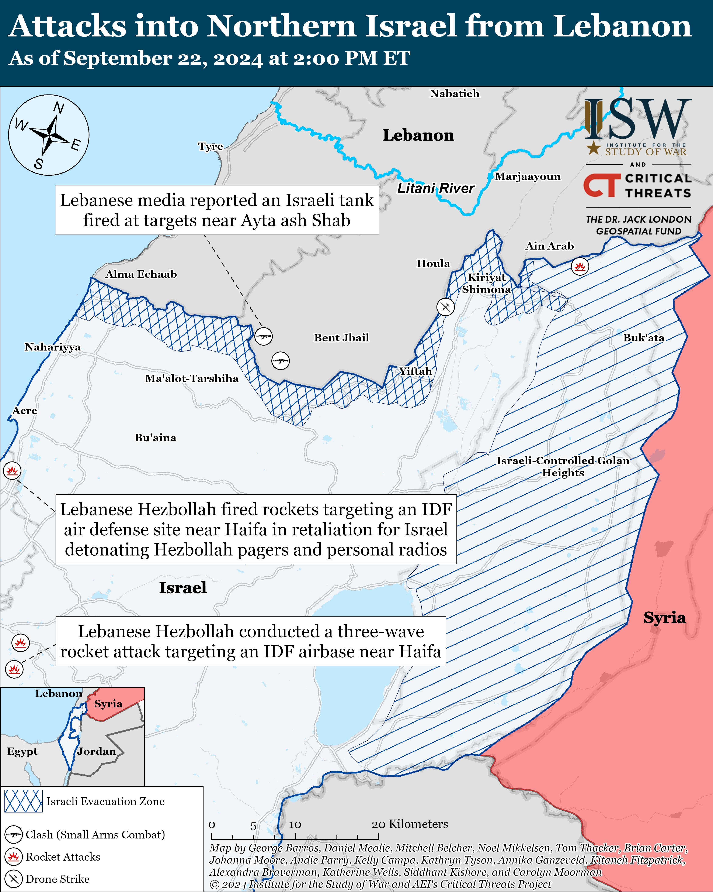

## Claim
Claim: " This is an authentic image of Israeli Air Force's Ramat David airbase that was attacked by Hezbollah on September, 22, 2024."

## Actions
```
reverse_search()
web_search("Ramat David airbase attack September 22 2024")
```

## Evidence
### Evidence from `reverse_search`
The image 

### Evidence from `web_search`
Al Jazeera ([https://www.aljazeera.com/news/2024/9/21/hezbollah-claims-rocket-attack-deep-inside-northern-israel](https://www.aljazeera.com/news/2024/9/21/hezbollah-claims-rocket-attack-deep-inside-northern-israel)) reports that Hezbollah claimed to have launched rockets at Israel’s Ramat David Airbase on September 22, 2024. Politico.eu ([https://www.politico.eu/article/hezbollah-launches-revenge-rocket-attack-against-israeli-base/](https://www.politico.eu/article/hezbollah-launches-revenge-rocket-attack-against-israeli-base/)) also reports on the attack.

JPost.com ([https://www.jpost.com/israel-news/article-821267](https://www.jpost.com/israel-news/article-821267)) discusses Hezbollah's rocket attacks on Ramat David airbase. <image:k>


## Elaboration
The evidence confirms that Hezbollah claimed to have attacked the Ramat David airbase on September 22, 2024. However, the reverse image search did not provide any information about the authenticity of the image.

Therefore, the claim cannot be verified. More information is needed to determine if the image is authentic.


## Actions
```
image_search("Ramat David airbase attack September 22 2024")
```

## Evidence
### Evidence from `image_search`
From [Source](https://www.understandingwar.org/backgrounder/iran-update-september-22-2024): 
Content: The Institute for the Study of War and Critical Threats Project published a map showing the location of the attacks into Northern Israel from Lebanon as of September 22, 2024. 


## Elaboration
The image search results do not provide any visual evidence to support the claim. The provided map from the Institute for the Study of War and Critical Threats Project ([https://www.understandingwar.org/backgrounder/iran-update-september-22-2024](https://www.understandingwar.org/backgrounder/iran-update-september-22-2024)) shows the location of attacks but does not include any images of the Ramat David airbase.

Therefore, the claim cannot be verified. There is no visual evidence to support the claim that the image is authentic.


## Final Judgement
The fact-check reveals that while there were reports of a Hezbollah attack on the Ramat David airbase on September 22, 2024, the authenticity of the provided image could not be verified. The reverse image search did not yield any results, and the image search did not provide any visual evidence to support the claim.

`false`

### Verdict: FALSE

### Justification
The claim is unverified. While reports confirm a Hezbollah attack on the Ramat David airbase on September 22, 2024, the image's authenticity remains unconfirmed. Reverse image and image searches did not provide evidence to support the claim.
