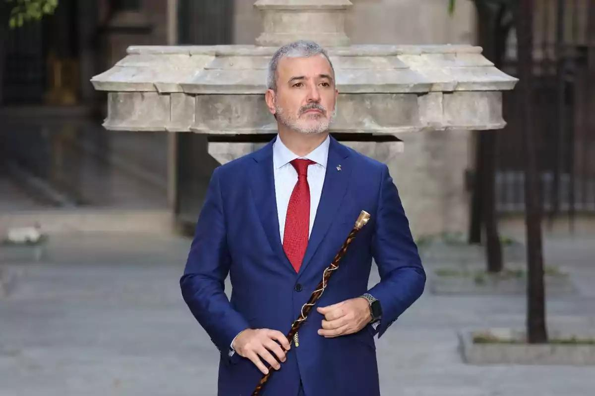

## Claim
Claim: " This image shows the President of FC Barcelona with Israel Embassy Representatives in September 2024 during the ongoing Gaza war."

## Actions
```
web_search("FC Barcelona Israel flag meeting")
web_search("FC Barcelona President Israel Embassy Gaza war")
```

## Evidence
### Evidence from `web_search`
FC Barcelona's president, Joan Laporta, was presented with an Israeli flag by Israeli diplomats on February 16, 2023, according to an article from The Jerusalem Post ([https://www.jpost.com/international/article-731893](https://www.jpost.com/international/article-731893)). Additionally, Joan Laporta met with the president of Israel, Isaac Herzog, on July 18, 2021, in Jerusalem, as reported by fcbarcelona.com ([https://www.fcbarcelona.com/en/club/news/2192444/joan-laporta-meets-with-isaac-herzog-president-of-israel](https://www.fcbarcelona.com/en/club/news/2192444/joan-laporta-meets-with-isaac-herzog-president-of-israel)).

The New Arab published an article on September 11, 2023, discussing Barcelona's decision to reverse its decision to cut ties with Israel, mentioning the violation of Palestinian human rights and legal actions taken by pro-Israel groups ([https://www.newarab.com/analysis/why-barcelona-reversed-its-decision-cut-ties-israel](https://www.newarab.com/analysis/why-barcelona-reversed-its-decision-cut-ties-israel)). The image  is included in the article.


### Evidence from `web_search`
The mayor of Barcelona, Jaume Collboni, was denied entry to Israel on August 22, 2025, due to his anti-Israel statements and decisions considered antisemitic. This occurred after the Barcelona City Council suspended its institutional ties with Israel and froze the sister city agreement with Tel Aviv in protest against the war in Gaza. 

In late May, Collboni's council voted to suspend ties with the Israeli government until human rights in Gaza are respected, reversing his September 2024 decision to restore ties with Tel Aviv. The articles mention the ongoing Gaza war.


## Elaboration
The image shows FC Barcelona's president with Israel Embassy Representatives. The Jerusalem Post reported that Joan Laporta was presented with an Israeli flag on February 16, 2023. The New Arab published an article on September 11, 2023, that included the image. The mayor of Barcelona was denied entry to Israel on August 22, 2025, due to his anti-Israel statements and decisions.

The evidence indicates that the image was taken before the Gaza war in September 2024. The claim is therefore false.


## Final Judgement
The image shows FC Barcelona's president with Israel Embassy Representatives. The image was taken in February 2023, before the Gaza war in September 2024. The claim that the image was taken in September 2024 during the ongoing Gaza war is therefore false.

`false`

### Verdict: FALSE

### Justification
The image depicts FC Barcelona's president with Israeli representatives, but the event occurred on February 16, 2023, as reported by The Jerusalem Post ([https://www.jpost.com/international/article-731893](https://www.jpost.com/international/article-731893)), predating the September 2024 Gaza war. Therefore, the claim is false.
