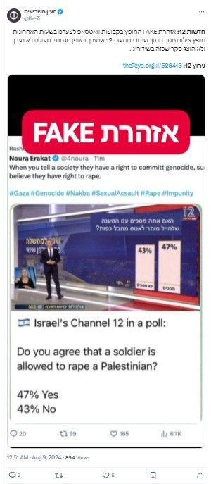

## Claim
Claim: " The image shows a screenshot of an authentic question from Israel's Channel 12 public opinion poll: 'Do you agree with the claim that a solder is allowed to rape a prisoner with his hands tied?'"

## Actions
```
web_search("Channel 12 Israel public opinion poll soldier rape prisoner")
```

## Evidence
### Evidence from `web_search`
The image is a doctored screenshot of a poll from Israel's Channel 12, as reported by AFP Malaysia and The National Desk. The original poll, which aired on May 27, 2022, was about the government's reliance on supporters of terrorism, but the altered image shared on social media on August 11, 2024, falsely presents a question about whether a soldier is allowed to rape a prisoner. Channel 12 has debunked the false posts. The image was shared by Noura Erakat and Rashida Tlaib. Another article from Mondoweiss.net discusses a poll showing that 65% of Jewish Israelis oppose criminal prosecution for soldiers suspected of raping Palestinian detainees.

Relevant URLs:
*   [https://cedmohub.eu/posts-share-doctored-prisoner-abuse-poll-from-israeli-tv-channel/](https://cedmohub.eu/posts-share-doctored-prisoner-abuse-poll-from-israeli-tv-channel/)
*   [https://komonews.com/news/nation-world/squad-member-shares-fake-poll-claiming-most-israelis-support-rape-of-palestinians-rashida-tlaib-noura-erakat-alex-zeldin-ritchie-torres-israel-palestine-hamas-war-terrorism-gaza](https://komonews.com/news/nation-world/squad-member-shares-fake-poll-claiming-most-israelis-support-rape-of-palestinians-rashida-tlaib-noura-erakat-alex-zeldin-ritchie-torres-israel-palestine-hamas-war-terrorism-gaza)
*   [https://mondoweiss.net/2024/08/65-of-israeli-jews-oppose-criminal-prosecution-for-soldiers-suspected-of-raping-palestinian-detainees/](https://mondoweiss.net/2024/08/65-of-israeli-jews-oppose-criminal-prosecution-for-soldiers-suspected-of-raping-palestinian-detainees/)

, , , 


## Elaboration
The claim is false. The image is a doctored screenshot of a poll from Israel's Channel 12. The original poll's topic was different, and the altered image falsely presents a question about whether a soldier is allowed to rape a prisoner. Channel 12 has debunked the false posts.


## Final Judgement
The image is a doctored screenshot of a poll from Israel's Channel 12. The original poll's topic was different, and the altered image falsely presents a question about whether a soldier is allowed to rape a prisoner. Channel 12 has debunked the false posts.

The claim is demonstrably false as the image has been altered to misrepresent the original poll's question. `false`


### Verdict: FALSE

### Justification
The image is a manipulated screenshot of a poll from Israel's Channel 12, as reported by [AFP Malaysia](https://cedmohub.eu/posts-share-doctored-prisoner-abuse-poll-from-israeli-tv-channel/) and [The National Desk](https://komonews.com/news/nation-world/squad-member-shares-fake-poll-claiming-most-israelis-support-rape-of-palestinians-rashida-tlaib-noura-erakat-alex-zeldin-ritchie-torres-israel-palestine-hamas-war-terrorism-gaza). The original poll's subject was different, and the altered image falsely presents a question about soldier rape. Channel 12 has debunked the false posts.
