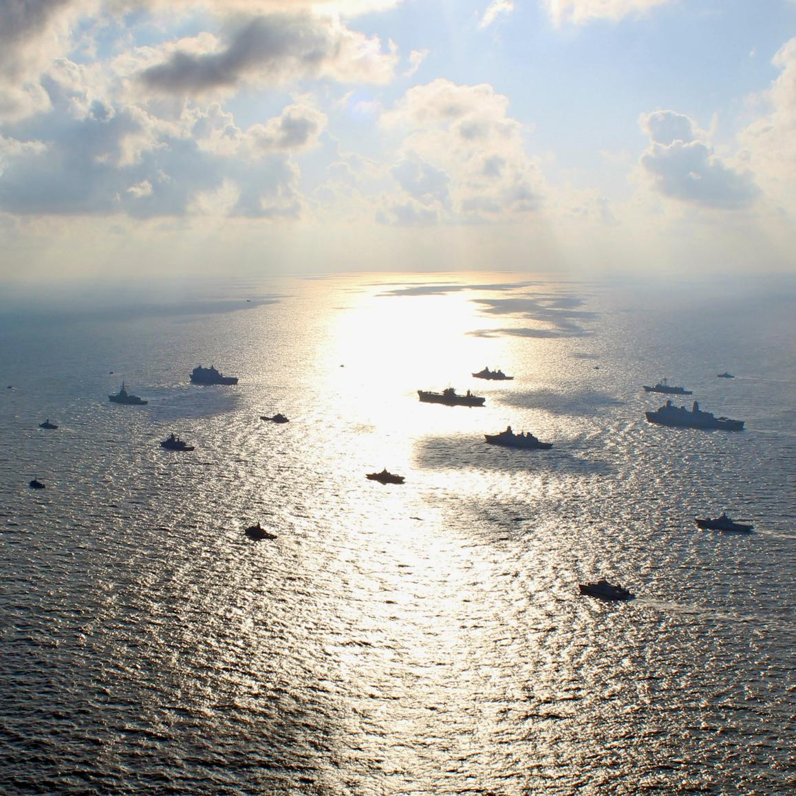

## Claim
Claim: " This image shows U.S. warships being en route to the Lebanon coast in August 2024 to support the Israel Defence Forces (IDF)."

## Actions
```
reverse_search()
web_search("US warships Lebanon coast August 2024")
```

## Evidence
### Evidence from `reverse_search`
The image shows the USS Mount Whitney (LCC 20) arriving in Kiel, Germany, on June 19, 2024, after completing BALTOPS 24, which took place in the Baltic Sea on June 8, 2024.  The image is also found on a U.S. government website.

The image is related to the Baltic Operations 2024 exercise and an article discussing NATO.


### Evidence from `web_search`
In August 2024, the U.S. sent more warships to the Middle East in response to escalating attacks and threats from Iran and its proxies, including Hezbollah. The U.S. military presence was increased, with two aircraft carriers and their accompanying warships stationed in or near the Gulf of Oman. The U.S. aimed to deter a larger conflict between Israel and Iran and assisted Israel in spotting incoming rockets. (, )

Sources include an article from NPR ([https://www.npr.org/2024/08/03/nx-s1-5061738/the-u-s-is-sending-more-warships-to-the-middle-east-as-israel-steps-up-attacks](https://www.npr.org/2024/08/03/nx-s1-5061738/the-u-s-is-sending-more-warships-to-the-middle-east-as-israel-steps-up-attacks)), The New York Times ([https://www.nytimes.com/2024/08/25/world/middleeast/us-aircraft-carriers-submarine.html](https://www.nytimes.com/2024/08/25/world/middleeast/us-aircraft-carriers-submarine.html)), and Military Times ([https://www.militarytimes.com/news/pentagon-congress/2024/08/26/two-us-aircraft-carriers-to-stay-in-middle-east-after-hezbollah-attack/](https://www.militarytimes.com/news/pentagon-congress/2024/08/26/two-us-aircraft-carriers-to-stay-in-middle-east-after-hezbollah-attack/)).


## Elaboration
The claim is not supported by the evidence. The image provided shows the USS Mount Whitney arriving in Kiel, Germany, on June 19, 2024, after completing BALTOPS 24, which took place in the Baltic Sea. The web search confirms that U.S. warships were deployed to the Middle East in August 2024, but the provided image does not depict this.


## Final Judgement
The image shows the USS Mount Whitney in Germany in June 2024, not en route to Lebanon in August 2024. While the U.S. did send warships to the Middle East in August 2024, the image is unrelated to this event.

The claim is demonstrably false because the image is misrepresented. `false`

### Verdict: FALSE

### Justification
The image in the claim depicts the USS Mount Whitney in Germany in June 2024, not U.S. warships en route to Lebanon in August 2024. While the U.S. did deploy warships to the Middle East in August 2024, as reported by sources like NPR ([https://www.npr.org/2024/08/03/nx-s1-5061738/the-u-s-is-sending-more-warships-to-the-middle-east-as-israel-steps-up-attacks](https://www.npr.org/2024/08/03/nx-s1-5061738/the-u-s-is-sending-more-warships-to-the-middle-east-as-israel-steps-up-attacks)), the image is unrelated to this event.
