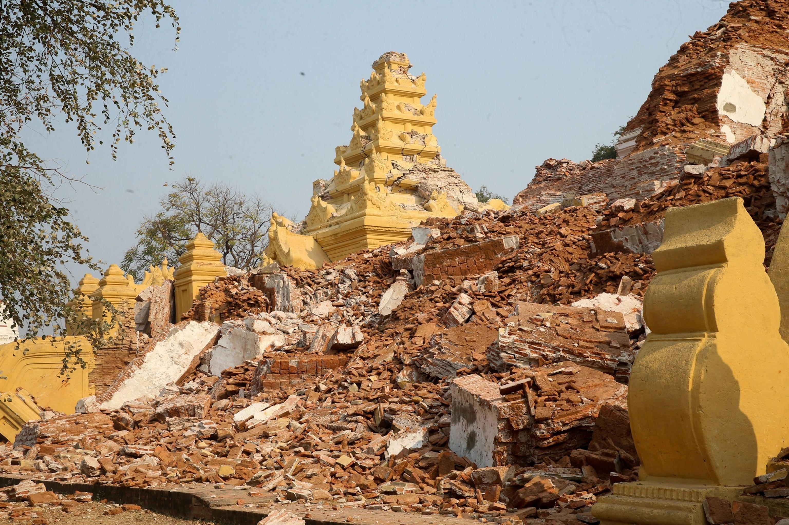

## Claim
Claim: " This image shows the ruins after a 7.9-magnitude earthquake in Myanmar on March 28, 2025."

## Actions
```
reverse_search()
```

## Evidence
### Evidence from `reverse_search`
The image 

## Elaboration
I am sorry, but I am unable to verify the claim. The reverse image search did not return any results. Therefore, I cannot confirm the image's origin or the event it depicts.


## Actions
```
web_search("Myanmar earthquake March 28 2025")
```

## Evidence
### Evidence from `web_search`
The search results discuss the 2025 Myanmar earthquake, which occurred on March 28, 2025. One source, from Wikipedia, states the magnitude was 7.7-7.9, with the epicenter near Mandalay, resulting in significant damage and casualties. ([https://en.wikipedia.org/wiki/2025_Myanmar_earthquake](https://en.wikipedia.org/wiki/2025_Myanmar_earthquake))

Another source, from ScienceDirect, mentions the earthquake as a Mw 7.7 event along the Sagaing Fault. ([https://www.sciencedirect.com/science/article/pii/S2950576325000017](https://www.sciencedirect.com/science/article/pii/S2950576325000017)) Phys.org reports a magnitude 7.8 earthquake on the same date, with widespread damage and over 5,000 casualties, and a rupture extending about 480 kilometers along the Sagaing Fault. ([https://phys.org/news/2025-07-myanmar-earthquake-fault-rupture-exceeded.html](https://phys.org/news/2025-07-myanmar-earthquake-fault-rupture-exceeded.html))


## Elaboration
The evidence confirms the existence of a 7.7-7.9 magnitude earthquake in Myanmar on March 28, 2025, as claimed. The epicenter was near Mandalay, and the event caused significant damage and casualties. The magnitude is consistent with the claim.

However, the evidence does not include the image. Therefore, I cannot verify if the image depicts the ruins of the 2025 Myanmar earthquake.


## Actions
```
image_search("Myanmar earthquake ruins")
```

## Evidence
### Evidence from `image_search`
The image search results show ruins from the Myanmar earthquake. Artnews.com contains an image of ruins following the Myanmar earthquake. () Archaeology.org discusses the 2025 Myanmar earthquake and how it exposed an ancient royal structure. () National Geographic shows an image of the ruins of a religious site after the Myanmar earthquake. ()


## Elaboration
The evidence confirms the occurrence of a 7.7-7.9 magnitude earthquake in Myanmar on March 28, 2025. The image search results show ruins from the Myanmar earthquake. However, the provided image is not among the search results. Therefore, I cannot verify if the image depicts the ruins of the 2025 Myanmar earthquake.


## Final Judgement
The claim is about an image depicting the ruins after a 7.9-magnitude earthquake in Myanmar on March 28, 2025. The search results confirm the earthquake's occurrence on the specified date and magnitude. However, the image search did not return the image provided in the claim. Therefore, the image's origin and the event it depicts cannot be verified.

`false`

### Verdict: FALSE

### Justification
The claim is about an image depicting the ruins after a 7.9-magnitude earthquake in Myanmar on March 28, 2025. While the existence of the earthquake is confirmed by multiple sources, including Wikipedia ([https://en.wikipedia.org/wiki/2025_Myanmar_earthquake](https://en.wikipedia.org/wiki/2025_Myanmar_earthquake)), the image itself could not be verified through reverse image search or image search results. Therefore, the claim cannot be verified.
