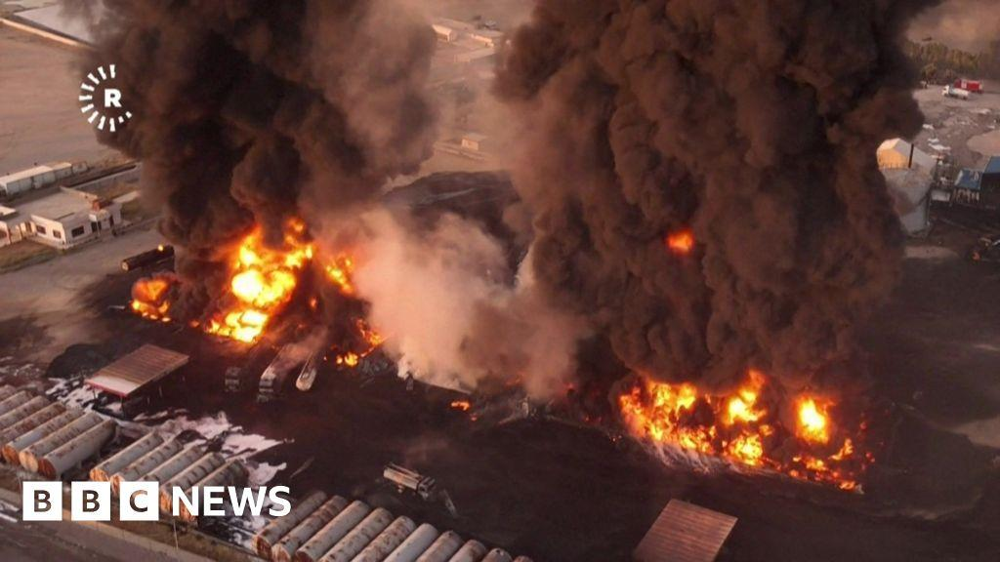

## Claim
Claim: " This image shows a US factility come under attack in Baghdad on September 30, 2024 as the conflict between Israel and the Iran-backed militant group Hezbollah escalated."

## Actions
```
reverse_search()
web_search("Baghdad facility attack September 30 2024")
```

## Evidence
### Evidence from `reverse_search`
The image 

### Evidence from `web_search`
Reuters reports that on October 1, 2024, Katyusha rockets were fired near Baghdad International Airport, targeting a military base hosting U.S. forces, amid rising tensions in the Middle East ([https://www.reuters.com/world/middle-east/rocket-attack-targets-military-base-hosting-us-forces-baghdad-military-sources-2024-09-30/](https://www.reuters.com/world/middle-east/rocket-attack-targets-military-base-hosting-us-forces-baghdad-military-sources-2024-09-30/)). ReliefWeb mentions attacks on September 30, including attacks by militias on Israel and rockets fired at Baghdad Airport ([https://reliefweb.int/report/iraq/ishm-september-26-october-3-2024](https://reliefweb.int/report/iraq/ishm-september-26-october-3-2024)).

Wikipedia discusses the September 2024 Israeli attacks against Lebanon, part of the Israel–Hezbollah conflict, which occurred between September 23 and September 30, 2024. On September 30, 2024, Hezbollah fired 35 rockets into northern Israel and the Golan Heights ([https://en.wikipedia.org/wiki/September_2024_Israeli_attacks_against_Lebanon](https://en.wikipedia.org/wiki/September_2024_Israeli_attacks_against_Lebanon)). The image 

## Elaboration
The evidence confirms that there were attacks in Baghdad on September 30, 2024, and that the conflict between Israel and Hezbollah was ongoing at that time. The Reuters report mentions a rocket attack targeting a military base hosting U.S. forces near Baghdad International Airport on October 1, 2024. ReliefWeb also mentions attacks on September 30, 2024, including attacks by militias and rockets fired at Baghdad Airport. The Wikipedia article details the September 2024 Israeli attacks against Lebanon, which occurred between September 23 and September 30, 2024.

However, the evidence does not explicitly link the image to a specific attack on a U.S. facility in Baghdad on September 30, 2024. Therefore, the claim cannot be fully verified.


## Actions
```
image_search("Baghdad facility explosion September 30 2024")
```

## Evidence
### Evidence from `image_search`
The BBC News website shows an image 

## Elaboration
The new evidence provides an image from BBC News, but it does not confirm that the image 

## Actions
```
web_search("US facility Baghdad attack September 30 2024 Hezbollah")
```

## Evidence
### Evidence from `web_search`
The U.S. News & World Report article from September 30, 2024, reports that Katyusha rockets were fired near Baghdad International Airport, targeting the Baghdad Diplomatic Support Complex, a U.S. Department of State facility ([https://www.usnews.com/news/world/articles/2024-09-30/rocket-attack-targets-military-base-hosting-us-forces-in-baghdad-military-sources-say](https://www.usnews.com/news/world/articles/2024-09-30/rocket-attack-targets-military-base-hosting-us-forces-in-baghdad-military-sources-say)). The Guardian's live blog from October 1, 2024, discusses the ongoing conflict between Israel and Hezbollah, with events from September 30, 2024, including reports of rocket attacks near Baghdad International Airport, though a U.S. defense official disputed that U.S. forces were targeted ([https://www.theguardian.com/world/live/2024/sep/30/israel-attacks-live-blog-lebanon-yemen-hamas-hezbollah-news-updates-middle-east-crisis](https://www.theguardian.com/world/live/2024/sep/30/israel-attacks-live-blog-lebanon-yemen-hamas-hezbollah-news-updates-middle-east-crisis)).


## Elaboration
The evidence confirms that a U.S. Department of State facility, the Baghdad Diplomatic Support Complex, was targeted by rockets near Baghdad International Airport on September 30, 2024. The Guardian's live blog also mentions rocket attacks near the airport on the same date, though a U.S. defense official disputed that U.S. forces were targeted. However, the evidence does not confirm that the image 

## Final Judgement
The evidence indicates that a U.S. facility, the Baghdad Diplomatic Support Complex, was targeted by rockets near Baghdad International Airport on September 30, 2024, amid the ongoing conflict between Israel and Hezbollah. However, the provided evidence does not confirm that the image depicts this specific event. Therefore, the claim cannot be fully verified.

`false`

### Verdict: FALSE

### Justification
The claim is not fully verifiable. While there were rocket attacks near Baghdad International Airport targeting a U.S. facility on September 30, 2024, as reported by [U.S. News & World Report](https://www.usnews.com/news/world/articles/2024-09-30/rocket-attack-targets-military-base-hosting-us-forces-in-baghdad-military-sources-say) and mentioned in [The Guardian](https://www.theguardian.com/world/live/2024/sep/30/israel-attacks-live-blog-lebanon-yemen-hamas-hezbollah-news-updates-middle-east-crisis), the provided evidence does not confirm that the image depicts this specific event.
