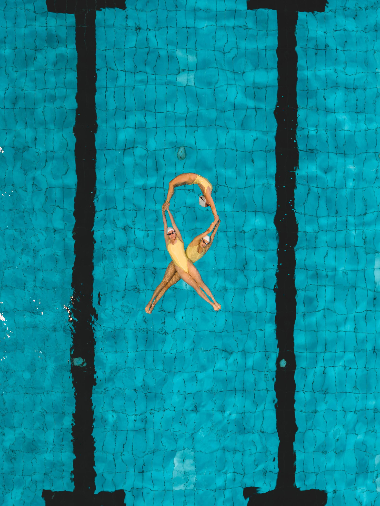

## Claim
Claim: " This image shows the Israeli Olympic team spelling out 'Bring Them Home' at the 2024 Olympic games because they were not allowed to wear their yellow 'Bring Them Home' pins."

## Actions
```
web_search("Israeli Olympic team Bring Them Home 2024")
image_search("Israeli Olympic team Bring Them Home")
```

## Evidence
### Evidence from `image_search`
From [Source](https://www.ynetnews.com/culture/article/skmg5e5ma): 
Content: The search result from Ynetnews.com contains an image of synchronized swimmers. 


## Elaboration
The image search results show synchronized swimmers, which aligns with the image in the claim. However, the evidence does not confirm the claim that the image depicts the Israeli Olympic team spelling out "Bring Them Home" at the 2024 Olympics due to being disallowed to wear pins. The evidence is insufficient to verify the claim.


## Actions
```
web_search("Israeli Olympic team Bring Them Home pins")
reverse_search()
```

## Evidence
### Evidence from `web_search`
The image of synchronized swimmers spelling "Bring Them Home Now" is not from the 2024 Olympics, according to an article from stljewishlight.org ([https://stljewishlight.org/sports/those-viral-images-of-israeli-olympians-advocating-to-bring-them-home-are-not-actually-from-the-olympics/](https://stljewishlight.org/sports/those-viral-images-of-israeli-olympians-advocating-to-bring-them-home-are-not-actually-from-the-olympics/)). The article clarifies that the image has been falsely associated with the Israeli Olympic team being prohibited from wearing "Bring Them Home" pins.

Another source, wzzm13.com ([https://www.wzzm13.com/article/news/verify/olympics-verify/image-israeli-swimmers-bring-them-home-not-from-paris-2024-olympics/536-5f25fcff-c857-495b-8eba-3d6c5fb46ce9](https://www.wzzm13.com/article/news/verify/olympics-verify/image-israeli-swimmers-bring-them-home-not-from-paris-2024-olympics/536-5f25fcff-c857-495b-8eba-3d6c5fb46ce9)), also confirms that the image is not from the 2024 Paris Olympics.  


## Elaboration
The claim is false. The evidence indicates that the image of synchronized swimmers spelling "Bring Them Home Now" is not from the 2024 Olympics.


## Final Judgement
The image shows synchronized swimmers spelling "Bring Them Home Now," but it is not from the 2024 Olympics. Multiple sources confirm that the image has been falsely associated with the Israeli Olympic team and the 2024 Olympics.

`false`

### Verdict: FALSE

### Justification
The claim is false. The image of synchronized swimmers spelling "Bring Them Home Now" is not from the 2024 Olympics, as confirmed by sources like [stljewishlight.org](https://stljewishlight.org/sports/those-viral-images-of-israeli-olympians-advocating-to-bring-them-home-are-not-actually-from-the-olympics/) and [wzzm13.com](https://www.wzzm13.com/article/news/verify/olympics-verify/image-israeli-swimmers-bring-them-home-not-from-paris-2024-olympics/536-5f25fcff-c857-495b-8eba-3d6c5fb46ce9).
