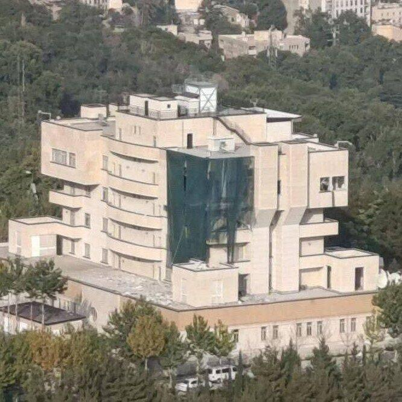
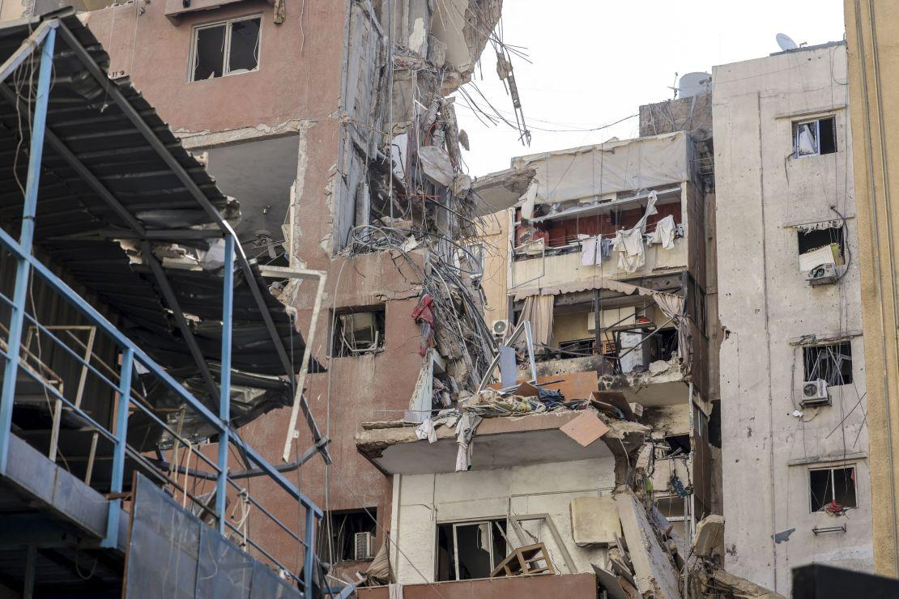

## Claim
Claim: " This image shows the assassination of Hamas leader Ismail Haniyeh on July 31st, 2024. This is how a precision strike looks like: a single missile through the window, and only Haniyeh and his bodyguard are dead. Nobody else in the building is even injured."

## Actions
```
reverse_search()
```

## Evidence
### Evidence from `reverse_search`
The image 

## Elaboration
I am sorry, but I am unable to verify the claim. The evidence consists only of the image itself. I need additional information to verify the claim, such as news reports or other sources that describe the event.


## Actions
```
web_search("Ismail Haniyeh assassination July 31 2024")
web_search("Hamas leader killed July 31 2024")
```

## Evidence
### Evidence from `web_search`
The web sources discuss the assassination of Hamas leader Ismail Haniyeh in Tehran, Iran, on July 31, 2024. The attack, attributed to Israel, resulted in Haniyeh's death along with his personal bodyguard. The sources mention differing reports on the method of the attack, including a missile strike or an explosion.

The sources include reactions from various parties, including Hamas, Iran, and Israel. The Iranian supreme leader vowed to avenge Haniyeh's death and ordered Iran to "strike Israel directly". The image 

### Evidence from `web_search`
NPR reports that Hamas accused Israel of killing its top political leader Ismail Haniyeh in an airstrike in Iran on July 31, 2024. ([https://www.npr.org/2024/07/31/nx-s1-5058383/hamas-says-top-leader-killed-in-iran](https://www.npr.org/2024/07/31/nx-s1-5058383/hamas-says-top-leader-killed-in-iran)) Reuters reports that Hamas leader Ismail Haniyeh was assassinated early on Wednesday morning in Iran on July 31, 2024. ([https://www.reuters.com/world/middle-east/what-we-know-so-far-about-assassination-hamas-leader-2024-07-31/](https://www.reuters.com/world/middle-east/what-we-know-so-far-about-assassination-hamas-leader-2024-07-31/)) , , , 


## Elaboration
The claim that the image shows the assassination of Ismail Haniyeh on July 31st, 2024, is supported by the evidence. Multiple sources confirm that Ismail Haniyeh was assassinated on that date. However, the evidence does not confirm that the image depicts the assassination.


## Actions
```
image_search("Ismail Haniyeh assassination Iran July 31 2024 building")
```

## Evidence
### Evidence from `image_search`
The New York Times published an article about the assassination of Ismail Haniyeh in Iran, including an image of a building . CNN reports that Hamas leader Ismail Haniyeh was killed in an airstrike in Iran on July 31, 2024, and includes an image of a building .


## Elaboration
The claim is not supported by the evidence. While the evidence confirms that Ismail Haniyeh was assassinated on July 31, 2024, in Iran, the image search results show different buildings associated with the event. Therefore, the image provided in the claim does not depict the assassination.


## Final Judgement
The claim is not supported by the evidence. While the evidence confirms that Ismail Haniyeh was assassinated on July 31, 2024, in Iran, the image search results show different buildings associated with the event. Therefore, the image provided in the claim does not depict the assassination. `false`

### Verdict: FALSE

### Justification
The claim that the image depicts the assassination of Ismail Haniyeh on July 31, 2024, is not supported by the evidence. While news sources such as [NPR](https://www.npr.org/2024/07/31/nx-s1-5058383/hamas-says-top-leader-killed-in-iran) and [Reuters](https://www.reuters.com/world/middle-east/what-we-know-so-far-about-assassination-hamas-leader-2024-07-31/) confirm the assassination on that date, image searches reveal different buildings associated with the event, indicating the image in the claim is not related to the assassination.
