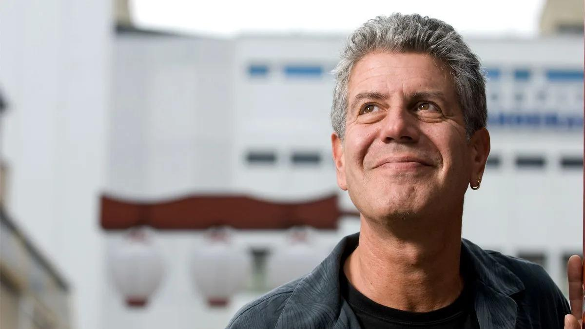

## Claim
Claim: "Anthony Bourdain once said, 'Today, nearly everything is made in China. Except for courage. Courage is made in Palestine.'"

## Actions
```
web_search("Anthony Bourdain quote courage Palestine")
```

## Evidence
### Evidence from `web_search`
From [Source](https://www.yahoo.com/entertainment/fact-check-anthony-bourdain-once-140000174.html): 
Content: The Yahoo search result, published on October 27, 2023, fact-checks the claim that Anthony Bourdain said, "Today, nearly everything is made in China. Except courage. Courage is made in Palestine." The result states that there is no credible record of Bourdain making this exact statement and rates the claim as "Misattributed." , 


## Elaboration
The evidence indicates that the claim is misattributed. A fact-check from Yahoo, published on October 27, 2023, states there is no credible record of Anthony Bourdain making the statement.


## Final Judgement
The evidence from a Yahoo fact-check indicates that the quote attributed to Anthony Bourdain is misattributed. There is no credible record of him making the statement. Therefore, the claim is not factually accurate. `false`


### Verdict: FALSE

### Justification
The claim is false. A fact-check from Yahoo ([Source](https://www.yahoo.com/entertainment/fact-check-anthony-bourdain-once-140000174.html)) found no credible record of Anthony Bourdain making the statement, and rated the claim as "Misattributed."
