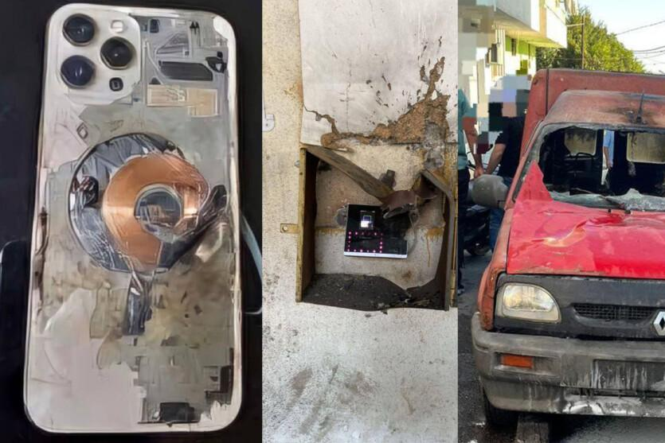

## Claim
Claim: " This image shows an Iphone that exploded during the pager attacks on Hezbollah devices in Lebanon in September 2024, blowing up random people."

## Actions
```
reverse_search()
```

## Evidence
### Evidence from `reverse_search`
The image of the exploded iPhone () is featured in multiple articles discussing explosions in Lebanon. One article from DW.com ([https://www.dw.com/en/fact-check-no-iphones-solar-panels-laptops-exploded-in-lebanon/a-70281061](https://www.dw.com/en/fact-check-no-iphones-solar-panels-laptops-exploded-in-lebanon/a-70281061)) states that the image is not related to the current attacks and dates back to March 2021.

Other articles, such as those from itc.ua ([https://itc.ua/en/news/not-just-pagers-iphones-laptops-electronic-locks-and-other-devices-exploded-in-lebanon-today/](https://itc.ua/en/news/not-just-pagers-iphones-laptops-electronic-locks-and-other-devices-exploded-in-lebanon-today/)) and The China Academy ([https://thechinaacademy.org/israels-pager-attack-has-cooked-western-led-globalization/](https://thechinaacademy.org/israels-pager-attack-has-cooked-western-led-globalization/)), discuss the explosions in Lebanon, with the latter mentioning the image of the detonated iPhone () and the impact on Chinese consumers. The itc.ua article also includes another image of an exploded iPhone ().


## Elaboration
The claim that the image shows an iPhone that exploded during pager attacks in Lebanon in September 2024 is not entirely accurate. While the image is related to explosions in Lebanon, the evidence suggests the image predates the alleged attacks. According to DW.com ([https://www.dw.com/en/fact-check-no-iphones-solar-panels-laptops-exploded-in-lebanon/a-70281061](https://www.dw.com/en/fact-check-no-iphones-solar-panels-laptops-exploded-in-lebanon/a-70281061)), the image dates back to March 2021.

The evidence does confirm that explosions have occurred in Lebanon, with multiple sources discussing the incidents. However, the claim's specific details about the image's context are incorrect.

Therefore, the claim is partially false. The image is related to explosions, but not in the context described.


## Final Judgement
The image of the exploded iPhone is associated with explosions in Lebanon, but the claim misrepresents the context. The image predates the alleged attacks, as indicated by a DW.com article stating it dates back to March 2021.

`false`

### Verdict: FALSE

### Justification
The image of the exploded iPhone (