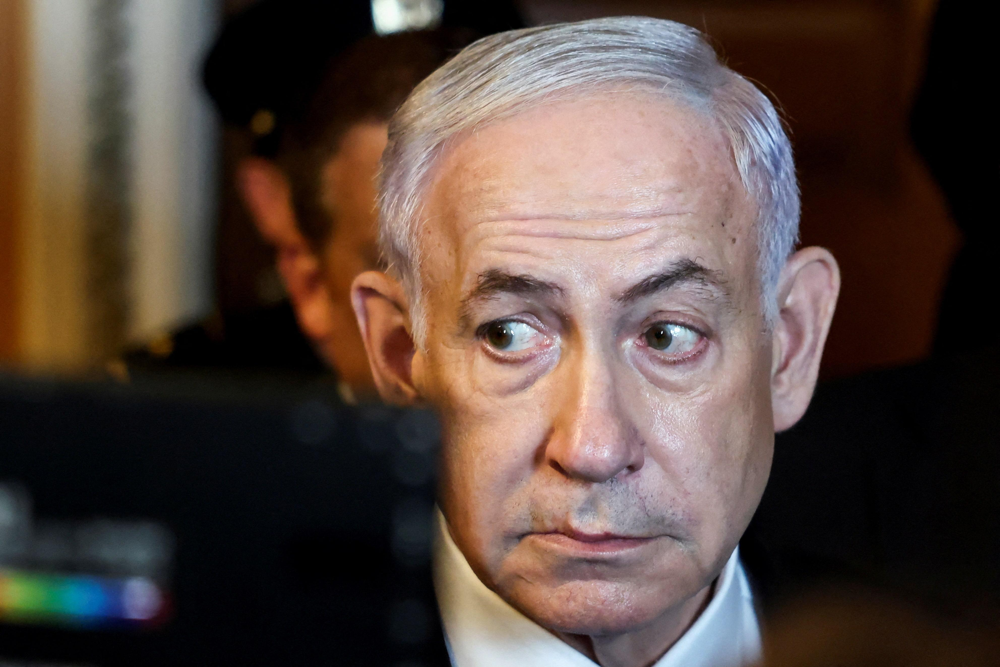
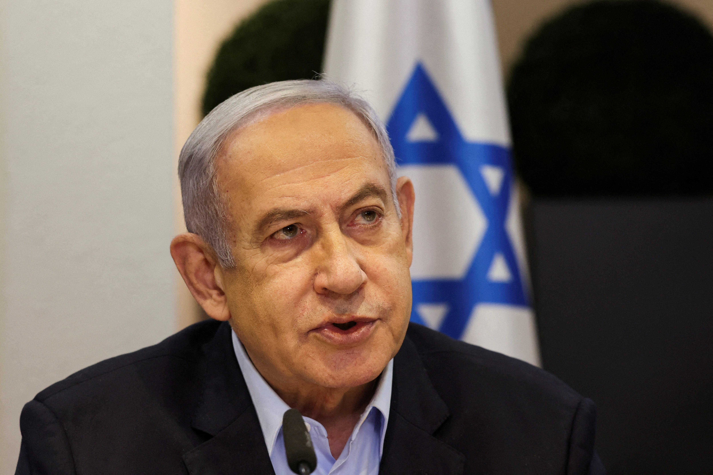

## Claim
Claim: " This is an authentic image of Benjamin Netanyahu being hospitalized in Tel Aviv in November 2024 due to a serious health issue."

## Actions
```
reverse_search()
```

## Evidence
### Evidence from `reverse_search`
The image 

## Elaboration
The reverse image search did not yield any results. Therefore, I cannot verify the claim. I need more information to determine if the image is authentic and if it depicts Benjamin Netanyahu.


## Actions
```
web_search("Benjamin Netanyahu hospitalized health issue")
web_search("Benjamin Netanyahu Tel Aviv hospital")
```

## Evidence
### Evidence from `web_search`
Benjamin Netanyahu has experienced health issues, including intestinal inflammation from spoiled food and dehydration, as reported by The Times of Israel ([https://www.timesofisrael.com/liveblog_entry/pm-suffering-from-food-poisoning-his-office-says-after-he-skipped-cabinet-meeting/](https://www.timesofisrael.com/liveblog_entry/pm-suffering-from-food-poisoning-his-office-says-after-he-skipped-cabinet-meeting/)) and Reuters ([https://www.reuters.com/world/middle-east/netanyahu-suffers-food-poisoning-rest-three-days-his-office-says-2025-07-20/](https://www.reuters.com/world/middle-east/netanyahu-suffers-food-poisoning-rest-three-days-his-office-says-2025-07-20/)). He was also recovering from food poisoning in July 2025.

CNN reported that Netanyahu underwent prostate removal surgery in December 2024 and left a Jerusalem hospital on December 31, 2024 ([https://www.cnn.com/2024/12/31/middleeast/netanyahu-hospital-prostate-budget-bill-intl-latam](https://www.cnn.com/2024/12/31/middleeast/netanyahu-hospital-prostate-budget-bill-intl-latam)). The sources mention that Netanyahu was fitted with a pacemaker in 2023. , , <image:i>


### Evidence from `web_search`
Benjamin Netanyahu underwent a hernia operation in April 2024 and was recovering in the hospital, according to Reuters ([https://www.reuters.com/world/middle-east/israeli-pm-netanyahus-hernia-operation-was-successful-hospital-says-2024-04-01/](https://www.reuters.com/world/middle-east/israeli-pm-netanyahus-hernia-operation-was-successful-hospital-says-2024-04-01/)). 

NBC News reported that Benjamin Netanyahu visited the Soroka hospital in Beersheba after it was damaged in an Iranian missile strike on June 19, 2025 ([https://www.nbcnews.com/video/netanyahu-visits-hospital-damaged-in-iranian-strike-241915973619](https://www.nbcnews.com/video/netanyahu-visits-hospital-damaged-in-iranian-strike-241915973619)). <image:i>


## Elaboration
The evidence indicates that Benjamin Netanyahu was hospitalized in December 2024 for prostate surgery and in April 2024 for a hernia operation. He also experienced food poisoning in July 2025. The claim mentions hospitalization in Tel Aviv in November 2024, which does not align with the provided information. Therefore, the claim is not supported by the evidence.


## Final Judgement
The claim is not supported by the evidence. While Benjamin Netanyahu was hospitalized in 2024, the provided information does not align with the claim's specifics regarding the location and timing of the hospitalization.

`false`

### Verdict: FALSE

### Justification
The claim is false. While Benjamin Netanyahu has been hospitalized for various health issues, including a hernia operation in April 2024 and prostate surgery in December 2024, there is no evidence to support the claim that he was hospitalized in Tel Aviv in November 2024. The provided sources, such as Reuters ([https://www.reuters.com/world/middle-east/israeli-pm-netanyahus-hernia-operation-was-successful-hospital-says-2024-04-01/](https://www.reuters.com/world/middle-east/israeli-pm-netanyahus-hernia-operation-was-successful-hospital-says-2024-04-01/)) and CNN ([https://www.cnn.com/2024/12/31/middleeast/netanyahu-hospital-prostate-budget-bill-intl-latam](https://www.cnn.com/2024/12/31/middleeast/netanyahu-hospital-prostate-budget-bill-intl-latam)), do not corroborate the specific details of the claim.
