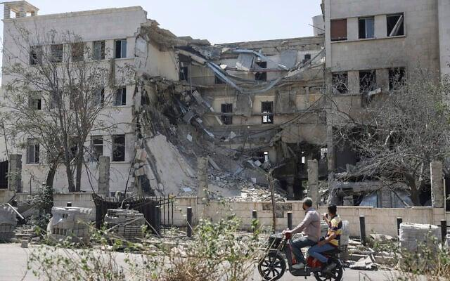

## Claim
Claim: "Turkey's President urged the U.S. in March 2025 to control its ally Israel over its intervention in southern Syria in February 2025."

## Actions
```
web_search("Turkey President US Israel Syria intervention March 2025")
```

## Evidence
### Evidence from `web_search`
PBS News reported on July 23, 2025, that Syria requested Turkey's support due to sectarian violence and Israeli intervention, with tensions escalating in southern Syria, leading to clashes and Israeli airstrikes (). Al Jazeera reported on August 13, 2025, that Turkey's Foreign Minister accused Israel and the SDF of undermining Syria's recovery efforts ().

The Times of Israel reported on August 13, 2025, that Turkey's foreign minister warned Israel not to stir up chaos in Syria, mentioning bloodshed in Latakia and violence in Sweida in March, and Israeli airstrikes in July 2025 and April 2025 ().

*   [https://www.pbs.org/newshour/world/syria-asks-turkey-for-defense-support-after-weeks-of-sectarian-violence](https://www.pbs.org/newshour/world/syria-asks-turkey-for-defense-support-after-weeks-of-sectarian-violence)
*   [https://www.aljazeera.com/news/2025/8/13/turkiye-slams-israel-kurdish-led-sdf-for-destabilising-syria](https://www.aljazeera.com/news/2025/8/13/turkiye-slams-israel-kurdish-led-sdf-for-destabilising-syria)
*   [https://www.timesofisrael.com/turkey-and-syria-accuse-israel-of-fostering-chaos-in-syria/](https://www.timesofisrael.com/turkey-and-syria-accuse-israel-of-fostering-chaos-in-syria/)


## Elaboration
The evidence does not mention the Turkish President urging the U.S. to control Israel. However, it does show that Turkey's Foreign Minister warned Israel not to stir up chaos in Syria in August 2025. The evidence also indicates that there were Israeli airstrikes in April and July 2025, and that Syria requested Turkey's support due to Israeli intervention.

The claim cannot be verified because the evidence does not mention the Turkish President's actions.


## Actions
```
web_search("Turkey President Israel Syria intervention March 2025 US")
```

## Evidence
### Evidence from `web_search`
From [Source](https://www.cnn.com/2025/07/15/middleeast/israel-strikes-syria-sectarian-clashes-druze-intl): 
Content: CNN reported on July 19, 2025, that Israel intervened in southern Syria due to clashes between the Druze minority group and Bedouin tribes. . The article mentions Israeli airstrikes and a ceasefire. The article also mentions that the Syrian government declared a ceasefire and sent in troops. The article does not mention the Turkish President.


## Elaboration
The evidence does not support the claim. The search results do not mention the Turkish President urging the U.S. to control Israel. The evidence does mention Israeli intervention in southern Syria and related events, but not the specific actions of the Turkish President as described in the claim.


## Final Judgement
The evidence indicates that there was Israeli intervention in southern Syria in 2025, and that Turkey's Foreign Minister warned Israel. However, there is no evidence to support the claim that Turkey's President urged the U.S. to control Israel.

The claim is not supported by the evidence. `false`


### Verdict: FALSE

### Justification
The claim is not supported by the evidence. While reports from sources like PBS News and The Times of Israel ([https://www.timesofisrael.com/turkey-and-syria-accuse-israel-of-fostering-chaos-in-syria/](https://www.timesofisrael.com/turkey-and-syria-accuse-israel-of-fostering-chaos-in-syria/)) detail Israeli intervention in Syria and Turkey's Foreign Minister's warnings to Israel, there is no mention of the Turkish President urging the U.S. to control Israel.
