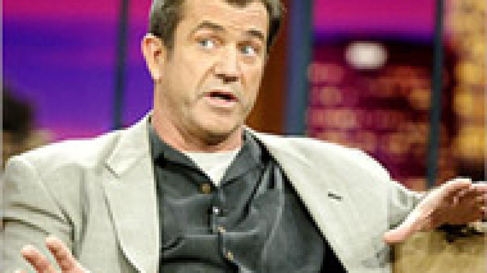

## Claim
Claim: " The image shows a screenshot of an authentic social media post from Mel Gibson saying that Israel will end soon and therefore destroy everything in its way together with a flag in the color of Israel that shows an hourglass."

## Actions
```
web_search("Mel Gibson Israel hourglass")
image_search("Mel Gibson Israel flag hourglass")
```

## Evidence
### Evidence from `web_search`
The image of Mel Gibson's post is fake, according to a fact-check from Yahoo ([https://www.yahoo.com/entertainment/fact-check-mel-gibson-posted-235600604.html](https://www.yahoo.com/entertainment/fact-check-mel-gibson-posted-235600604.html)). The post includes an altered Israeli flag with an hourglass ().

Mel Gibson has faced accusations of antisemitism in the past. He apologized for an anti-Semitic slur in 2006, as reported by the World Jewish Congress ([https://www.worldjewishcongress.org/en/news/mel-gibson-apologizes-for-anti-semitic-slur-at-jewish-police-officer](https://www.worldjewishcongress.org/en/news/mel-gibson-apologizes-for-anti-semitic-slur-at-jewish-police-officer)). The BBC also reported on accusations of antisemitism against Gibson in 2011 ([https://www.bbc.com/news/entertainment-arts-17692563](https://www.bbc.com/news/entertainment-arts-17692563)).


### Evidence from `image_search`
The Associated Press published a fact check on a social media post attributed to Mel Gibson (). Al Jazeera contains a photograph of Mel Gibson ().

Relevant URLs: [https://apnews.com/article/fact-check-mel-gibson-israel-post-342335121493](https://apnews.com/article/fact-check-mel-gibson-israel-post-342335121493), [https://www.aljazeera.com/news/2004/4/4/palestinians-love-mel-gibsons-film](https://www.aljazeera.com/news/2004/4/4/palestinians-love-mel-gibsons-film).


## Elaboration
The claim is false. A fact-check from Yahoo ([https://www.yahoo.com/entertainment/fact-check-mel-gibson-posted-235600604.html](https://www.yahoo.com/entertainment/fact-check-mel-gibson-posted-235600604.html)) confirms that the social media post attributed to Mel Gibson is fake. The post includes an altered Israeli flag with an hourglass.


## Final Judgement
The provided evidence indicates that the social media post attributed to Mel Gibson is fake. Fact-checks from multiple sources confirm the post's inauthenticity, including the altered Israeli flag with an hourglass.

`false`


### Verdict: FALSE

### Justification
The claim is false. A fact-check by Yahoo ([https://www.yahoo.com/entertainment/fact-check-mel-gibson-posted-235600604.html](https://www.yahoo.com/entertainment/fact-check-mel-gibson-posted-235600604.html)) and the Associated Press ([https://apnews.com/article/fact-check-mel-gibson-israel-post-342335121493](https://apnews.com/article/fact-check-mel-gibson-israel-post-342335121493)) confirm that the social media post attributed to Mel Gibson is fake.
