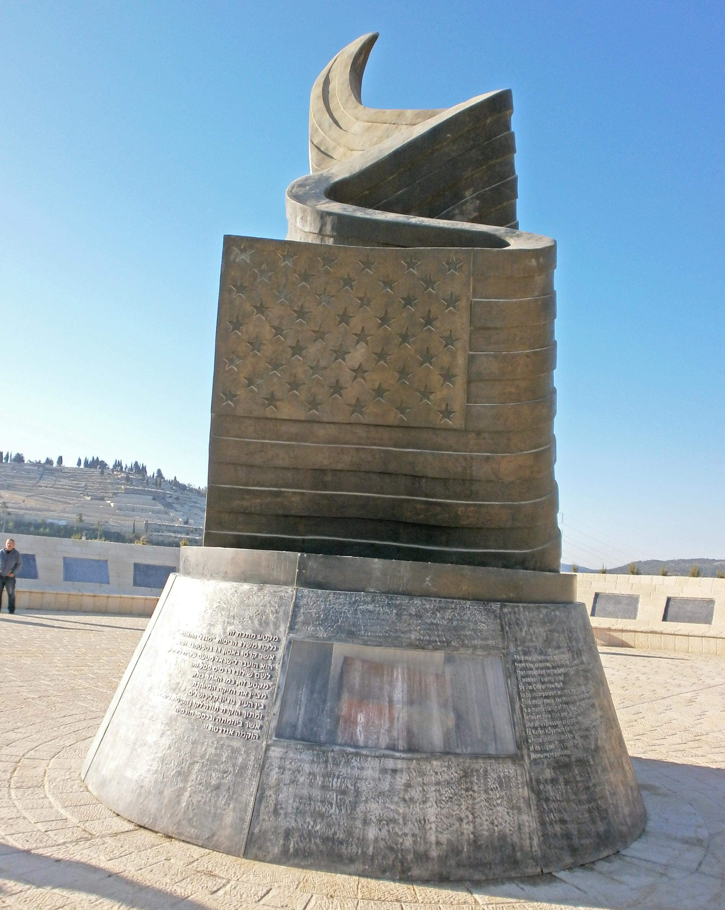
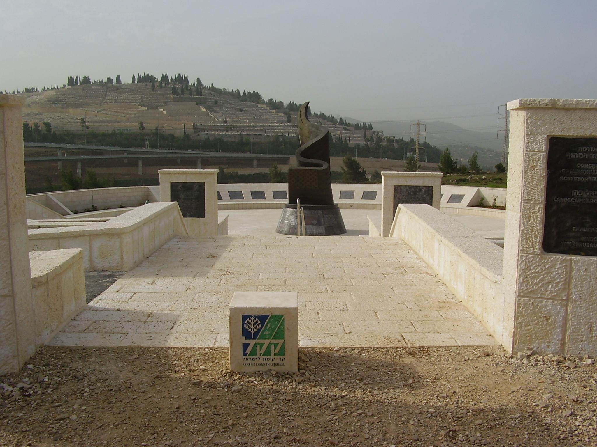

## Claim
Claim: " This image shows Israel's 9/11 memorial which is the only one outside the US."

## Actions
```
web_search("Israel 9/11 memorial")
```

## Evidence
### Evidence from `web_search`
The 9/11 Living Memorial Plaza in Jerusalem, Israel, is described in the search results. The memorial, designed by Eliezer Weishoff, includes a 30-foot high bronze sculpture of a waving American flag transforming into a flame, resting on a granite base, and a metal remnant from the Twin Towers. The memorial was dedicated on November 12, 2009, and commemorates the victims of the September 11 attacks, including five Israelis.

The memorial is located in Jerusalem Park and includes memorial plaques. The cenotaph is made of granite, bronze, and aluminum. The sources are from Wikipedia ([https://en.wikipedia.org/wiki/9/11_Living_Memorial_Plaza](https://en.wikipedia.org/wiki/9/11_Living_Memorial_Plaza)), Memorial Mapping ([http://www.memorialmapping.com/memorials/9-11-living-memorial-plaza](http://www.memorialmapping.com/memorials/9-11-living-memorial-plaza)), and KKL-JNF ([https://www.kkl-jnf.org/tourism-and-recreation/scenic-lookouts/center/twin-towers-living-memorial-jerusalem-park.aspx](https://www.kkl-jnf.org/tourism-and-recreation/scenic-lookouts/center/twin-towers-living-memorial-jerusalem-park.aspx)).       


## Elaboration
The evidence confirms that the image depicts the 9/11 Living Memorial Plaza in Jerusalem, Israel. The memorial includes a sculpture and a remnant from the Twin Towers. The evidence does not explicitly state whether this is the only 9/11 memorial outside the US.

To fully verify the claim, it would be necessary to search for other 9/11 memorials located outside of the United States.


## Actions
```
web_search("9/11 memorials outside US")
```

## Evidence
### Evidence from `web_search`
The search results indicate that there are multiple 9/11 memorials outside the US. Memorial Mapping lists several countries with 9/11 memorials, including Israel, which has 12. ([http://www.memorialmapping.com/memorials/browse-by-country](http://www.memorialmapping.com/memorials/browse-by-country)). Wikipedia and Architectural Digest also mention the 9/11 Living Memorial Plaza in Jerusalem, Israel, along with other memorials in various locations, but do not state that it is the only one outside the US. ([https://en.wikipedia.org/wiki/Memorials_and_services_for_the_September_11_attacks](https://en.wikipedia.org/wiki/Memorials_and_services_for_the_September_11_attacks), [https://www.architecturaldigest.com/gallery/september-11-memorials-slideshow](https://www.architecturaldigest.com/gallery/september-11-memorials-slideshow)). 

## Elaboration
The evidence contradicts the claim. The search results show that there are multiple 9/11 memorials outside the US, including several in Israel.


## Final Judgement
The image does show the 9/11 Living Memorial Plaza in Jerusalem, Israel. However, the claim that it is the only 9/11 memorial outside the US is false, as there are multiple such memorials in various countries. `false`

### Verdict: FALSE

### Justification
The claim is false. While the image depicts the 9/11 Living Memorial Plaza in Jerusalem, Israel, the assertion that it is the only 9/11 memorial outside the US is incorrect. Multiple sources, including [Memorial Mapping](http://www.memorialmapping.com/memorials/browse-by-country), confirm the existence of other 9/11 memorials outside the United States.
