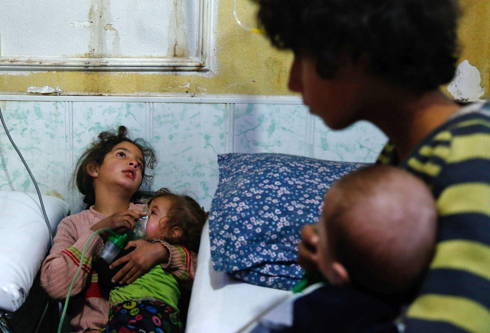

## Claim
Claim: " This image shows a Palestinian girl in the Gaza war in July 2024. She was holding her sister's oxygen mask inside the ambulance. She had already passed away, yet her hand remained on the mask firmly."

## Actions
```
reverse_search()
```

## Evidence
### Evidence from `reverse_search`
The image in the claim appears in a VOA News article from January 24, 2018, titled "Syria, Russia Accuse US of Lying About Chemical Weapons Attacks" ([https://www.voanews.com/a/syria-russia-us-chemical-attacks/4221637.html](https://www.voanews.com/a/syria-russia-us-chemical-attacks/4221637.html)). The image shows a Syrian girl holding an oxygen mask over the face of an infant at a makeshift hospital following a reported gas attack in Douma, Syria, on January 22, 2018. 

The image is also found in a report by the Center for Strategic and International Studies (CSIS) ([https://www.csis.org/analysis/emerging-trends-chemical-weapons-usage-middle-east](https://www.csis.org/analysis/emerging-trends-chemical-weapons-usage-middle-east)) discussing emerging trends in chemical weapons usage in the Middle East. 


## Elaboration
The image in the claim is not from the Gaza war in July 2024. The evidence indicates that the image is from a VOA News article from January 24, 2018, and shows a Syrian girl holding an oxygen mask over an infant's face following a reported gas attack in Douma, Syria, on January 22, 2018. The image is also found in a report by the Center for Strategic and International Studies (CSIS).


## Final Judgement
The image is from 2018 and depicts a Syrian girl, not a Palestinian girl in the Gaza war in July 2024. The context of the image is misrepresented.

`false`

### Verdict: FALSE

### Justification
The image in the claim is from a VOA News article ([https://www.voanews.com/a/syria-russia-us-chemical-attacks/4221637.html](https://www.voanews.com/a/syria-russia-us-chemical-attacks/4221637.html)) from January 2018 and shows a Syrian girl, not a Palestinian girl in the Gaza war in July 2024. The image's context is misrepresented.
