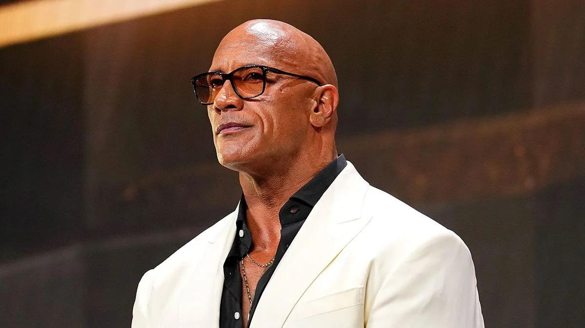
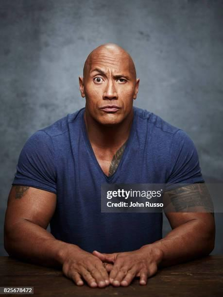
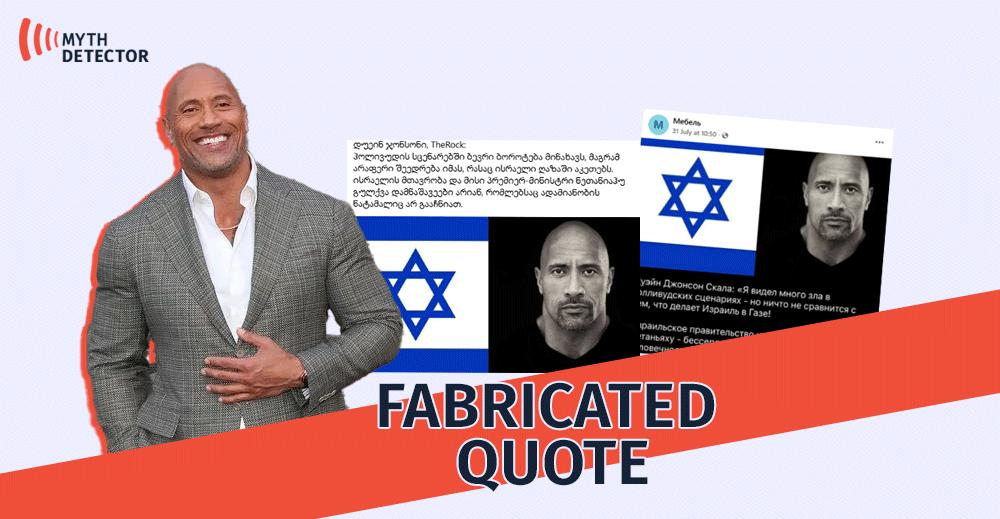

## Claim
Claim: " This is an authentic image of Dwayne Johnson waring the Israeli flag in support of Israel."

## Actions
```
reverse_search()
web_search("Dwayne Johnson Israel support")
```

## Evidence
### Evidence from `web_search`
Dwayne "The Rock" Johnson has expressed his views on the Israel-Palestine conflict, condemning terrorism and expressing sympathy for innocent lives lost in the conflict, as reported by [Shop Israel](https://shopisrael.com/blogs/support/does-dwayne-johnson-support-israel?srsltid=AfmBOopy4n2f7lxTWWqdiE6_xSd1XeW0AbQOVlP76nNPJQ6KrktIHL3X). [Marca.com](https://www.marca.com/en/lifestyle/world-news/2023/10/11/6526c4cc22601d2d748b45da.html) mentions Johnson's Instagram post where he expressed his heartbreak and outrage at the events. [Variety](https://variety.com/2023/film/news/hollywood-stars-support-israel-palestine-conflict-1235749537/) reports that Johnson is among the Hollywood stars who have shown support for Israel.

The image of Dwayne Johnson wearing the Israeli flag () is mentioned in the Shop Israel article.


## Elaboration
The evidence confirms that Dwayne Johnson has expressed support for Israel. The image in the claim is mentioned in the Shop Israel article. However, the evidence does not explicitly state whether the image is authentic.

To verify the claim's authenticity, further investigation is needed to confirm if the image is genuine or digitally altered.


## Actions
```
image_search("Dwayne Johnson Israeli flag image authenticity")
```

## Evidence
### Evidence from `image_search`
The Yahoo News article fact-checks a fake image of Dwayne Johnson (). Getty Images provides a portrait of Dwayne Johnson (). Myth Detector states that the image of Dwayne Johnson with the Israeli flag is a fabricated quote ().


## Elaboration
The image search results indicate that the image of Dwayne Johnson with the Israeli flag is fabricated. Therefore, the claim is false.


## Final Judgement
The evidence shows that Dwayne Johnson has expressed support for Israel. However, the image of Dwayne Johnson wearing the Israeli flag is a fabricated image. Therefore, the claim that the image is authentic is false. `false`

### Verdict: FALSE

### Justification
The claim is false. While Dwayne Johnson has expressed support for Israel, the image of him wearing the Israeli flag is fabricated, as confirmed by a [Myth Detector](https://www.mythdetector.ge/en/article/dveyn-dzhonson-izrail-flag-foto-fejk) fact-check.
