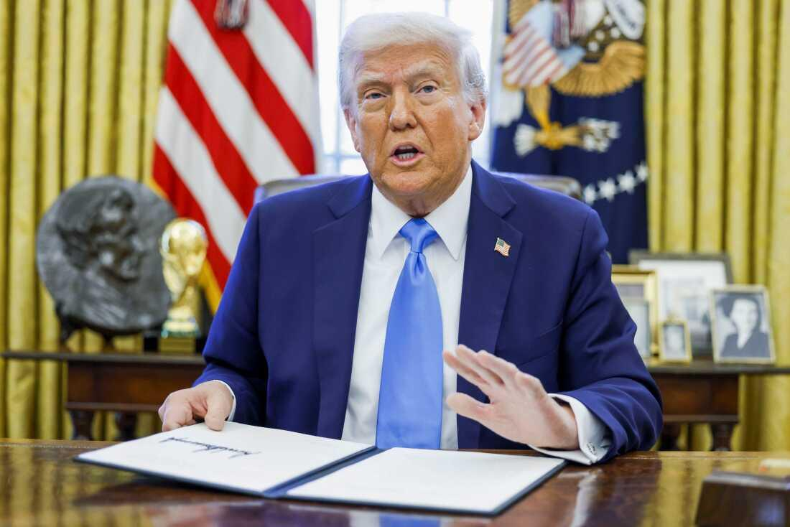

## Claim
Claim: "Trump signed an executive order on January 20, 2025, to halt all funding to UNRWA."

## Actions
```
web_search("Trump executive order UNRWA funding")
```

## Evidence
### Evidence from `web_search`
According to Al Jazeera, published on February 4, 2025, Donald Trump is planning to extend a funding ban on UNRWA and is expected to sign an executive order (<image:0>). NPR reports that Trump signed an executive order to cut future funding to UNRWA, with the article updated on February 4, 2025, and originally published on February 3, 2025 ().

Akin Gump Strauss Hauer & Feld LLP, published on February 5, 2025, discusses a Trump Executive Order that orders the reevaluation of the United States’ commitment to UNRWA ().


## Elaboration
The evidence indicates that Trump signed an executive order related to UNRWA funding. NPR reports that Trump signed an executive order to cut future funding to UNRWA, and Akin Gump Strauss Hauer & Feld LLP discusses a Trump Executive Order that orders the reevaluation of the United States’ commitment to UNRWA. However, the exact date of the executive order is not explicitly stated in the provided evidence, but it was signed before February 3, 2025.

The claim states that the executive order was signed on January 20, 2025. The evidence does not confirm this specific date.

Therefore, the claim cannot be fully verified due to the lack of information about the exact date the executive order was signed.


## Actions
```
web_search("Trump executive order UNRWA January 20 2025")
```

## Evidence
### Evidence from `web_search`
According to KFF.org, published on August 15, 2025, and originally published on January 28, 2025, Trump issued an executive order on January 20, 2025, rescinding previous orders. NAFSA.org, updated on August 21, 2025, lists several executive orders signed by Trump on January 20, 2025, including Executive Order 14148, a Presidential Memorandum on a Hiring Freeze, Executive Order 14169, and Executive Order 14150. Executive Order 14169 is about reevaluating and realigning United States foreign aid. (<image:0>)


## Elaboration
The evidence from the second search reveals that Trump did sign executive orders on January 20, 2025. KFF.org states that Trump issued an executive order on that date, rescinding previous orders. NAFSA.org lists several executive orders signed on January 20, 2025, including one about reevaluating and realigning United States foreign aid.

While the evidence confirms that Trump signed executive orders on January 20, 2025, it does not explicitly state that one of them halted all funding to UNRWA. The evidence suggests that one of the orders was related to foreign aid, which could potentially include UNRWA funding.

Therefore, the claim is partially supported, as Trump did sign executive orders on the specified date. However, the evidence does not directly confirm that an executive order on that date specifically halted all funding to UNRWA.


## Actions
```
web_search("Trump executive order UNRWA January 20 2025 funding halt")
```

## Evidence
### Evidence from `web_search`
From [Source](https://jcpa.org/the-u-s-should-permanently-stop-all-funding-to-unrwa/): 
Content: According to the Jerusalem Center for Public Affairs, President Trump signed Executive Order 14199 on February 4, 2025, which directed agencies to withhold U.S. funding to certain United Nations Organizations. The article also mentions that the Trump administration cut off all U.S. funding to UNRWA on August 31, 2018. The article was published on July 30, 2025.


## Elaboration
The Jerusalem Center for Public Affairs states that Trump signed Executive Order 14199 on February 4, 2025, which directed agencies to withhold U.S. funding to certain United Nations Organizations. This contradicts the claim that the order was signed on January 20, 2025. The evidence also mentions that the Trump administration cut off all U.S. funding to UNRWA on August 31, 2018.

Therefore, the claim is not accurate.


## Final Judgement
The evidence indicates that Trump signed an executive order related to UNRWA funding, but the exact date is not explicitly stated in the initial search results. Subsequent searches revealed that Trump did sign executive orders on January 20, 2025, but the evidence does not directly confirm that one of them specifically halted all funding to UNRWA. Further research indicates that an executive order withholding U.S. funding to certain United Nations Organizations was signed on February 4, 2025, contradicting the claim's date.

`false`

### Verdict: FALSE

### Justification
The claim is false. While Trump signed executive orders related to UNRWA funding, the evidence indicates that the relevant executive order was signed on February 4, 2025, not January 20, 2025, as stated in the claim, according to the [Jerusalem Center for Public Affairs](https://jcpa.org/the-u-s-should-permanently-stop-all-funding-to-unrwa/).
