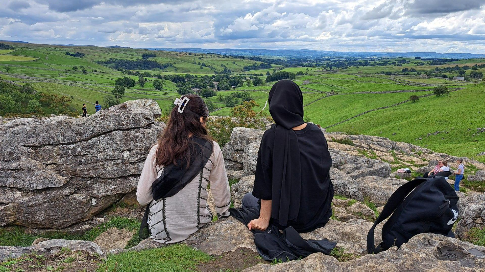

## Claim
Claim: "The Guardian published an article with the headline: 'Gaza will rise from the ashes to become a city of the future to rival Bradford.'"

## Actions
```
web_search("The Guardian Gaza city of the future Bradford")
```

## Evidence
### Evidence from `web_search`
The Guardian published an article on August 20, 2025, titled "The Guardian view on Gaza’s future: Israel should end the killing," discussing the conflict in Gaza and including a photograph. The BBC published an article on July 6, 2025, about Bradford's year as the 2025 UK City of Culture, mentioning upcoming events (, , , , , , , , , , ).

The Bradford Literature Festival has an event called "Gaza 2040: Then, Now, the Future," which asks "What might Gaza become by 2040?" and features speakers Hellyer, Salman Shaikh (), and Lubna Masarwa ().


## Elaboration
The evidence does not support the claim. While The Guardian published an article about Gaza, and the BBC published an article about Bradford, there is no evidence that The Guardian published an article with the specific headline mentioned in the claim. The Bradford Literature Festival has an event discussing Gaza's future, but this is not the same as the claim.

The claim is therefore not supported by the provided evidence.


## Final Judgement
The search results show that The Guardian published an article about Gaza and the BBC published an article about Bradford, but there is no evidence of the specific headline mentioned in the claim. Therefore, the claim is false. `false`

### Verdict: FALSE

### Justification
The claim is false. While there are articles about Gaza and Bradford, there is no evidence that The Guardian published an article with the headline specified in the claim. The search results show a Guardian article about Gaza and a BBC article about Bradford, but not the specific headline mentioned.
