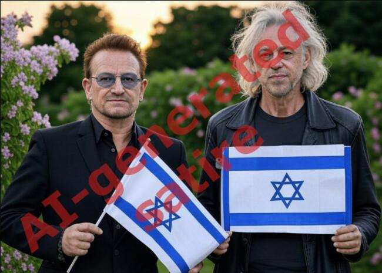

## Claim
Claim: " This is an authentic image of Bono and Bob Geldof holding the Israeli flag outside the Israeli embassy in Dublin."

## Actions
```
web_search("Bono Bob Geldof Israeli Embassy Dublin")
```

## Evidence
### Evidence from `web_search`
The image of Bono and Bob Geldof holding Israeli flags is AI-generated, according to fact-check articles published by The Journal ([https://www.thejournal.ie/ai-generated-photo-of-bono-and-bob-geldof-with-israeli-flags-is-it-real-6577454-Dec2024/](https://www.thejournal.ie/ai-generated-photo-of-bono-and-bob-geldof-with-israeli-flags-is-it-real-6577454-Dec2024/)), AOL ([https://www.aol.com/fact-check-image-bono-holding-173242187.html](https://www.aol.com/fact-check-image-bono-holding-173242187.html)), and ABP Live ([https://news.abplive.com/fact-check/fact-check-irish-rockstars-bono-bob-geldof-israel-flag-ai-1739811](https://news.abplive.com/fact-check/fact-check-irish-rockstars-bono-bob-geldof-israel-flag-ai-1739811)). The image was first shared by a satirical social media account. There is no evidence of the supposed vigil. , , , , , , , 


## Elaboration
The claim is false. The image of Bono and Bob Geldof holding Israeli flags is AI-generated, according to fact-check articles from The Journal ([https://www.thejournal.ie/ai-generated-photo-of-bono-and-bob-geldof-with-israeli-flags-is-it-real-6577454-Dec2024/](https://www.thejournal.ie/ai-generated-photo-of-bono-and-bob-geldof-with-israeli-flags-is-it-real-6577454-Dec2024/)), AOL ([https://www.aol.com/fact-check-image-bono-holding-173242187.html](https://www.aol.com/fact-check-image-bono-holding-173242187.html)), and ABP Live ([https://news.abplive.com/fact-check/fact-check-irish-rockstars-bono-bob-geldof-israel-flag-ai-1739811](https://news.abplive.com/fact-check/fact-check-irish-rockstars-bono-bob-geldof-israel-flag-ai-1739811)).


## Final Judgement
The claim that the image is authentic is false. Multiple fact-checking sources confirm that the image of Bono and Bob Geldof holding Israeli flags is AI-generated.

`false`

### Verdict: FALSE

### Justification
The image of Bono and Bob Geldof holding Israeli flags is AI-generated, as confirmed by fact-checks from The Journal ([https://www.thejournal.ie/ai-generated-photo-of-bono-and-bob-geldof-with-israeli-flags-is-it-real-6577454-Dec2024/](https://www.thejournal.ie/ai-generated-photo-of-bono-and-bob-geldof-with-israeli-flags-is-it-real-6577454-Dec2024/)), AOL ([https://www.aol.com/fact-check-image-bono-holding-173242187.html](https://www.aol.com/fact-check-image-bono-holding-173242187.html)), and ABP Live ([https://news.abplive.com/fact-check/fact-check-irish-rockstars-bono-bob-geldof-israel-flag-ai-1739811](https://news.abplive.com/fact-check/fact-check-irish-rockstars-bono-bob-geldof-israel-flag-ai-1739811)).
