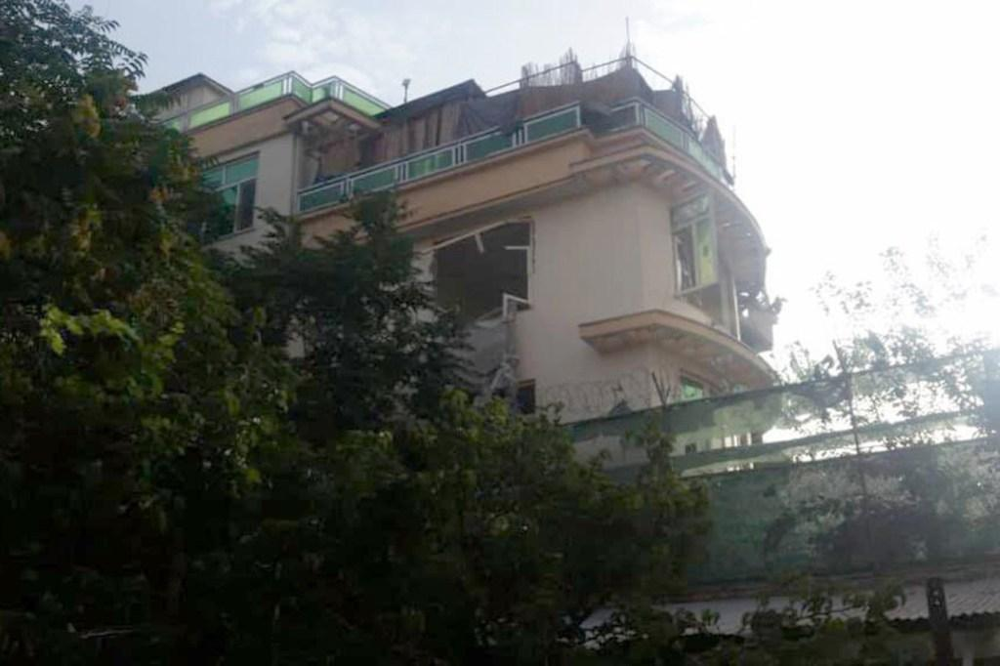
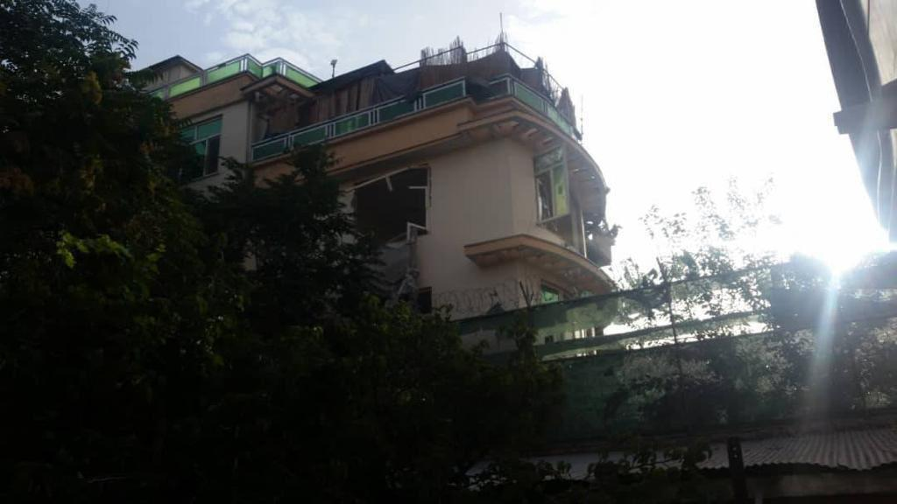

## Claim
Claim: " This image shows the assassination of Hamas leader Ismail Haniyeh on July 31st, 2024. This is how a precision strike looks like: a single missile through the window, and only Haniyeh and his bodyguard are dead. Nobody else in the building is even injured."

## Actions
```
geolocate()
reverse_search()
web_search("Ismail Haniyeh assassination July 31 2024")
image_search("Ismail Haniyeh building strike")
```

## Evidence
### Evidence from `geolocate`
The most likely countries where the image was taken are: {'Cambodia': 0.35, 'Pakistan': 0.1, 'Bangladesh': 0.07, 'Ghana': 0.07, 'Bhutan': 0.06, 'China': 0.05, 'Sri Lanka': 0.04, 'Albania': 0.03, 'Kyrgyzstan': 0.02, 'Laos': 0.02}

### Evidence from `reverse_search`
The image in the claim is associated with the assassination of al-Qaeda leader Ayman al-Zawahiri in Kabul, Afghanistan, on July 31, 2022, as reported by multiple sources. The New York Post ([https://nypost.com/2022/08/01/biden-to-speak-after-us-takes-out-al-qaeda-target-in-afghanistan/](https://nypost.com/2022/08/01/biden-to-speak-after-us-takes-out-al-qaeda-target-in-afghanistan/)), ISWNews ([https://english.iswnews.com/24517/ayman-al-zawahiri-the-leader-of-al-qaeda-was-killed-what-will-be-the-possible-consequences-of-this-assassination/](https://english.iswnews.com/24517/ayman-al-zawahiri-the-leader-of-al-qaeda-was-killed-what-will-be-the-possible-consequences-of-this-assassination/)), and News18.com ([https://www.news18.com/news/world/al-zawahiri-liked-sitting-outside-on-his-balcony-the-cia-watched-for-months-before-killing-him-5671915.html](https://www.news18.com/news/world/al-zawahiri-liked-sitting-outside-on-his-balcony-the-cia-watched-for-months-before-killing-him-5671915.html)) all feature the image and discuss the event.

The US military carried out the strike using Hellfire missiles. The CIA monitored al-Zawahiri for months before the strike. The image shows the building that was hit. , , , , , , and .


### Evidence from `web_search`
The web sources discuss the assassination of Hamas leader Ismail Haniyeh in Tehran, Iran, on July 31, 2024 (). The assassination is reported by Wikipedia ([https://en.wikipedia.org/wiki/Assassination_of_Ismail_Haniyeh](https://en.wikipedia.org/wiki/Assassination_of_Ismail_Haniyeh)), CSIS ([https://www.csis.org/analysis/ismail-haniyehs-assassination-escalation-or-ramp](https://www.csis.org/analysis/ismail-haniyehs-assassination-escalation-or-ramp)), and CNN ([https://www.cnn.com/world/live-news/hamas-political-leader-haniyeh-killed-iran-07-31-24](https://www.cnn.com/world/live-news/hamas-political-leader-haniyeh-killed-iran-07-31-24)). The cause of death is under investigation, with reports varying from a missile strike to an explosion. The CSIS article mentions that Haniyeh was killed by an explosion in his guesthouse. The CNN article states that Israel has neither confirmed nor denied being behind the assassination.


### Evidence from `image_search`
CNN reports on an explosion in a building in Iran ([https://www.cnn.com/2024/08/01/middleeast/ismail-haniyeh-iran-explosion-bomb-planted-intl](https://www.cnn.com/2024/08/01/middleeast/ismail-haniyeh-iran-explosion-bomb-planted-intl)) . Axios published an article about the assassination of Hamas leader Ismail Haniyeh ([https://www.axios.com/2024/07/31/us-hamas-leader-assassination-gaza-hostage-ceasefire-deal](https://www.axios.com/2024/07/31/us-hamas-leader-assassination-gaza-hostage-ceasefire-deal)) .


## Elaboration
The claim is demonstrably false. The image provided in the claim is associated with the assassination of al-Qaeda leader Ayman al-Zawahiri in Kabul, Afghanistan, on July 31, 2022, not the assassination of Ismail Haniyeh. The evidence indicates that the image depicts the aftermath of a US drone strike using Hellfire missiles. The claim also incorrectly states the date and location of the event.


## Final Judgement
The image in the claim is associated with the assassination of Ayman al-Zawahiri in Kabul, Afghanistan, on July 31, 2022, not the assassination of Ismail Haniyeh. The claim misrepresents the event, date, and location. `false`

### Verdict: FALSE

### Justification
The image in the claim is of a building struck in Kabul, Afghanistan, during the assassination of al-Qaeda leader Ayman al-Zawahiri on July 31, 2022, as reported by the New York Post ([https://nypost.com/2022/08/01/biden-to-speak-after-us-takes-out-al-qaeda-target-in-afghanistan/](https://nypost.com/2022/08/01/biden-to-speak-after-us-takes-out-al-qaeda-target-in-afghanistan/)), ISWNews ([https://english.iswnews.com/24517/ayman-al-zawahiri-the-leader-of-al-qaeda-was-killed-what-will-be-the-possible-consequences-of-this-assassination/](https://english.iswnews.com/24517/ayman-al-zawahiri-the-leader-of-al-qaeda-was-killed-what-will-be-the-possible-consequences-of-this-assassination/)), and News18.com ([https://www.news18.com/news/world/al-zawahiri-liked-sitting-outside-on-his-balcony-the-cia-watched-for-months-before-killing-him-5671915.html](https://www.news18.com/news/world/al-zawahiri-liked-sitting-outside-on-his-balcony-the-cia-watched-for-months-before-killing-him-5671915.html)). The claim is therefore false.
