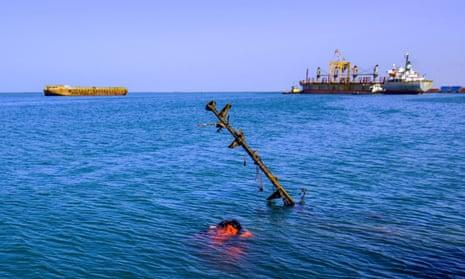

## Claim
Claim: " This image shows the U.S. bombarding Yemen on December 22, 2024 in reprisal after Yemen launched an attack on Israel's capital."

## Actions
```
geolocate()
web_search("U.S. bombing Yemen December 22, 2024")
reverse_search()
```

## Evidence
### Evidence from `geolocate`
The most likely countries where the image was taken are: {'Palestine': 0.55, 'Israel': 0.3, 'United Arab Emirates': 0.1, 'Jordan': 0.02, 'Albania': 0.0, 'Andorra': 0.0, 'Argentina': 0.0, 'Australia': 0.0, 'Austria': 0.0, 'Bangladesh': 0.0}

### Evidence from `web_search`
The Guardian reported on December 22, 2024, that the U.S. launched airstrikes against Houthi targets in Yemen in response to Houthi attacks against U.S. navy warships and merchant vessels. The article also mentions that Israel launched strikes against ports and energy infrastructure in Houthi-held parts of Yemen. ()

Al Jazeera reported on December 22, 2024, that two U.S. Navy pilots were shot down over the Red Sea in a "friendly fire" incident. The article also mentions that Yemen's Houthi fighters claimed to have targeted the aircraft carrier USS Harry S Truman and hit Tel Aviv, Israel, with a missile. The U.S. conducted strikes against Houthi targets in Yemen's capital. () Reuters reported that the U.S. military conducted an airstrike on December 16, 2024, against a Houthi command and control facility in Yemen. ()

*   [https://www.theguardian.com/world/2024/dec/22/us-launches-airstrikes-against-houthi-targets-in-yemen](https://www.theguardian.com/world/2024/dec/22/us-launches-airstrikes-against-houthi-targets-in-yemen)
*   [https://www.aljazeera.com/news/2024/12/22/us-army-says-two-navy-pilots-shot-down-over-red-sea-in-friendly-fire](https://www.aljazeera.com/news/2024/12/22/us-army-says-two-navy-pilots-shot-down-over-red-sea-in-friendly-fire)
*   [https://www.reuters.com/world/us-airstrike-hits-houthi-command-control-facility-yemen-2024-12-16/](https://www.reuters.com/world/us-airstrike-hits-houthi-command-control-facility-yemen-2024-12-16/)


### Evidence from `reverse_search`
The image 

## Elaboration
The evidence suggests that the image is likely from Palestine or Israel. The web search results confirm that the U.S. conducted airstrikes against Houthi targets in Yemen on December 22, 2024. However, the claim states that the U.S. was bombarding Yemen in reprisal after Yemen launched an attack on Israel's capital. The Al Jazeera article mentions that Yemen's Houthi fighters claimed to have targeted Tel Aviv, Israel, with a missile.

The claim is partially supported by the evidence, as the U.S. did conduct airstrikes in Yemen on the specified date. However, the evidence does not explicitly state that the U.S. strikes were in direct reprisal for an attack on Israel's capital.


## Final Judgement
The image is likely from Palestine or Israel. The U.S. did conduct airstrikes against Houthi targets in Yemen on December 22, 2024. However, the claim's assertion that the U.S. strikes were in direct reprisal for an attack on Israel's capital is not explicitly supported by the evidence.

`false`

### Verdict: FALSE

### Justification
The image is likely from Palestine or Israel. While the U.S. did conduct airstrikes in Yemen on December 22, 2024, as reported by [The Guardian](https://www.theguardian.com/world/2024/dec/22/us-launches-airstrikes-against-houthi-targets-in-yemen) and [Al Jazeera](https://www.aljazeera.com/news/2024/12/22/us-army-says-two-navy-pilots-shot-down-over-red-sea-in-friendly-fire), the claim that these strikes were a direct reprisal for an attack on Israel's capital is not explicitly supported by the provided evidence.
