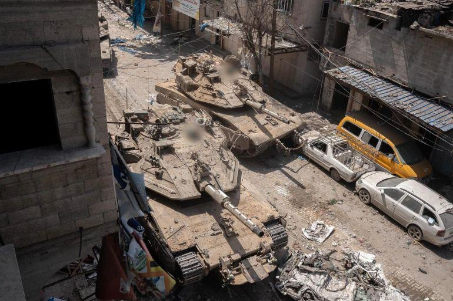
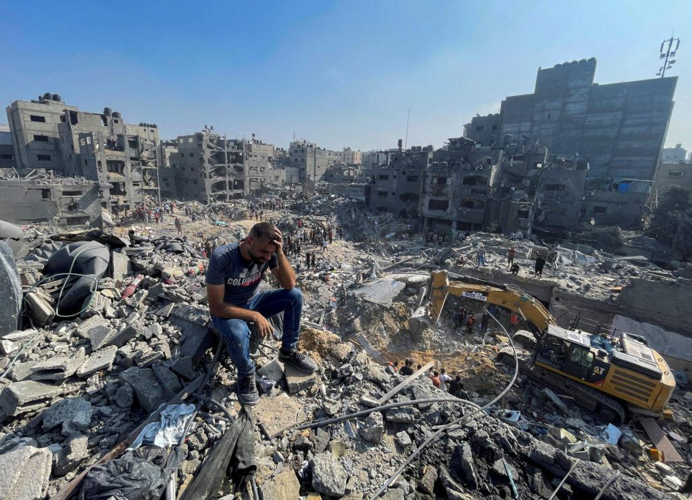
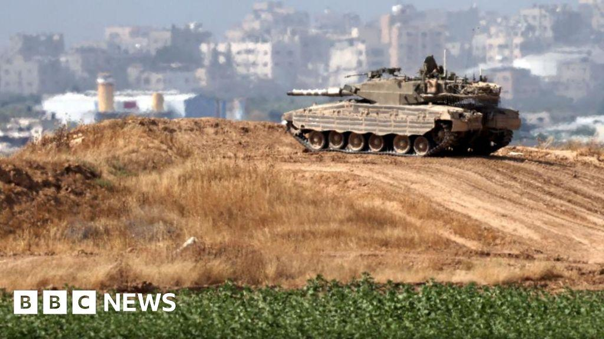

## Claim
Claim: " This image shows an Israeli tank unit near Jabalia camp in northern Gaza that was successfully ambushed by Hamas fighters, destroying multiple vehicles and injuring or killing their crews in October 2024."

## Actions
```
web_search("Israeli tank Jabalia camp Hamas ambush October 2024")
image_search("Israeli tank destroyed Jabalia Gaza")
```

## Evidence
### Evidence from `web_search`
Al Jazeera reported on an Israeli ground offensive on Jabalia on October 6, 2024, resulting in at least 17 deaths, with tank deployment and evacuation orders (). The Palestinian Islamic Jihad targeted an Israeli command and control room in Jabalia. The Guardian discussed the destruction of the Jabaliya refugee camp in Gaza by Israeli forces, with the third offensive starting on October 5, 2024, and included satellite images and videos showing the destruction of buildings and infrastructure in the camp (, , , , , ).

Wikipedia discusses the Siege of North Gaza, which took place from October 5, 2024, to January 19, 2025, as part of the Israeli invasion of the Gaza Strip. The article mentions the involvement of Israeli forces and Hamas fighters in Jabalia, Beit Lahia, and Beit Hanoun. On October 10, Hamas organized an ambush which destroyed an IDF mechanized infantry company of 12 vehicles east of the Jabalia camp.


### Evidence from `image_search`
Al Jazeera reports on battles in northern Gaza, mentioning Palestinian fighters ambushing Israeli troops (). PBS NewsHour published an article about Israeli airstrikes in the Jabalia refugee camp in Gaza (). The BBC News website contains an image of an Israeli tank ().

The provided sources do not confirm the claim that the image shows an Israeli tank unit near Jabalia camp that was successfully ambushed by Hamas fighters in October 2024.


## Elaboration
The evidence confirms that there was an Israeli ground offensive on Jabalia in October 2024, and that Hamas fighters were active in the area. Specifically, Wikipedia mentions an ambush by Hamas on October 10, 2024, which destroyed an IDF mechanized infantry company east of the Jabalia camp. However, the evidence does not directly link the image to this specific event.

Therefore, while the claim's context is supported by the evidence, the image's specific association with the ambush cannot be verified. More information is needed to confirm the image's origin and the circumstances of the tank's destruction.


## Actions
```
reverse_search()
```

## Evidence
### Evidence from `reverse_search`
The image of the burning tank () appears in articles discussing the 2023 Hamas attacks on Israel, including a 9jaflaver.com article from October 7, 2023, and a Nairaland forum thread from the same date. Another source, dawahilallah.com, published on August 14, 2025, uses the image to illustrate an attack by Al-Qassam Brigades in Khan Yunis.


## Elaboration
The reverse image search reveals that the image of the burning tank (

## Final Judgement
The initial search confirmed that there was an Israeli ground offensive on Jabalia in October 2024, and that Hamas fighters were active in the area. However, the image's specific association with the ambush could not be verified. The reverse image search revealed that the image of the burning tank was used in articles discussing the 2023 Hamas attacks on Israel and an attack by Al-Qassam Brigades in Khan Yunis. This indicates that the image is not from October 2024, and therefore the claim is false. `false`

### Verdict: FALSE

### Justification
The claim is false. While there was an Israeli ground offensive in Jabalia in October 2024, and Hamas fighters were active in the area, a reverse image search of the provided image revealed that it was used in articles discussing the 2023 Hamas attacks on Israel and an attack by Al-Qassam Brigades in Khan Yunis, indicating the image is not from October 2024.
