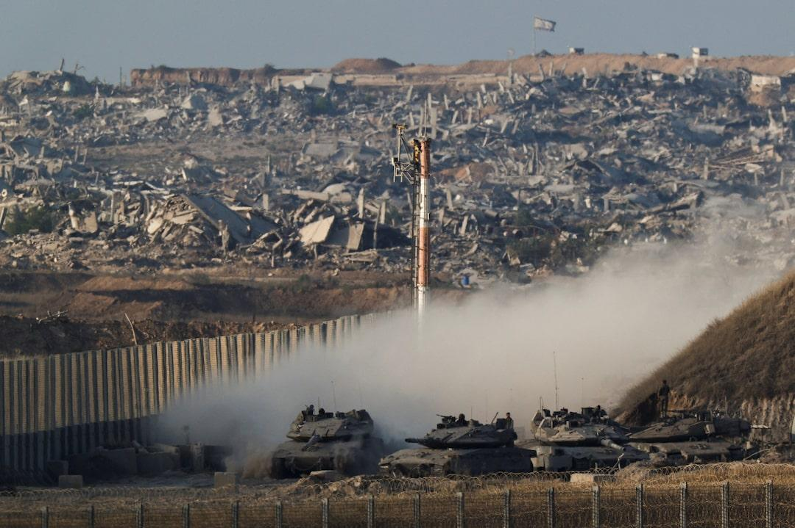
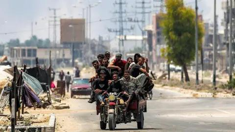
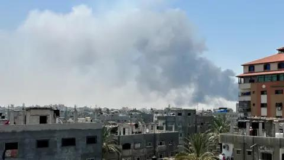

## Claim
Claim: " This image shows a Palestinian woman using an Israeli tank to dry clothes in Gaza in July 2024."

## Actions
```
geolocate()
web_search("Israeli tank Gaza")
reverse_search()
```

## Evidence
### Evidence from `geolocate`
The most likely countries where the image was taken are: {'Palestine': 0.29, 'Tunisia': 0.26, 'Jordan': 0.19, 'United Arab Emirates': 0.09, 'Israel': 0.07, 'Pakistan': 0.04, 'China': 0.01, 'Albania': 0.0, 'Andorra': 0.0, 'Argentina': 0.0}

### Evidence from `web_search`
The Reuters article from August 27, 2025, discusses Israeli tanks on the border with Gaza and an upcoming meeting chaired by U.S. President Donald Trump regarding the war in Gaza ([https://www.reuters.com/world/middle-east/israeli-tanks-close-gaza-city-trump-chair-meeting-2025-08-27/](https://www.reuters.com/world/middle-east/israeli-tanks-close-gaza-city-trump-chair-meeting-2025-08-27/)). The Wikipedia article discusses the Israeli invasion of the Gaza Strip, which began on October 28, 2023, and mentions the use of tanks and armored vehicles ([https://en.wikipedia.org/wiki/Israeli_invasion_of_the_Gaza_Strip](https://en.wikipedia.org/wiki/Israeli_invasion_of_the_Gaza_Strip)). The BBC article from July 21, 2025, reports on Israeli tanks advancing into Deir al-Balah in central Gaza ([https://www.bbc.com/news/articles/c2d060xy331o](https://www.bbc.com/news/articles/c2d060xy331o)).

The BBC article and the Reuters article include images of the conflict, but neither mentions the image of the tank with clothes drying on it (, , ). The Wikipedia article does not mention the image either.


### Evidence from `reverse_search`
From [Source](https://nabd.com/s/126364693-2572c9/%D8%A8%D8%B9%D8%AF-%D9%81%D9%8A%D8%AF%D9%8A%D9%88%D9%87%D8%A7%D8%AA-%D8%A7%D8%AD%D8%AA%D8%B1%D8%A7%D9%82%D9%87%D8%A7..-%D9%83%D9%8A%D9%81-%D8%AA%D9%85-%D8%AA%D8%AF%D9%85%D9%8A%D8%B1-%D9%85%D9%8A%D8%B1%D9%83%D8%A7%D9%81%D8%A7-%D8%A7%D9%84%D8%A5%D8%B3%D8%B1%D8%A7%D8%A6%D9%8A%D9%84%D9%8A%D8%A9%D8%9F): Found exact image on website with title: بعد فيديوهات احتراقها.. كيف تم تدمير "ميركافا" الإسرائيلية؟
Content: The search result is from Sky News Arabia, published on October 11, 2023. It discusses the destruction of the Israeli Merkava tank. The article includes an image of the tank. 


## Elaboration
The image is likely taken in Palestine, according to the geolocation analysis. The reverse image search indicates that the image was published on October 11, 2023, by Sky News Arabia, which discusses the destruction of an Israeli Merkava tank. The claim states the image was taken in July 2024, which is inconsistent with the reverse image search results. Therefore, the claim is likely false.


## Final Judgement
The geolocation analysis suggests the image was likely taken in Palestine. The reverse image search indicates the image was published in October 2023, discussing the destruction of an Israeli tank, which contradicts the claim's date of July 2024.

`false`

### Verdict: FALSE

### Justification
The claim is false. The image, likely taken in Palestine, was published in October 2023, as indicated by a reverse image search on Sky News Arabia, which contradicts the claim's date of July 2024.
