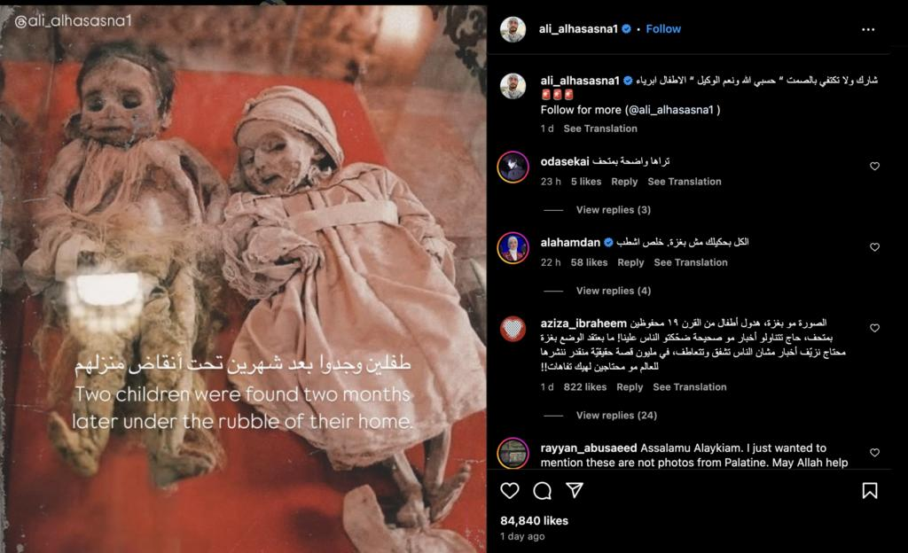

## Claim
Claim: " This image shows two children in Gaza in April 2025 found dead under the rubble of their home two months after an Israeli airstrike destroyed it."

## Actions
```
reverse_search()
web_search("children found rubble home Gaza Israeli airstrike")
```

## Evidence
### Evidence from `reverse_search`
From [Source](https://kashif.ps/en/index.php/2025/04/14/image-of-two-mummified-children-in-a-bolivian-museum-goes-viral-as-from-gaza/): Found exact image on website with title: Image of two mummified children in a Bolivian museum goes viral as ...
Content: The image in the claim shows two mummified children from a Bolivian museum, not children found in Gaza. The image was posted on Instagram and the source of the claim is ali\_alhasasna1. The image was posted on Fliker on 25/12/2006 by Tanya Knight. , , . The article was published on April 14, 2025, by Nadeen.


### Evidence from `web_search`
The PBS News article from March 20, 2025, discusses an Israeli airstrike in Khan Younis, Gaza, that killed at least 16 people, including women and children, and mentions a month-old girl pulled from the rubble (). The BBC article from December 29, 2023, reports on a baby girl found alive in Rafah after an Israeli air strike that killed her mother and sister, and mentions over 21,500 deaths, mostly children and women, during Israeli retaliatory attacks on Gaza (, , , , , , , ). Democracy Now! published an article on May 27, 2025, about an Israeli airstrike on a Palestinian pediatrician's home in Gaza, which killed nine of her ten children ().


## Elaboration
The claim is false. The image depicts mummified children from a Bolivian museum, not children found in Gaza. The image was posted on Flickr in 2006. While there have been instances of children being found in the rubble of homes in Gaza after Israeli airstrikes, as reported by PBS News and BBC, the image in the claim is not related to those events.


## Final Judgement
The image in the claim is of mummified children from a Bolivian museum, not children found in Gaza. The image has been circulating online with a false context. Therefore, the claim is not factually accurate. `false`

### Verdict: FALSE

### Justification
The image in the claim is of mummified children from a Bolivian museum, as confirmed by a reverse image search ([Source](https://kashif.ps/en/index.php/2025/04/14/image-of-two-mummified-children-in-a-bolivian-museum-goes-viral-as-)). While there have been reports of children being found in the rubble in Gaza after Israeli airstrikes, the image is unrelated to those events.
