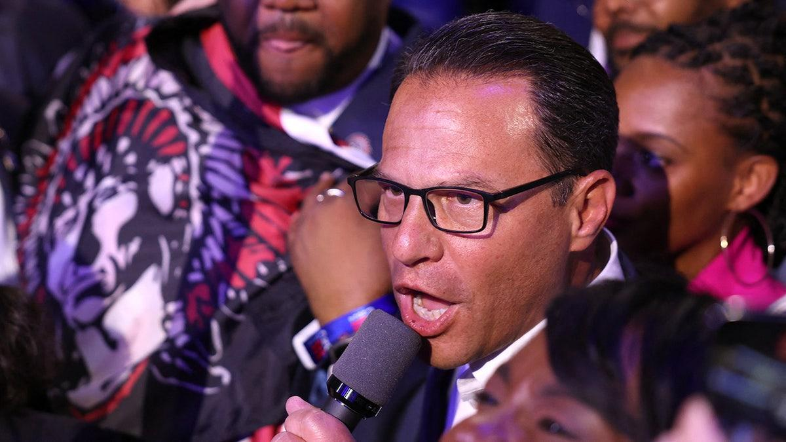
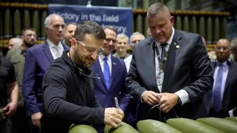

## Claim
Claim: " This image shows Ukrainian President Volodymyr Zelenskyy in March 2025 signing Israeli bombs intended for use against Palestinians in Gaza."

## Actions
```
web_search("Volodymyr Zelenskyy signing bombs")
reverse_search()
```

## Evidence
### Evidence from `web_search`
The image shows Ukrainian President Volodymyr Zelenskyy signing artillery shells. According to Eurovision News | Spotlight, a video and still images falsely claimed that Zelenskyy signed the shells for use in Gaza by Israel. The video actually shows Zelenskyy at a U.S. munitions factory supporting Ukraine's defense needs. Zelenskyy wrote "Glory to Ukraine" and "Thanks for Support" on the shells, referencing Ukraine’s war with Russia. The event took place at the Scranton Army Ammunition Plant.

Fox News reported that Zelenskyy signed a missile alongside Pennsylvania Governor Josh Shapiro. The Penn Capital-Star also reported on Zelenskyy's visit to the Scranton Army Ammunition Plant (SCAAP) in Pennsylvania, where he signed some of the shells and met with local officials. The article also mentions that Zelenskyy signed an agreement to expand cooperation between Pennsylvania and Zaporizhzhia.

Relevant URLs:
*   [https://spotlight.ebu.ch/p/video-caption-falsely-claims-zelenskyy](https://spotlight.ebu.ch/p/video-caption-falsely-claims-zelenskyy)
*   [https://www.foxnews.com/politics/josh-shapiro-blasted-signing-missile-alongside-zelenskyy-bidens-hometown-party-war](https://www.foxnews.com/politics/josh-shapiro-blasted-signing-missile-alongside-zelenskyy-bidens-hometown-party-war)
*   [https://penncapital-star.com/government-politics/shapiro-casey-meet-with-zelenskyy-at-scranton-pennsylvania-ammunitions-factory/](https://penncapital-star.com/government-politics/shapiro-casey-meet-with-zelenskyy-at-scranton-pennsylvania-ammunitions-factory/)





### Evidence from `reverse_search`
The image shows Ukrainian President Volodymyr Zelenskyy signing ammunition. The image was taken during his visit to the Scranton Army Ammunition Plant (SCAAP) on September 23, 2024.

The BBC published articles on September 26, 2024, discussing Zelenskyy's meeting with Joe Biden and his visit to the SCAAP. The AP News article, published on September 25, 2024, reports that House Speaker Mike Johnson demanded Zelenskyy remove Ukraine’s ambassador to the U.S. after Zelenskyy's visit to an ammunition plant in Pennsylvania.
The articles can be found here: [Source](https://www.bbc.co.uk/news/articles/c80rkv0k4j8o), [Source](https://www.bbc.com/news/articles/c80rkv0k4j8o), and [Source](https://apnews.com/article/zelenskyy-johnson-ambassador-ukraine-biden-harris-trump-d81b0a055d99cfd4804b3f2c00915d09).





## Elaboration
The claim is false. The image shows Volodymyr Zelenskyy signing artillery shells at the Scranton Army Ammunition Plant (SCAAP) in Pennsylvania on September 23, 2024, not in March 2025. The shells were not intended for use by Israel against Palestinians in Gaza, but for Ukraine's defense needs in the war with Russia.


## Final Judgement
The image shows Volodymyr Zelenskyy signing artillery shells at a U.S. munitions factory, not Israeli bombs. The event occurred in September 2024, not March 2025, and the shells were for Ukraine's defense, not for use against Palestinians in Gaza.

`false`

### Verdict: FALSE

### Justification
The image depicts Ukrainian President Volodymyr Zelenskyy signing artillery shells at the Scranton Army Ammunition Plant in September 2024, not Israeli bombs in March 2025. The shells were intended for Ukraine's defense against Russia, not for use against Palestinians in Gaza, as falsely claimed by the original post. See [Eurovision News | Spotlight](https://spotlight.ebu.ch/p/video-caption-falsely-claims-zelenskyy) and [AP News](https://apnews.com/article/zelenskyy-johnson-ambassador-ukraine-biden-harris-trump-d81b0a055d99cfd4804b3f2c00915d09).
