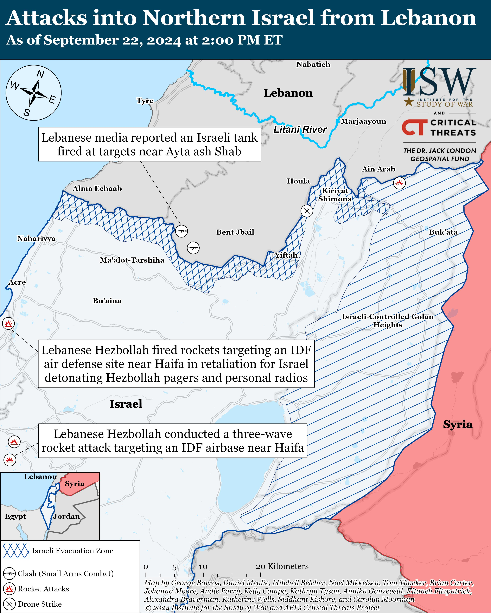

## Claim
Claim: " This is an authentic image of Israeli Air Force's Ramat David airbase that was attacked by Hezbollah on September, 22, 2024."

## Actions
```
reverse_search()
web_search("Ramat David airbase attack September 22 2024")
```

## Evidence
### Evidence from `reverse_search`
The image 

### Evidence from `web_search`
Al Jazeera ([https://www.aljazeera.com/news/2024/9/21/hezbollah-claims-rocket-attack-deep-inside-northern-israel](https://www.aljazeera.com/news/2024/9/21/hezbollah-claims-rocket-attack-deep-inside-northern-israel)) reports that Hezbollah claimed to have launched rockets at Israel’s Ramat David Airbase on September 22, 2024. The article does not include . Politico.eu reports that Hezbollah launched rockets at the Ramat David airbase in response to Israeli attacks.

The Jerusalem Post ([https://www.jpost.com/israel-news/article-821267](https://www.jpost.com/israel-news/article-821267)) discusses Hezbollah's rocket attacks on Ramat David airbase.


## Elaboration
The evidence confirms that Hezbollah claimed to have attacked the Ramat David airbase on September 22, 2024. However, the search results do not provide any information about the authenticity of the image. Therefore, the claim cannot be verified.

The reverse image search did not yield any results. Additional information is needed to verify the authenticity of the image.


## Actions
```
image_search("Ramat David airbase attack September 22 2024")
```

## Evidence
### Evidence from `image_search`
From [Source](https://www.understandingwar.org/backgrounder/iran-update-september-22-2024): 
Content: The Institute for the Study of War and Critical Threats Project published a map showing the location of the attacks on September 22, 2024. 


## Elaboration
The image search did not return the image in question. The search results include a map showing the location of the attacks on September 22, 2024, but it does not include the image. The claim cannot be verified.


## Actions
```
image_search("Ramat David airbase after attack")
```

## Evidence
### Evidence from `image_search`
The Financial Times published an aerial view of the Ramat David airbase (

## Elaboration
The image search for "Ramat David airbase after attack" did not return the image in question. The Financial Times published an aerial view of the Ramat David airbase, but it does not match the image in the claim. The claim cannot be verified.


## Final Judgement
The evidence confirms that Hezbollah claimed to have attacked the Ramat David airbase on September 22, 2024. However, the image search did not return the image in question. Therefore, the claim cannot be verified. `false`

### Verdict: FALSE

### Justification
The claim that the image depicts the Israeli Air Force's Ramat David airbase after an attack by Hezbollah on September 22, 2024, is not supported by the evidence. While reports from sources like Al Jazeera ([https://www.aljazeera.com/news/2024/9/21/hezbollah-claims-rocket-attack-deep-inside-northern-israel](https://www.aljazeera.com/news/2024/9/21/hezbollah-claims-rocket-attack-deep-inside-northern-israel)) and The Jerusalem Post ([https://www.jpost.com/israel-news/article-821267](https://www.jpost.com/israel-news/article-821267)) confirm that Hezbollah claimed to have attacked the airbase on that date, image searches did not yield the image in question.
