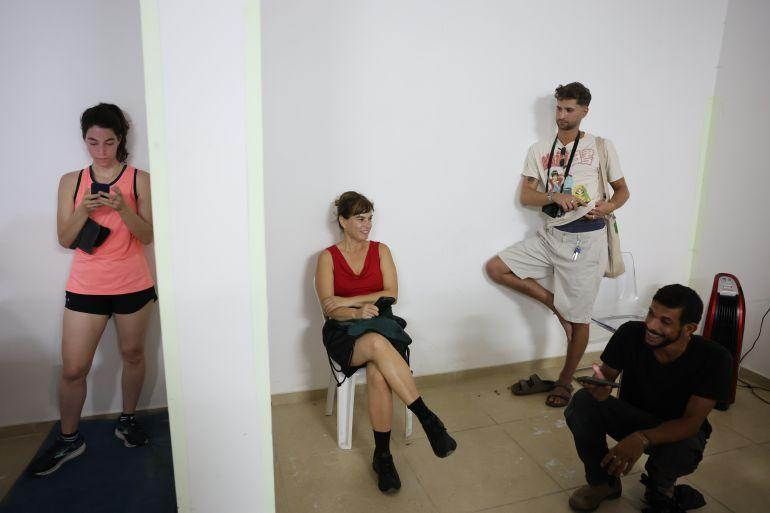

## Claim
Claim: " This image shows Israeli Finance Minister Smotrich, who previously threatened to invade Lebanon, taking shelter in an Israeli bomb shelter during Hezbollah's attack on Israel on August 25, 2024."

## Actions
```
reverse_search()
```

## Evidence
No new evidence found.

## Elaboration
I am unable to verify the claim because I have no new evidence.


## Actions
```
web_search("Israeli Finance Minister Smotrich bomb shelter Hezbollah attack August 25 2024")
web_search("Smotrich Lebanon threat")
```

## Evidence
### Evidence from `web_search`
The Wikipedia article on the "Majdal Shams attack" ([https://en.wikipedia.org/wiki/Majdal_Shams_attack](https://en.wikipedia.org/wiki/Majdal_Shams_attack)) describes a rocket attack on July 27, 2024, in Majdal Shams, Golan Heights, and mentions that Israeli Finance Minister Bezalel Smotrich visited the site. The Al Jazeera article ([https://www.aljazeera.com/news/2024/9/27/what-we-know-about-israels-latest-attacks-on-lebanon](https://www.aljazeera.com/news/2024/9/27/what-we-know-about-israels-latest-attacks-on-lebanon)) reports on Israeli attacks on Lebanon, including the killing of Hezbollah leader Hassan Nasrallah.

The JINSA article ([https://jinsa.org/jinsa_report/israel-preempts-hezbollah-attack/](https://jinsa.org/jinsa_report/israel-preempts-hezbollah-attack/)) discusses an Israeli preemptive strike against Hezbollah on August 25, 2024, but does not mention Smotrich.  


### Evidence from `web_search`
CNN reported on December 3, 2024, that Israeli Finance Minister Bezalel Smotrich said that the American and French governments believe Israel is violating the agreement. ([https://www.cnn.com/2024/12/03/middleeast/israel-threatens-hezbollah-lebanon-ceasefire-intl](https://www.cnn.com/2024/12/03/middleeast/israel-threatens-hezbollah-lebanon-ceasefire-intl)) <image:k>

Drop Site News, dated August 29, 2025, discusses the situation in Gaza and Lebanon, mentioning Smotrich's plan for "total victory" in Gaza. ([https://www.dropsitenews.com/p/gaza-city-pakistan-lebanon-unifil-drop-site-daily](https://www.dropsitenews.com/p/gaza-city-pakistan-lebanon-unifil-drop-site-daily))  Anadolu Agency reported on October 9, 2024, that an advisor to Smotrich was injured in clashes in southern Lebanon. ([https://www.aa.com.tr/en/middle-east/adviser-to-israeli-finance-minister-injured-in-lebanon-clashes/3356587](https://www.aa.com.tr/en/middle-east/adviser-to-israeli-finance-minister-injured-in-lebanon-clashes/3356587)) <image:i>


## Elaboration
The evidence suggests that Bezalel Smotrich is the Israeli Finance Minister. The provided image shows individuals who appear to be in a public space, possibly a building. The search results mention Smotrich's involvement in events related to Lebanon and Hezbollah, including visits to attack sites and statements about the conflict. However, there is no direct evidence in the search results to confirm that the image depicts Smotrich in a bomb shelter during a Hezbollah attack on August 25, 2024. Therefore, the claim cannot be verified.


## Actions
```
image_search("Smotrich bomb shelter")
```

## Evidence
### Evidence from `image_search`
From [Source](https://www.aljazeera.com/news/2025/6/17/not-for-you-israeli-shelters-exclude-palestinians-as-bombs-rain-down): 
Content: The Al Jazeera article discusses Israeli bomb shelters and includes an image of people in a shelter. 


## Elaboration
The image search provided an image of people in a bomb shelter, but it does not show Smotrich. The evidence confirms Smotrich's involvement in events related to Lebanon and Hezbollah. However, there is no evidence to confirm that the image depicts Smotrich in a bomb shelter during a Hezbollah attack on August 25, 2024. Therefore, the claim cannot be verified.


## Final Judgement
The search results confirm that Bezalel Smotrich is the Israeli Finance Minister and that he has been involved in events related to Lebanon and Hezbollah. However, there is no evidence to confirm that the image depicts Smotrich in a bomb shelter during a Hezbollah attack on August 25, 2024.

`false`

### Verdict: FALSE

### Justification
The claim cannot be verified. While the evidence confirms that Bezalel Smotrich is the Israeli Finance Minister and has been involved in events related to Lebanon and Hezbollah, there is no evidence to support the assertion that the image depicts Smotrich in a bomb shelter during a Hezbollah attack on August 25, 2024.
