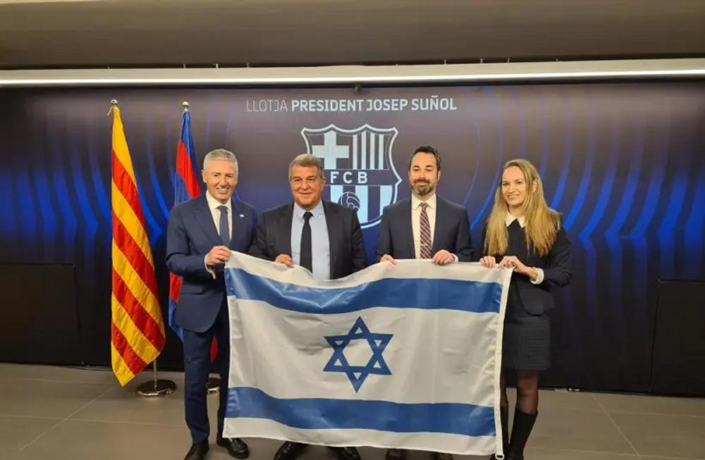

## Claim
Claim: " This image shows the President of FC Barcelona with Israel Embassy Representatives in September 2024 during the ongoing Gaza war."

## Actions
```
web_search("FC Barcelona Israel flag")
web_search("FC Barcelona President Israel Embassy")
```

## Evidence
### Evidence from `web_search`
FC Barcelona's president Joan Laporta was presented with an Israeli flag by Israeli diplomats on February 16, 2023, according to an article published by The Jerusalem Post on February 17, 2023. [<image:527630>] The New Arab published an article on September 11, 2023, discussing Barcelona's decision to reverse its decision to cut ties with Israel. []

Getty Images contains photos of FC Barcelona players visiting Israel and the West Bank in August 2013, including images of Lionel Messi, Xavi, Gerard Pique, and Neymar with Israeli Prime Minister Benjamin Netanyahu and Israeli President Shimon Peres. [, , , , , , ]

*   [https://www.jpost.com/international/article-731893](https://www.jpost.com/international/article-731893)
*   [https://www.newarab.com/analysis/why-barcelona-reversed-its-decision-cut-ties-israel](https://www.newarab.com/analysis/why-barcelona-reversed-its-decision-cut-ties-israel)
*   [https://www.gettyimages.com/photos/barcelona-visit-the-west-bank-and-israel](https://www.gettyimages.com/photos/barcelona-visit-the-west-bank-and-israel)


### Evidence from `web_search`
FC Barcelona's president, Joan Laporte, invited representatives from the Israeli Embassy in Spain to a soccer match and was presented with an Israeli flag as a sign of support for Israel, according to an i24NEWS article from February 16, 2023 ([https://www.i24news.tv/en/news/israel/diplomacy/1676623454-barcelona-soccer-team-sends-message-of-support-for-israel](https://www.i24news.tv/en/news/israel/diplomacy/1676623454-barcelona-soccer-team-sends-message-of-support-for-israel)). The Times of Israel also reported on this event ([https://www.timesofisrael.com/spanish-fm-swipes-at-barcelona-for-cutting-ties-with-israel/](https://www.timesofisrael.com/spanish-fm-swipes-at-barcelona-for-cutting-ties-with-israel/)).

The image in the claim () appears to be the same as the one in the i24NEWS article ().


## Elaboration
The evidence indicates that the image shows FC Barcelona's president, Joan Laporta, with representatives from the Israeli Embassy. This event occurred on February 16, 2023, not in September 2024. The evidence also does not confirm whether the Gaza war was ongoing at the time of the meeting.

Therefore, the claim is inaccurate regarding the date and the context of the Gaza war.


## Final Judgement
The image shows FC Barcelona's president with Israeli Embassy representatives, but the event occurred in February 2023, not September 2024. The claim also incorrectly states that the meeting occurred during the ongoing Gaza war.

`false`

### Verdict: FALSE

### Justification
The image depicts FC Barcelona's president, Joan Laporta, with Israeli Embassy representatives, but the event occurred in February 2023, as reported by the [Jerusalem Post](https://www.jpost.com/international/article-731893) and [i24NEWS](https://www.i24news.tv/en/news/israel/diplomacy/1676623454-barcelona-soccer-team-sends-message-of-support-for-israel), not in September 2024. The claim also incorrectly states that the meeting occurred during the ongoing Gaza war.
