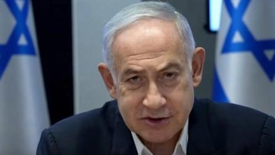

## Claim
Claim: " This image shows Israeli PM Benjamin Netanyahu inside his office and was captured and published by Hezbollah in August 2024."

## Actions
```
web_search("Benjamin Netanyahu office Hezbollah August 2024")
reverse_search()
```

## Evidence
### Evidence from `web_search`
The Times of Israel published an article in August 2025 discussing Israel's readiness to support Lebanon in disarming Hezbollah, mentioning a ceasefire deal from November 2024 and a recent drone strike by Israel on a Hezbollah operative. The article includes images of Hezbollah supporters and US envoy Tom Barrack. ([https://www.timesofisrael.com/netanyahu-says-israel-is-ready-to-support-lebanon-in-disarming-hezbollah/](https://www.timesofisrael.com/netanyahu-says-israel-is-ready-to-support-lebanon-in-disarming-hezbollah/)) , 

The Guardian published an article on August 25, 2024, discussing the exchange of fire between Israel and Hezbollah, including a video of Benjamin Netanyahu, who stated that the attacks on Hezbollah in Lebanon were "not the end of the story." The article also mentions that the IDF used 100 jet fighters that hit more than 40 target sites inside Lebanon. ([https://www.theguardian.com/world/article/2024/aug/25/netanyahu-says-attacks-on-hezbollah-in-lebanon-not-the-end-of-the-story](https://www.theguardian.com/world/article/2024/aug/25/netanyahu-says-attacks-on-hezbollah-in-lebanon-not-the-end-of-the-story)) , ,  The Washington Jewish Week published an article on August 29, 2025, discussing the conflict between Israel and Hezbollah, mentioning that by August 2024, Hezbollah had fired over 8,000 rockets and 200 UAVs into Israel, and also discusses the role of Benjamin Netanyahu in the conflict.


### Evidence from `reverse_search`
From [Source](https://pesacheck.org/altered-this-photo-of-a-drone-surveilling-pm-netanyahu-is-fabricated-396f43e817da): Found exact image on website with title: ALTERED: This photo of a drone surveilling PM Netanyahu is ...
Content: The search result from PesaCheck states that the image is fabricated. The original photo was taken on February 8, 2009, and shows Benjamin Netanyahu with his father. The article also mentions that the image was edited to make it appear as though Netanyahu was under surveillance.


## Elaboration
The claim that the image shows Benjamin Netanyahu in his office captured and published by Hezbollah in August 2024 is false. The reverse image search reveals that the image is fabricated and was edited to make it appear as though Netanyahu was under surveillance. The original photo was taken in 2009.


## Final Judgement
The image is fabricated, and the claim is not factually accurate. The original photo was taken in 2009 and edited to create the impression of surveillance. `false`

### Verdict: FALSE

### Justification
The claim is false. The image is fabricated, as confirmed by a reverse image search, which revealed that the original photo was taken in 2009 and edited to depict surveillance of Benjamin Netanyahu. The evidence from [PesaCheck](https://pesacheck.org/altered-this-photo-of-a-drone-surveilling-pm-netanyahu-is-fabricated-396f43e817da) confirms the image's alteration.
