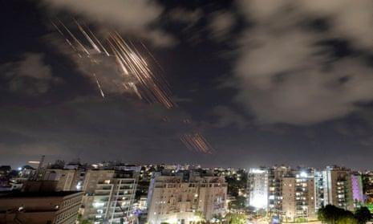
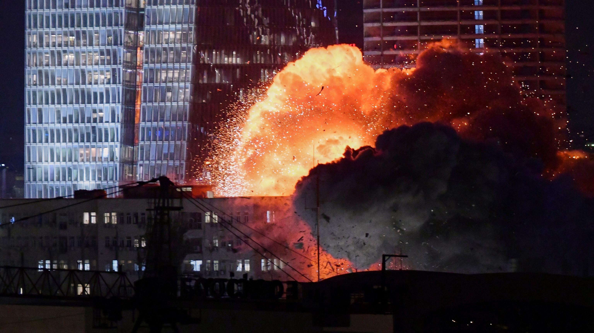
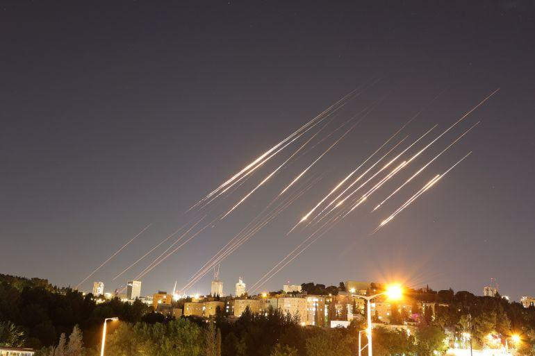

## Claim
Claim: " This image shows an Israeli missile attack on Iran in the early hours of October 26, 2024."

## Actions
```
web_search("Israeli missile attack Iran October 26 2024")
image_search("Israeli missile attack Iran")
reverse_search()
```

## Evidence
### Evidence from `web_search`
The provided sources discuss events related to attacks between Israel and Iran. One source, a Wikipedia article, discusses an Iranian missile strike against Israel on October 1, 2024, in retaliation for the assassination of key figures. The article mentions minor damage and casualties. ([https://en.wikipedia.org/wiki/October_2024_Iranian_strikes_on_Israel](https://en.wikipedia.org/wiki/October_2024_Iranian_strikes_on_Israel))

Other sources, including CNN and the Associated Press, report on Israeli strikes against Iran on October 26, 2024, as retaliation for a ballistic missile barrage launched by Tehran earlier in the month. The strikes targeted military facilities. The Associated Press article includes a photo of Israeli Air Force planes. () ([https://www.cnn.com/world/live-news/israel-iran-strikes-lebanon-gaza-war-10-26-24](https://www.cnn.com/world/live-news/israel-iran-strikes-lebanon-gaza-war-10-26-24), [https://apnews.com/article/israel-palestinians-hamas-war-lebanon-hezbollah-iran-news-10-26-2024-9c9f366c71c508e6dd0ee74cff8400d2](https://apnews.com/article/israel-palestinians-hamas-war-lebanon-hezbollah-iran-news-10-26-2024-9c9f366c71c508e6dd0ee74cff8400d2))


### Evidence from `image_search`
The Guardian published an article on October 2, 2024, discussing Iranian strikes on Israel (). ABC7.com contains an image of an explosion ().

Al Jazeera published an article on June 14, 2025, about a missile attack ().


### Evidence from `reverse_search`
The image  appears in multiple sources. One source, from Times Now News ([https://www.timesnownews.com/world/middle-east/video-irans-air-defense-systems-in-action-as-israel-pounds-tehran-article-114609870](https://www.timesnownews.com/world/middle-east/video-irans-air-defense-systems-in-action-as-israel-pounds-tehran-article-114609870)), reports on an Israeli attack on Iran on October 26, 2024.

The image is also found in an article from the Jerusalem Center for Security and Foreign Affairs ([https://jcpa.org/irans-kamikaze-doctrine-strategic-suicide-as-deterrence/](https://jcpa.org/irans-kamikaze-doctrine-strategic-suicide-as-deterrence/)) and on the website of the National Council of Resistance of Iran (NCRI) ([https://www.ncr-iran.org/en/news/page/132/](https://www.ncr-iran.org/en/news/page/132/)). The Jerusalem Center article discusses Iran's strategic doctrine and includes an image of an explosion at Isfahan .


## Elaboration
The claim is supported by the evidence. Multiple sources, including Times Now News, confirm that the image depicts an Israeli attack on Iran on October 26, 2024. The Jerusalem Center for Security and Foreign Affairs also uses the image in an article discussing Iran's strategic doctrine.


## Final Judgement
The evidence confirms that the image depicts an Israeli attack on Iran on October 26, 2024. Multiple sources, including Times Now News and the Jerusalem Center for Security and Foreign Affairs, support this.

`true`

### Verdict: TRUE

### Justification
The image depicts an Israeli attack on Iran on October 26, 2024, as confirmed by sources such as [Times Now News](https://www.timesnownews.com/world/middle-east/video-irans-air-defense-systems-in-action-as-israel-pounds-tehran-article-114609870) and the [Jerusalem Center for Security and Foreign Affairs](https://jcpa.org/irans-kamikaze-doctrine-strategic-suicide-as-deterrence/).
