## Claim
Claim: " This image shows a palestinian child stuck under the rubble in Gaza after an Israeli airstrike in July 2024."

## Actions
```
reverse_search()
web_search("Palestinian child rubble Gaza Israeli airstrike July 2024")
```

## Evidence
### Evidence from `reverse_search`
The image 

### Evidence from `web_search`
The CNN article from July 27, 2024, reports on an Israeli airstrike on a school in Deir-al Balah, central Gaza, on July 27, 2024, where at least 30 people were killed. The article does not include the image. ([https://www.cnn.com/2024/07/27/middleeast/israel-gaza-deir-al-balah-school-intl](https://www.cnn.com/2024/07/27/middleeast/israel-gaza-deir-al-balah-school-intl))

The BBC article from August 20, 2024, discusses an Israeli strike on a school in Gaza City, which was sheltering displaced people. ([https://www.bbc.com/news/articles/ce9zxlpz5evo](https://www.bbc.com/news/articles/ce9zxlpz5evo)) The Associated Press article from July 27, 2024, reports on an Israeli airstrike on a school in Deir al-Balah, central Gaza Strip, which killed at least 30 people, including children. ([https://apnews.com/article/israel-hamas-war-gaza-palestinians-evacuation-27-july-2024-c95e8effebd9d4e4ba7e69bfbae61e04](https://apnews.com/article/israel-hamas-war-gaza-palestinians-evacuation-27-july-2024-c95e8effebd9d4e4ba7e69bfbae61e04)) <image:k>


## Elaboration
The provided evidence does not contain the image. The reverse image search only confirms the existence of the image. The web search results describe Israeli airstrikes in Gaza in July and August 2024, including strikes on schools. However, none of the articles include the image or confirm the specific details of the claim.

Therefore, the claim cannot be verified with the available information. More information is needed to confirm the image's context, including the child's identity, the location, and the cause of the rubble.


## Actions
```
image_search("child rubble Gaza Israeli airstrike")
geolocate()
```

## Evidence
### Evidence from `image_search`
The NBC News video shows rescue workers trying to save children trapped in the rubble after an airstrike in Gaza City. ([https://www.nbcnews.com/video/rescue-workers-fight-to-save-children-trapped-in-gaza-city-airstrike-rubble-196401733655](https://www.nbcnews.com/video/rescue-workers-fight-to-save-children-trapped-in-gaza-city-airstrike-rubble-196401733655)) 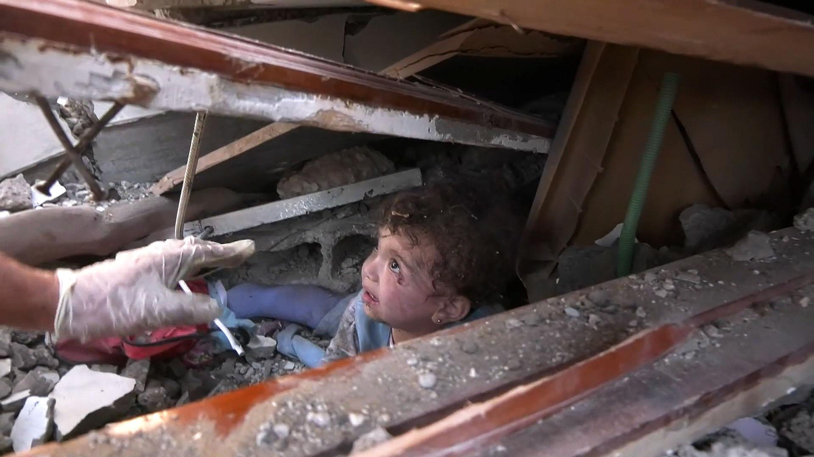 Al Jazeera published an article about the impact of the war on children in Gaza, including an image of children amidst rubble. ([https://www.aljazeera.com/news/2023/10/19/israels-war-against-gazas-children-explained](https://www.aljazeera.com/news/2023/10/19/israels-war-against-gazas-children-explained)) 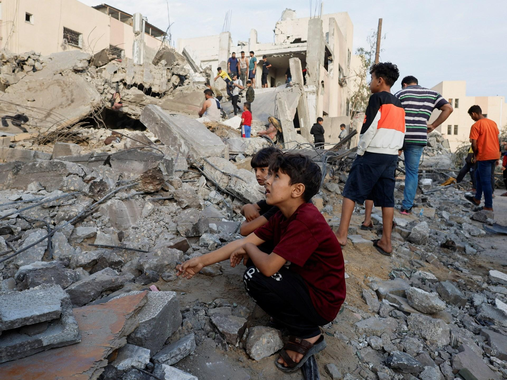 The NPR article includes an image of a woman sitting in rubble in Gaza. ([https://www.npr.org/2025/03/17/g-s1-54401/israel-launches-deadly-series-of-attack-on-gaza](https://www.npr.org/2025/03/17/g-s1-54401/israel-launches-deadly-series-of-attack-on-gaza)) 


### Evidence from `geolocate`
The most likely countries where the image was taken are: {'Palestine': 0.51, 'Israel': 0.24, 'Jordan': 0.11, 'Russia': 0.02, 'Canada': 0.01, 'Colombia': 0.01, 'France': 0.01, 'Sweden': 0.01, 'Turkey': 0.01, 'Ukraine': 0.01}

## Elaboration
The image search provides additional images of children in rubble in Gaza, supporting the claim's general context. The geolocation data suggests the image was most likely taken in Palestine or Israel. However, the evidence still does not confirm the specific details of the claim, such as the exact date or the cause of the rubble.

Therefore, the claim remains unverified.


## Actions
```
web_search("image of palestinian child rubble Gaza")
```

## Evidence
### Evidence from `web_search`
The Getty Images search result ([https://www.gettyimages.com/photos/children-gaza](https://www.gettyimages.com/photos/children-gaza)) provides multiple images of Palestinian children in Gaza, some amidst rubble, dated from October 2023 to June 2025. 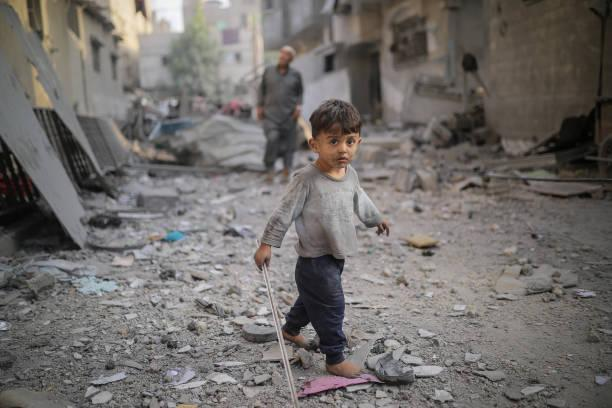, 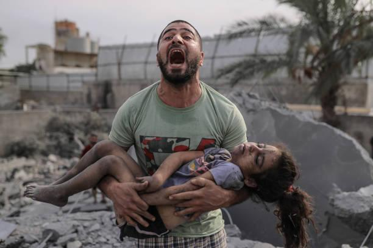, 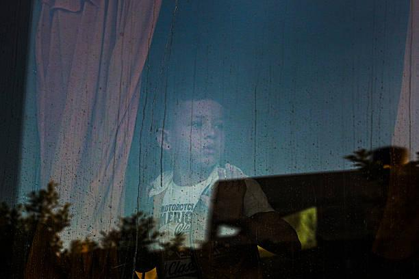, 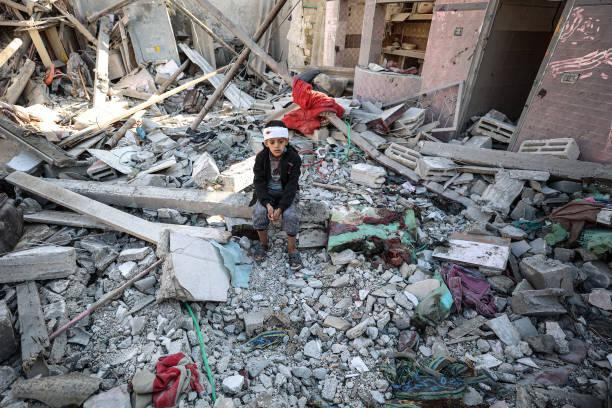, 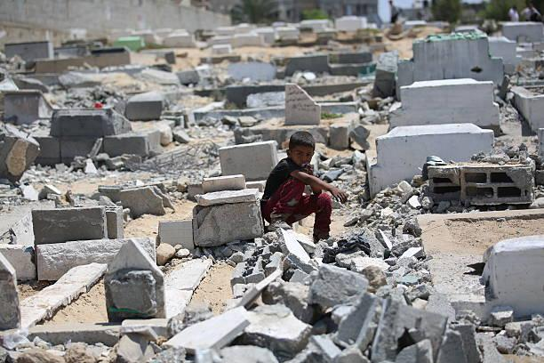, 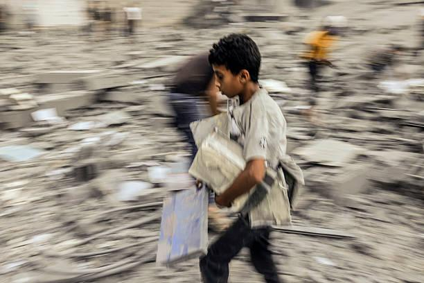, 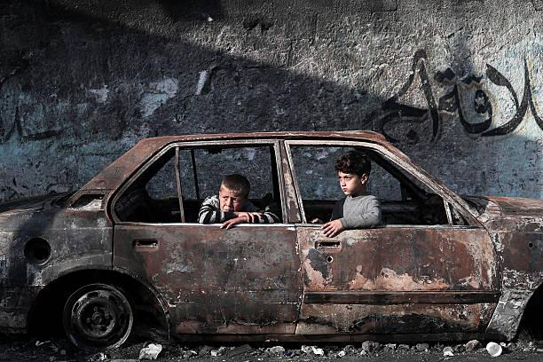, 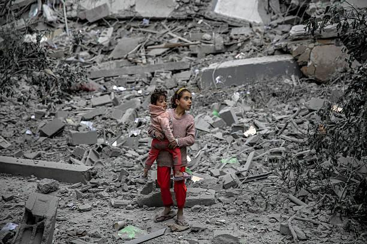, 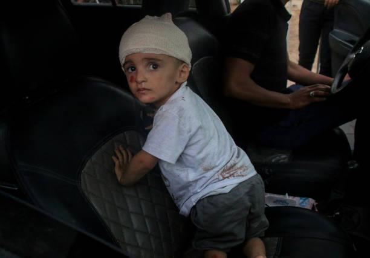, 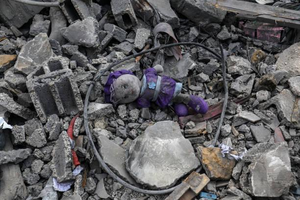, 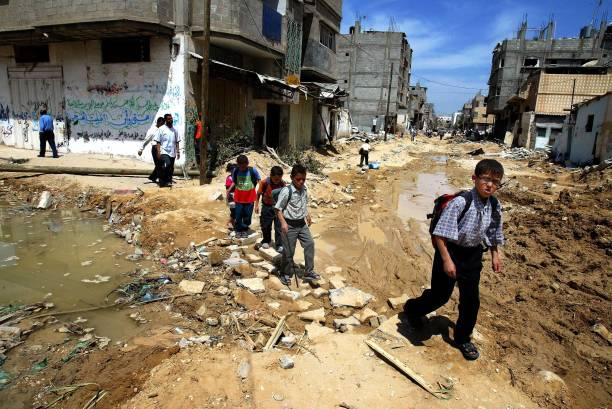 The BBC article ([https://www.bbc.com/news/videos/czryry57x4do](https://www.bbc.com/news/videos/czryry57x4do)) from July 24, 2025, discusses a photograph of a starving child in Gaza.  The Alamy website ([https://www.alamy.com/stock-photo/palestinian-child-in-rubble.html](https://www.alamy.com/stock-photo/palestinian-child-in-rubble.html)) contains stock photos of Palestinian children in rubble.


## Elaboration
The web search results provide additional images of Palestinian children in Gaza, some amidst rubble, and the Getty Images search result includes images dated from October 2023 to June 2025. However, none of the provided evidence contains the image in the claim or confirms the specific details of the claim.

Therefore, the claim remains unverified.


## Final Judgement
The claim cannot be verified because the provided evidence does not contain the image or confirm the specific details of the claim. The image search and web search results provide context about children in Gaza and Israeli airstrikes, but they do not confirm the image's origin, date, or the cause of the rubble. `false`

### Verdict: FALSE

### Justification
The claim that the image shows a Palestinian child stuck under rubble in Gaza after an Israeli airstrike in July 2024 cannot be verified. While the image search and web search results provide context about children in Gaza and Israeli airstrikes, they do not confirm the image's origin, date, or the cause of the rubble. The evidence includes images of children in rubble in Gaza ([https://www.gettyimages.com/photos/children-gaza](https://www.gettyimages.com/photos/children-gaza)), but none of the provided sources contain the image in the claim.
