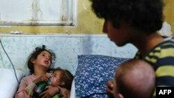
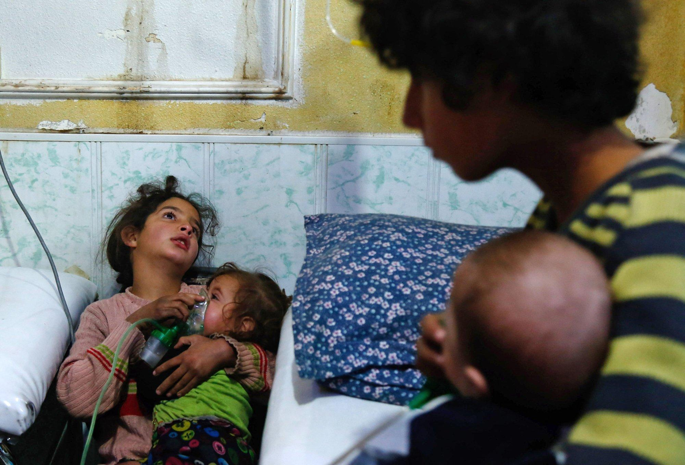

## Claim
Claim: " This image shows a Palestinian girl in the Gaza war in July 2024. She was holding her sister's oxygen mask inside the ambulance. She had already passed away, yet her hand remained on the mask firmly."

## Actions
```
reverse_search()
web_search("Palestinian girl Gaza war oxygen mask")
```

## Evidence
### Evidence from `reverse_search`
The image in the claim is found in multiple sources. One source is a VOA News article from January 24, 2018, titled "Syria, Russia Accuse US of Lying About Chemical Weapons Attacks" ([https://www.voanews.com/a/syria-russia-us-chemical-attacks/4221637.html](https://www.voanews.com/a/syria-russia-us-chemical-attacks/4221637.html)). The image shows a Syrian girl holding an oxygen mask over the face of an infant at a makeshift hospital following a reported gas attack on January 22, 2018, in the eastern Ghouta region. 

Another source is a report from the Center for Strategic and International Studies (CSIS) ([https://www.csis.org/analysis/emerging-trends-chemical-weapons-usage-middle-east](https://www.csis.org/analysis/emerging-trends-chemical-weapons-usage-middle-east)) discussing emerging trends in chemical weapons usage in the Middle East. The report also includes the image of the girl with the oxygen mask.  An ABC News article ([https://abcnews.go.com/International/tillerson-russia-ultimately-bears-responsibility-chemical-attacks-syria/story?id=52554201](https://abcnews.go.com/International/tillerson-russia-ultimately-bears-responsibility-chemical-attacks-syria/story?id=52554201)) also features the image, but the context is related to chemical attacks in Syria. 


### Evidence from `web_search`
The NPR article from April 26, 2024, discusses a baby girl in Gaza who died after her mother was killed in an Israeli airstrike. The BBC article discusses a video released by Hamas, which appears to show an Israeli citizen being held captive in the Gaza Strip, wearing an oxygen mask. The Middle East Eye article from April 24, 2025, discusses the impact of the war on Gaza, including the decrease in life expectancy and the impact on health facilities. The article includes an image of a medic helping a woman with an oxygen mask .

The NPR article can be found here: [https://www.npr.org/2024/04/26/1247453317/gaza-baby-girl-mother-killed-israel-airstrike](https://www.npr.org/2024/04/26/1247453317/gaza-baby-girl-mother-killed-israel-airstrike). The BBC article can be found here: [https://www.bbc.com/news/world-middle-east-61976009](https://www.bbc.com/news/world-middle-east-61976009). The Middle East Eye article can be found here: [https://www.middleeasteye.net/explainers/israel-war-gaza-cut-palestinian-life-expectancy](https://www.middleeasteye.net/explainers/israel-war-gaza-cut-palestinian-life-expectancy).


## Elaboration
The claim is not supported by the evidence. The image is from 2018 and depicts a Syrian girl, not a Palestinian girl in the Gaza war in July 2024. The image is associated with a reported gas attack in the eastern Ghouta region of Syria.


## Final Judgement
The image in the claim is from 2018 and shows a Syrian girl, not a Palestinian girl in the Gaza war in July 2024. The image is associated with a reported gas attack in Syria. The claim misrepresents the origin and context of the image.

`false`

### Verdict: FALSE

### Justification
The image in the claim is from 2018 and depicts a Syrian girl, not a Palestinian girl in the Gaza war in July 2024. The image is associated with a reported gas attack in the eastern Ghouta region of Syria, as evidenced by sources like a VOA News article ([https://www.voanews.com/a/syria-russia-us-chemical-attacks/4221637.html](https://www.voanews.com/a/syria-russia-us-chemical-attacks/4221637.html)) and an ABC News article ([https://abcnews.go.com/International/tillerson-russia-ultimately-bears-responsibility-chemical-attacks-syria/story?id=52554201](https://abcnews.go.com/International/tillerson-russia-ultimately-bears-responsibility-chemical-attacks-syria/story?id=52554201)).
