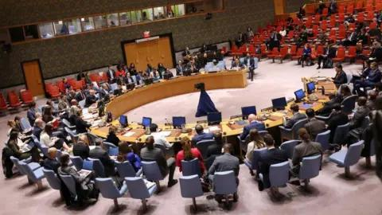

## Claim
Claim: "The US reinstituted draft in 2024 for the Israel-Hamas war."

## Actions
```
web_search("US draft Israel-Hamas war 2024")
```

## Evidence
### Evidence from `web_search`
The UN News reported on November 20, 2024, that the United States vetoed a UN Security Council draft resolution calling for an immediate ceasefire in Gaza (). The resolution, which was supported by 14 Council members, also demanded the release of hostages and humanitarian aid.

The Security Council Report from November 19, 2024, discussed a draft resolution on the war in Gaza, mentioning the US's stance and potential veto. A UN press release from November 20, 2024, confirmed the US veto, explaining that the US representative believed the resolution would have sent a dangerous message to Hamas.

*   [Source](https://news.un.org/en/story/2024/11/1157216)
*   [Source](https://www.securitycouncilreport.org/whatsinblue/2024/11/vote-on-a-draft-resolution-on-the-war-in-gaza.php)
*   [Source](https://press.un.org/en/2024/sc15907.doc.htm)


## Elaboration
The provided evidence does not contain any information about the US reinstituting the draft in 2024 for the Israel-Hamas war. The evidence focuses on the US's veto of a UN Security Council resolution regarding a ceasefire in Gaza.

Therefore, the claim cannot be verified with the available information.


## Actions
```
web_search("US military draft 2024")
```

## Evidence
### Evidence from `web_search`
The search results include a Wikipedia article on conscription in the United States, discussing the history of the draft and mentioning a 2024 meeting memo suggesting modifications to the Selective Service Act, including registration by women and self-reporting of critical skills. The article is available at [https://en.wikipedia.org/wiki/Conscription_in_the_United_States](https://en.wikipedia.org/wiki/Conscription_in_the_United_States).

Another source, from War on the Rocks, published an article on August 8, 2024, discussing the possibility of a draft in the US, mentioning debates about conscription and public concerns. The article is available at [https://warontherocks.com/2024/08/preparing-for-the-possibility-of-a-draft-without-panic/](https://warontherocks.com/2024/08/preparing-for-the-possibility-of-a-draft-without-panic/). One source had no content. (, )


## Elaboration
The evidence indicates discussions and debates about the possibility of a draft in the US in 2024, including potential modifications to the Selective Service Act. However, the evidence does not confirm that the US reinstituted the draft. The provided sources discuss the topic in general terms, without specifically linking it to the Israel-Hamas war.

Therefore, the claim remains unverified.


## Actions
```
web_search("US draft Israel-Hamas war")
```

## Evidence
### Evidence from `web_search`
The UN News reported in June 2025 that the US vetoed a UN Security Council resolution calling for a ceasefire in Gaza ([https://news.un.org/en/story/2025/06/1164056](https://news.un.org/en/story/2025/06/1164056)). The BBC News reported in November 2024 that the US vetoed a UN Security Council draft resolution calling for an immediate ceasefire in Gaza ([https://www.bbc.com/news/articles/cjr4p9rg8zlo](https://www.bbc.com/news/articles/cjr4p9rg8zlo)). PBS NewsHour reported in May 2025 about a new draft of a U.S. proposal for a 60-day cease-fire in Gaza ([https://www.pbs.org/newshour/show/how-israel-is-responding-to-latest-u-s-proposals-to-pause-war-in-gaza](https://www.pbs.org/newshour/show/how-israel-is-responding-to-latest-u-s-proposals-to-pause-war-in-gaza)). None of the articles mention the US reinstituting the draft. (, , , )


## Elaboration
The evidence does not support the claim. The search results discuss the US's actions regarding the Israel-Hamas war, such as vetoing UN resolutions, and general discussions about the possibility of a draft. However, none of the provided sources confirm that the US reinstituted the draft in 2024 for the Israel-Hamas war.

Therefore, the claim is not supported by the evidence.


## Final Judgement
The fact-check reveals that while there have been discussions about the possibility of a draft in the US and the US's involvement in the Israel-Hamas war, there is no evidence to support the claim that the US reinstituted the draft in 2024 for the war.

`false`


### Verdict: FALSE

### Justification
The fact-check found no evidence to support the claim that the US reinstituted the draft in 2024 for the Israel-Hamas war. While there were discussions about the possibility of a draft and the US's involvement in the conflict, such as vetoing UN resolutions, no sources confirm the claim.
