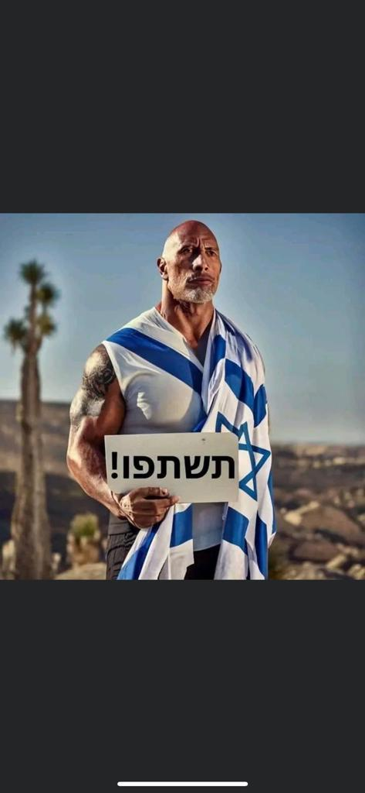
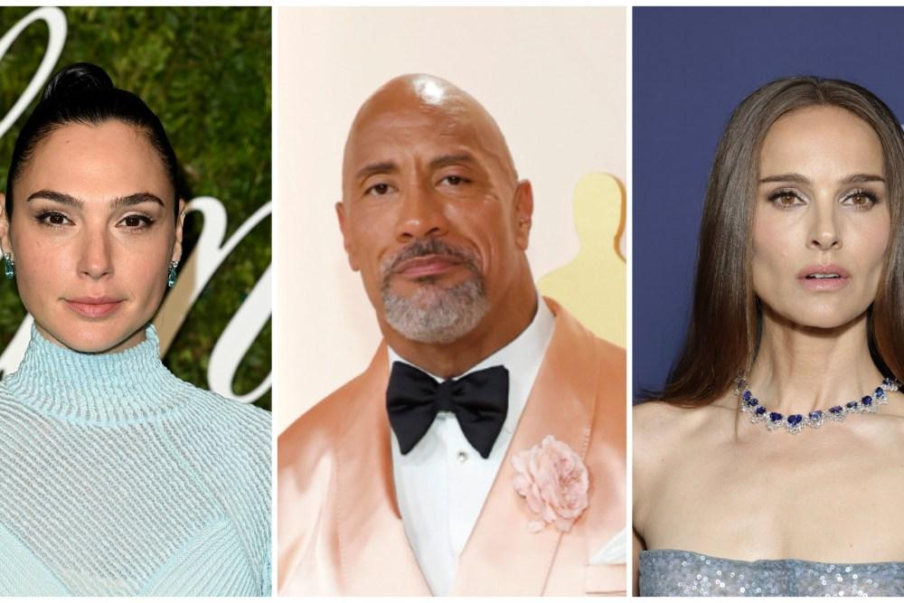

## Claim
Claim: " This is an authentic image of Dwayne Johnson waring the Israeli flag in support of Israel."

## Actions
```
reverse_search()
```

## Evidence
No new evidence found.

## Elaboration
There is no new evidence to analyze the claim.


## Actions
```
web_search("Dwayne Johnson Israel support")
image_search("Dwayne Johnson Israeli flag")
```

## Evidence
### Evidence from `web_search`
Dwayne "The Rock" Johnson has expressed his views on the Israel-Palestine conflict, condemning terrorism and expressing sympathy for innocent lives lost, as reported by [Marca.com](https://www.marca.com/en/lifestyle/world-news/2023/10/11/6526c4cc22601d2d748b45da.html) and [Shop Israel](https://shopisrael.com/blogs/support/does-dwayne-johnson-support-israel?srsltid=AfmBOopy4n2f7lxTWWqdiE6_xSd1XeW0AbQOVlP76nNPJQ6KrktIHL3X). Variety reported that Johnson, along with other Hollywood stars, has shown support for Israel amid the Hamas attacks ([Variety](https://variety.com/2023/film/news/hollywood-stars-support-israel-palestine-conflict-1235749537/)). The sources do not show Johnson wearing the Israeli flag.   


### Evidence from `image_search`
Euronews published an article about Dwayne Johnson ([https://www.euronews.com/culture/2023/11/14/dwayne-the-rock-johnson-says-political-parties-asked-him-to-run-for-president](https://www.euronews.com/culture/2023/11/14/dwayne-the-rock-johnson-says-political-parties-asked-him-to-run-for-president)). WIONews published an image of Dwayne Johnson with a statement about the Israel-Hamas conflict ([https://www.wionews.com/entertainment/dwayne-johnson-on-israel-hamas-conflict-im-heartbroken-angry-and-sickened-645300](https://www.wionews.com/entertainment/dwayne-johnson-on-israel-hamas-conflict-im-heartbroken-angry-and-sickened-645300)). Yahoo News published an article about a fake image of Dwayne Johnson ([https://www.yahoo.com/news/articles/fact-check-fake-dwayne-johnson-234700368.html](https://www.yahoo.com/news/articles/fact-check-fake-dwayne-johnson-234700368.html)). , , 


## Elaboration
The evidence indicates that the image is fake. Yahoo News published an article about a fake image of Dwayne Johnson. The search results show that Dwayne Johnson has expressed his views on the Israel-Palestine conflict, but the evidence does not show him wearing the Israeli flag.


## Final Judgement
The claim is that the image is an authentic image of Dwayne Johnson wearing the Israeli flag in support of Israel. However, the evidence suggests that the image is fake. Dwayne Johnson has expressed his views on the Israel-Palestine conflict, but there is no evidence of him wearing the Israeli flag.

`false`

### Verdict: FALSE

### Justification
The claim is false. While Dwayne Johnson has expressed his views on the Israel-Palestine conflict, the image of him wearing the Israeli flag is fake, as reported by [Yahoo News](https://www.yahoo.com/news/articles/fact-check-fake-dwayne-johnson-234700368.html).
