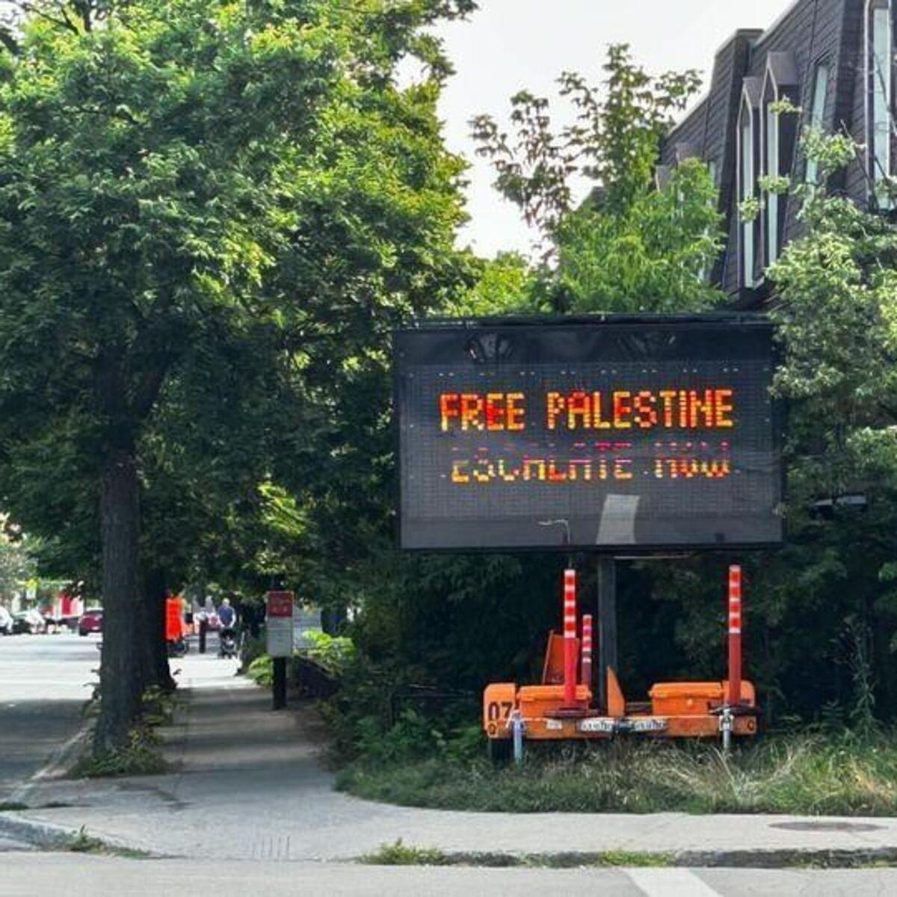

## Claim
Claim: " This image shows a traffic sign in Montreal in July 2024 which displays a 'Free Palestine. Escalate now' message and was authorized by Montreal's Mayor Valérie Plante."

## Actions
```
geolocate()
image_search("Free Palestine sign Montreal")
reverse_search()
```

## Evidence
### Evidence from `geolocate`
The most likely countries where the image was taken are: {'Palestine': 0.85, 'Canada': 0.07, 'Germany': 0.02, 'Austria': 0.01, 'Israel': 0.01, 'Poland': 0.01, 'Slovenia': 0.01, 'South Korea': 0.01, 'Albania': 0.0, 'Andorra': 0.0}

### Evidence from `image_search`
The Globe and Mail reported on a traffic sign in Montreal displaying a "Free Palestine" message (). Another source shows a building in Montreal with a Palestine flag and the slogan "Palestine Libre" painted on the brick walls ().

The first source is available at [https://www.theglobeandmail.com/canada/article-montreal-traffic-signs-apparently-hacked-to-display-pro-palestinian/](https://www.theglobeandmail.com/canada/article-montreal-traffic-signs-apparently-hacked-to-display-pro-palestinian/). The second source is available at [https://www.alamy.com/palestine-flag-and-free-palestine-palestine-libre-slogan-in-french-painted-on-the-brick-walls-of-a-building-in-montreal-quebec-canada-image214314665.html](https://www.alamy.com/palestine-flag-and-free-palestine-palestine-libre-slogan-in-french-painted-on-the-brick-walls-of-a-building-in-montreal-quebec-canada-image214314665.html).


### Evidence from `reverse_search`
From [Source](https://www.cbc.ca/news/canada/montreal/montreal-traffic-signs-pro-palestinian-slogans-1.7274809): Found exact image on website with title: Montreal electronic traffic signs altered to display pro-Palestinian ...
Content: The CBC News article, published on July 25, 2024, reports that electronic traffic signs in Montreal were altered to display pro-Palestinian slogans, including "Free Palestine" and "Escalate now."  The signs, which are owned by a private contractor hired by the city, were hacked to display the messages. A group called Clash Mtl claimed responsibility. The Montreal police are investigating the incident, which the City of Montreal called an act of vandalism. The original messages were restored by the end of the morning. The article includes a photograph of one of the altered signs.


## Elaboration
The image is of a traffic sign in Montreal displaying a "Free Palestine" message. The geolocation data suggests the image was most likely taken in Palestine, but also in Canada. The image search confirms that the sign is in Montreal. The reverse image search confirms the image and indicates that the signs were hacked to display the messages. The article states that the City of Montreal called it an act of vandalism.

The claim that the sign was authorized by Montreal's Mayor Valérie Plante is not supported by the evidence.


## Final Judgement
The image is of a traffic sign in Montreal displaying a "Free Palestine" message. The sign was hacked to display the message, and the City of Montreal called it an act of vandalism. The claim that the sign was authorized by Montreal's Mayor Valérie Plante is not supported by the evidence.

The claim is false because the evidence indicates that the signs were hacked and not authorized by the mayor. `false`

### Verdict: FALSE

### Justification
The image depicts a traffic sign in Montreal displaying a "Free Palestine" message, which was confirmed by image and reverse image searches. However, the sign was hacked, and the City of Montreal considered it an act of vandalism, contradicting the claim that the message was authorized by Montreal's Mayor Valérie Plante, as reported by [CBC News](https://www.cbc.ca/news/canada/montreal/montreal-traffic-signs-pro-palestinian-slogans-1.7274809).
