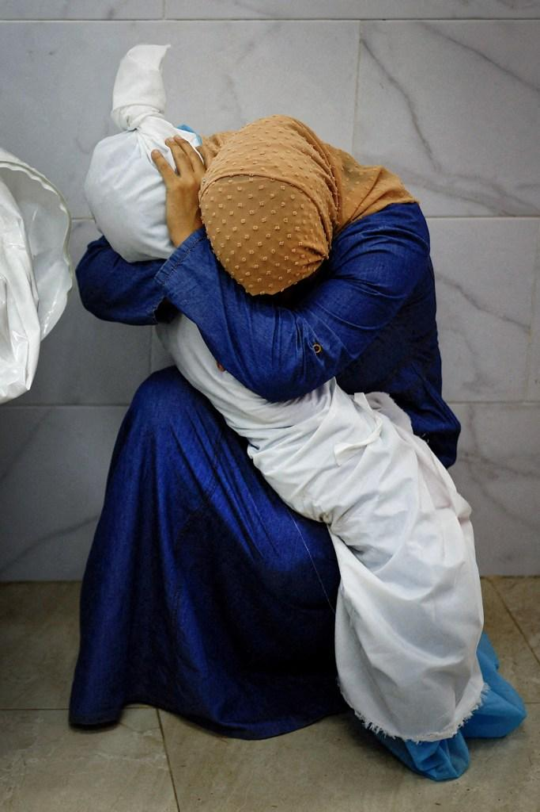

## Claim
Claim: " This is an authentic image of a mother holding the bones of her son in Gaza in March 2025. After more than a year and a half of searching for him under the rubble of their bombed-out house."

## Actions
```
reverse_search()
image_search("woman holding skeleton Gaza")
image_search("woman holding skeleton Palestine")
```

## Evidence
### Evidence from `image_search`
The image of the woman holding a skeleton is AI-generated, according to [kashif.ps](https://kashif.ps/ai-generated-image-of-woman-hugging-skeleton-goes-viral-as-from-gaza/) and [news.abplive.com](https://news.abplive.com/fact-check/viral-image-of-gazan-woman-golding-child-s-remains-is-digitally-generated-1760363).  

The Daily Mail published an article with images of emaciated children in Gaza. 


### Evidence from `image_search`
From [Source](https://www.rollingstone.com/culture/culture-news/mohammed-salem-world-press-photo-of-the-year-israel-hamas-war-1235006582/): 
Content: Rolling Stone published an article about the World Press Photo of the Year, which features a photograph of a woman in Gaza holding the body of her child wrapped in a shroud. 


## Elaboration
The claim that the image depicts an authentic scene is false. Evidence from image searches indicates that the image is AI-generated, as reported by [kashif.ps](https://kashif.ps/ai-generated-image-of-woman-hugging-skeleton-goes-viral-as-from-gaza/) and [news.abplive.com](https://news.abplive.com/fact-check/viral-image-of-gazan-woman-golding-child-s-remains-is-digitally-generated-1760363). The evidence also includes an article from Rolling Stone about a World Press Photo of the Year, which features a photograph of a woman in Gaza holding the body of her child wrapped in a shroud.


## Final Judgement
The image is AI-generated, and therefore the claim that it is an authentic image is false.

`false`

### Verdict: FALSE

### Justification
The image in the claim is not authentic. Multiple sources, including [kashif.ps](https://kashif.ps/ai-generated-image-of-woman-hugging-skeleton-goes-viral-as-from-gaza/) and [news.abplive.com](https://news.abplive.com/fact-check/viral-image-of-gazan-woman-golding-child-s-remains-is-digitally-generated-1760363), confirm that the image is AI-generated.
