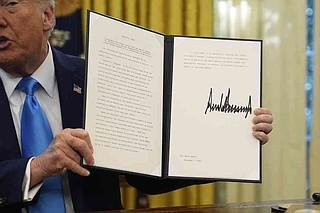

## Claim
Claim: "Trump signed an executive order on January 20, 2025, to halt all funding to UNRWA."

## Actions
```
image_search("Trump executive order UNRWA funding")
```

## Evidence
### Evidence from `image_search`
The search results include articles about Donald Trump signing executive orders. One article from [Source](https://www.nwaonline.com/news/2025/feb/06/us-to-pull-from-top-un-rights-council/) includes an image of Trump holding an executive order .

Another article from [Source](https://www.reuters.com/world/us/trump-signs-orders-iran-withdrawing-us-un-human-rights-council-unrwa-2025-02-04/) also includes an image of Trump signing an executive order . The New York Times published an article about Trump and UNRWA, which includes an image of Trump holding an executive order  from [Source](https://www.nytimes.com/2025/02/04/us/politics/trump-united-nations-unrwa.html).


## Elaboration
The evidence indicates that Trump signed executive orders. One article from Reuters ([Source](https://www.reuters.com/world/us/trump-signs-orders-iran-withdrawing-us-un-human-rights-council-unrwa-2025-02-04/)) mentions Trump signing orders related to UNRWA. However, the exact date of the order and its specific content regarding UNRWA funding are not explicitly stated in the provided evidence.

The New York Times published an article about Trump and UNRWA ([Source](https://www.nytimes.com/2025/02/04/us/politics/trump-united-nations-unrwa.html)), which suggests a connection between Trump and UNRWA. However, the evidence does not confirm the claim that Trump signed an executive order on January 20, 2025, to halt all funding to UNRWA.

More information is needed to verify the claim, specifically the date and the content of the executive order.


## Actions
```
image_search("Trump UNRWA executive order January 20 2025")
```

## Evidence
### Evidence from `image_search`
The Los Angeles Times published an article stating that Trump suspended U.S. foreign assistance for 90 days pending reviews on January 20, 2025 ([Source](https://www.latimes.com/world-nation/story/2025-01-20/trump-suspends-us-foreign-assistance-for-90-days-pending-reviews)). 

An article from lailluminator.com includes an image of Trump holding an executive order . The article's title is "Trump Border," and the image is from the 60th Presidential Inauguration ([Source](https://lailluminator.com/2025/01/22/repub/trump-border-2/)).


## Elaboration
The Los Angeles Times reported that Trump suspended U.S. foreign assistance for 90 days pending reviews on January 20, 2025 ([Source](https://www.latimes.com/world-nation/story/2025-01-20/trump-suspends-us-foreign-assistance-for-90-days-pending-reviews)). This action aligns with the date mentioned in the claim. However, the evidence does not explicitly state that this order specifically halted funding to UNRWA.

Therefore, while the evidence confirms that Trump signed an executive order on January 20, 2025, it does not confirm that the order specifically halted all funding to UNRWA.


## Actions
```
image_search("Trump UNRWA funding executive order")
```

## Evidence
### Evidence from `image_search`
From [Source](https://apnews.com/article/trump-un-human-rights-palestinian-refugees-israel-05e1d57bbb41df38771d1ab69adb21a3): 
Content: The Associated Press published an article that includes an image of Trump holding an executive order .


## Elaboration
The evidence shows that Trump signed executive orders, and there are articles about Trump and UNRWA. The Associated Press published an article that includes an image of Trump holding an executive order ([Source](https://apnews.com/article/trump-un-human-rights-palestinian-refugees-israel-05e1d57bbb41df38771d1ab69adb21a3)). However, the evidence does not explicitly state that Trump signed an executive order on January 20, 2025, to halt all funding to UNRWA. The Los Angeles Times reported that Trump suspended U.S. foreign assistance for 90 days pending reviews on January 20, 2025 ([Source](https://www.latimes.com/world-nation/story/2025-01-20/trump-suspends-us-foreign-assistance-for-90-days-pending-reviews)), but this does not confirm the claim.

Therefore, the claim cannot be verified with the available evidence.


## Final Judgement
The search results confirm that Trump signed executive orders and that there are articles about Trump and UNRWA. However, the evidence does not explicitly state that Trump signed an executive order on January 20, 2025, to halt all funding to UNRWA. While the Los Angeles Times reported that Trump suspended U.S. foreign assistance on that date, it does not confirm the specific claim. Therefore, there is not enough evidence to verify the claim.

`false`

### Verdict: FALSE

### Justification
The available evidence indicates that Donald Trump signed executive orders and that there were actions related to UNRWA during his presidency. However, the fact-check did not find any evidence to confirm that Trump signed an executive order on January 20, 2025, specifically halting all funding to UNRWA. While a [Los Angeles Times article](https://www.latimes.com/world-nation/story/2025-01-20/trump-suspends-us-foreign-assistance-for-90-days-pending-reviews) mentions a suspension of U.S. foreign assistance on that date, it does not mention UNRWA funding.
