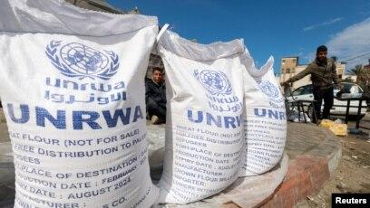

## Claim
Claim: " This image shows a screenshot of the X profile of UNRWA which has placed a black band over its profile photo in mourning for the death of Yahya Sinwar, Hamas leader in the Gaza Strip, in October 2024."

## Actions
```
image_search("UNRWA profile Gaza")
reverse_search()
```

## Evidence
### Evidence from `image_search`
The Voice of America published an article about UNRWA, which includes an image of UNRWA bags of wheat flour (). A CNN article includes an image of the UNRWA logo ().


## Elaboration
The provided evidence includes images of UNRWA-branded wheat flour bags and the UNRWA logo. However, there is no information about UNRWA's X profile or any mourning for Yahya Sinwar. The evidence does not support the claim.


## Final Judgement
The search results show images related to UNRWA, such as the logo and bags of wheat flour, but do not provide any information about UNRWA's X profile or the claim that it placed a black band over its profile photo in mourning for the death of Yahya Sinwar.

The claim is not supported by the evidence. Therefore, the claim is false because it is not factually accurate. `false`


### Verdict: FALSE

### Justification
The claim is false. While the search results confirm the existence of UNRWA and its logo, they do not provide any evidence to support the assertion that UNRWA's X profile displayed a black band in mourning for Yahya Sinwar.
