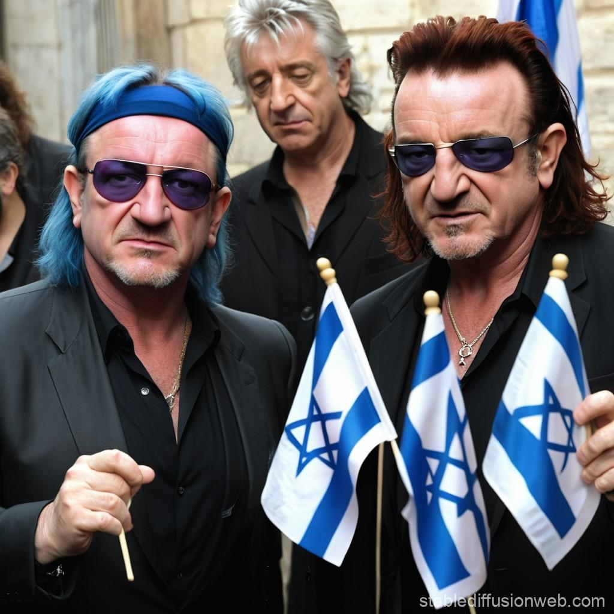

## Claim
Claim: " This is an authentic image of Bono and Bob Geldof holding the Israeli flag outside the Israeli embassy in Dublin."

## Actions
```
image_search("Bono Bob Geldof Israeli Embassy Dublin")
```

## Evidence
### Evidence from `image_search`
The Journal.ie published an article about an AI-generated photo of Bono and Bob Geldof with Israeli flags (). ABP Live states that the image is fake (). Another source contains an image of Bono and Bob Geldof holding Israeli flags ().

The image in the claim () is of Bono and Bob Geldof holding Israeli flags.


## Elaboration
The evidence indicates that the image in the claim is fake. The Journal.ie published an article about an AI-generated photo of Bono and Bob Geldof with Israeli flags. ABP Live also states that the image is fake.


## Final Judgement
The image in the claim is not authentic. Multiple sources confirm that the image is AI-generated or fake.

`false`

### Verdict: FALSE

### Justification
The claim is false. Evidence from image searches reveals that the image of Bono and Bob Geldof holding Israeli flags is AI-generated or fake, as reported by sources like The Journal.ie and ABP Live.
