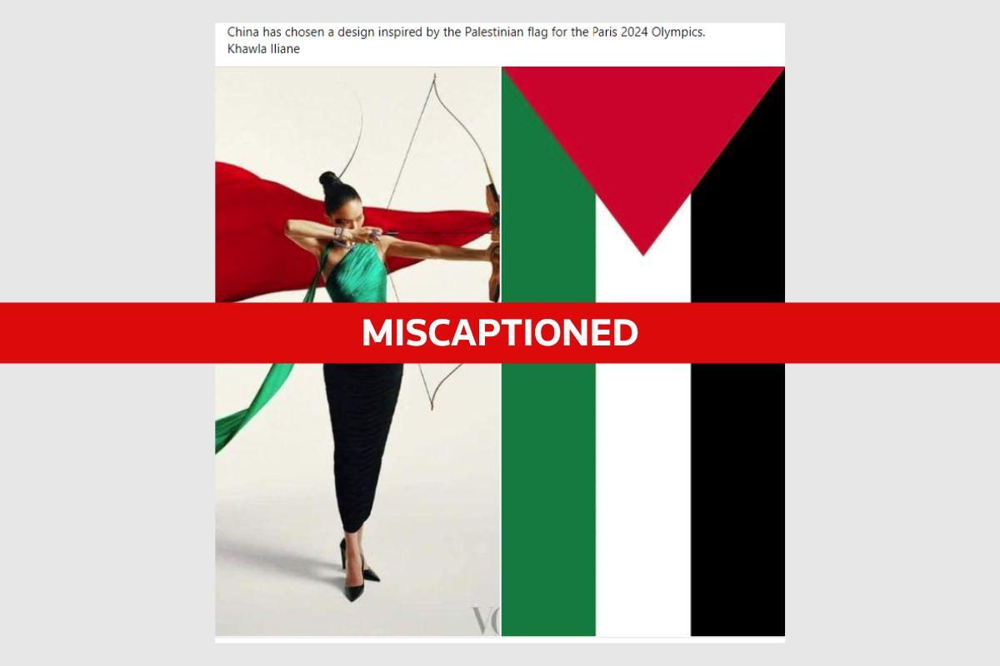

## Claim
Claim: " This image shows an athlete of China which has chosen a design of the Palestinian flag for the Paris 2024 Olympics."

## Actions
```
image_search("China design Palestinian flag Paris 2024 Olympics")
reverse_search()
```

## Evidence
### Evidence from `image_search`
The sources state that the claim is false. One source says that China did not choose a design inspired by the Palestinian flag for the Paris Olympics 2024. Another source says that the image is an old photo from Vogue China magazine and is being falsely shared. ,  A third source is an article about the Palestinian flag in Paris. 

*   [https://srilanka.factcrescendo.com/english/china-has-not-chosen-a-design-inspired-by-the-palestinian-flag-for-the-paris-olympics-2024/](https://srilanka.factcrescendo.com/english/china-has-not-chosen-a-design-inspired-by-the-palestinian-flag-for-the-paris-olympics-2024/)
*   [https://factly.in/an-old-photo-from-vogue-china-magazine-is-being-falsely-shared-as-showing-chinese-athletes-wearing-the-colours-of-the-palestinian-flag/](https://factly.in/an-old-photo-from-vogue-china-magazine-is-being-falsely-shared-as-showing-chinese-athletes-wearing-the-colours-of-the-palestinian-flag/)
*   [https://www.haaretz.com/middle-east-news/palestinians/2024-08-09/ty-article-magazine/.premium/when-raising-the-palestinian-flag-in-paris-is-an-achievement-in-itself/00000191-32a3-d5aa-a9b7-bff3ee690000](https://www.haaretz.com/middle-east-news/palestinians/2024-08-09/ty-article-magazine/.premium/when-raising-the-palestinian-flag-in-paris-is-an-achievement-in-itself/00000191-32a3-d5aa-a9b7-bff3ee690000)


## Elaboration
The evidence indicates that the claim is false. The image is an old photo from Vogue China magazine and is being falsely shared. China did not choose a design inspired by the Palestinian flag for the Paris Olympics 2024.


## Final Judgement
The claim is demonstrably false. The image is an old photo from Vogue China magazine, and the claim that China chose a design inspired by the Palestinian flag for the Paris Olympics 2024 is incorrect. `false`

### Verdict: FALSE

### Justification
The claim is false. The image is an old photo from Vogue China magazine, and the assertion that China chose a design inspired by the Palestinian flag for the Paris Olympics 2024 is incorrect, as confirmed by multiple sources ([https://srilanka.factcrescendo.com/english/china-has-not-chosen-a-design-inspired-by-the-palestinian-flag-for-the-paris-olympics-2024/](https://srilanka.factcrescendo.com/english/china-has-not-chosen-a-design-inspired-by-the-palestinian-flag-for-the-paris-olympics-2024/) and [https://factly.in/an-old-photo-from-vogue-china-magazine-is-being-falsely-shared-as-showing-chinese-athletes-wearing-the-colours-of-the-palestinian-flag/](https://factly.in/an-old-photo-from-vogue-china-magazine-is-being-falsely-shared-as-showing-chinese-athletes-wearing-the-colours-of-the-palestinian-flag/)).
