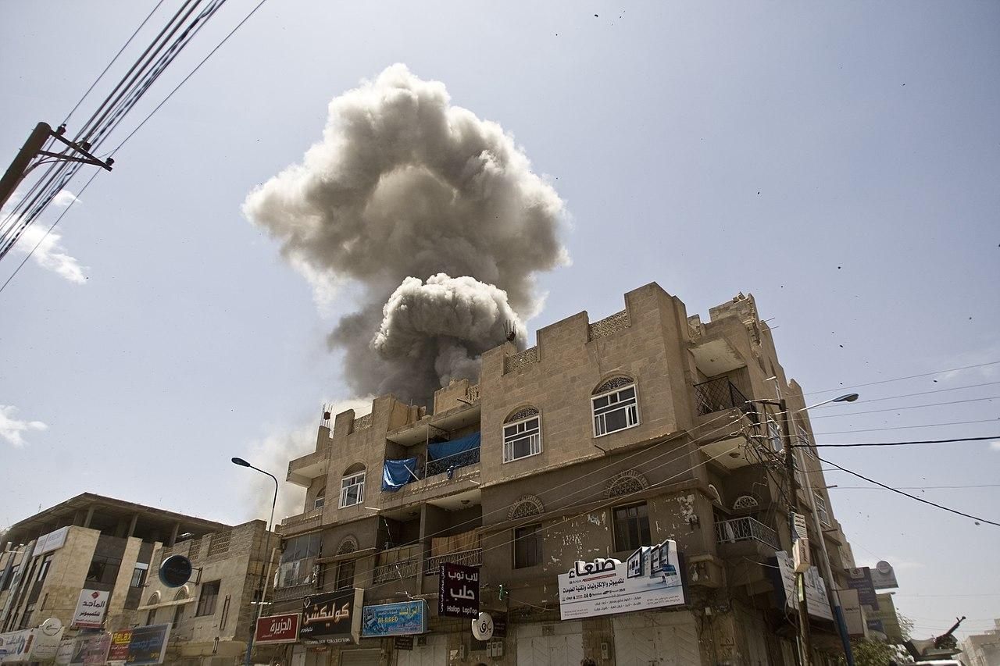
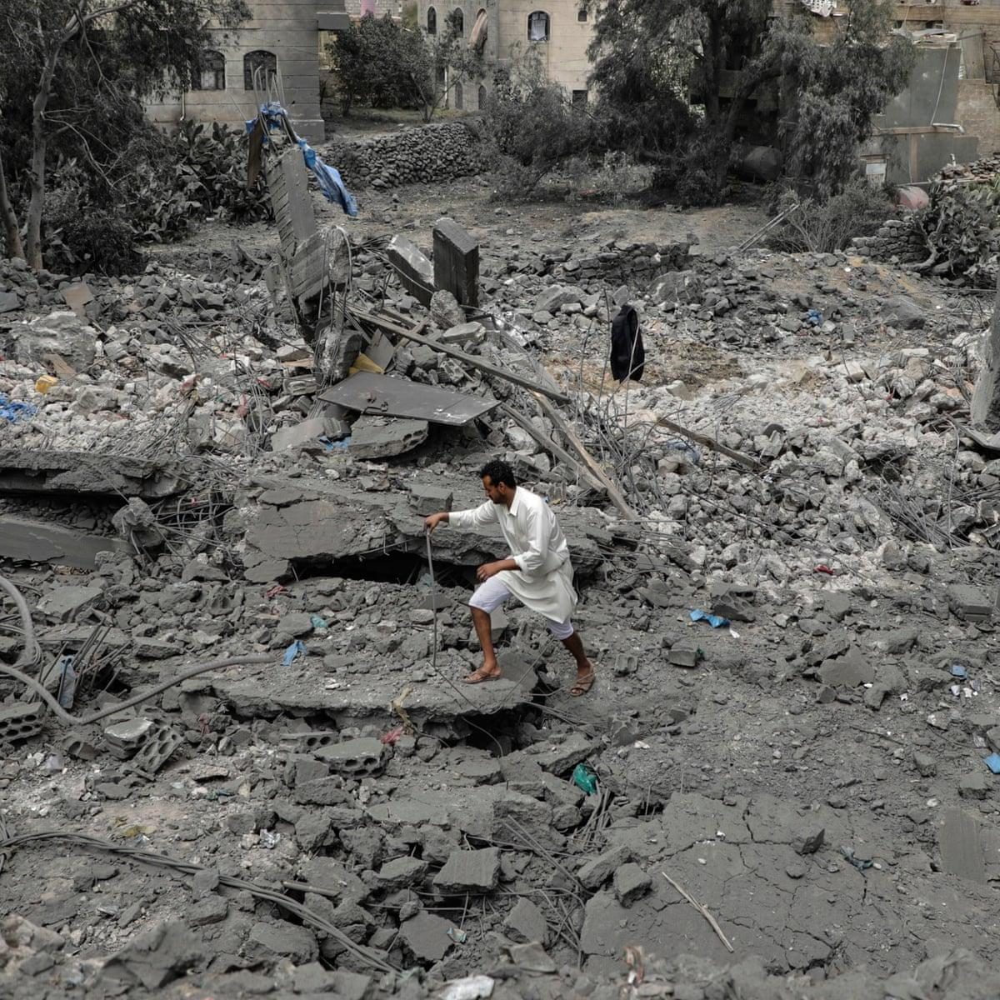
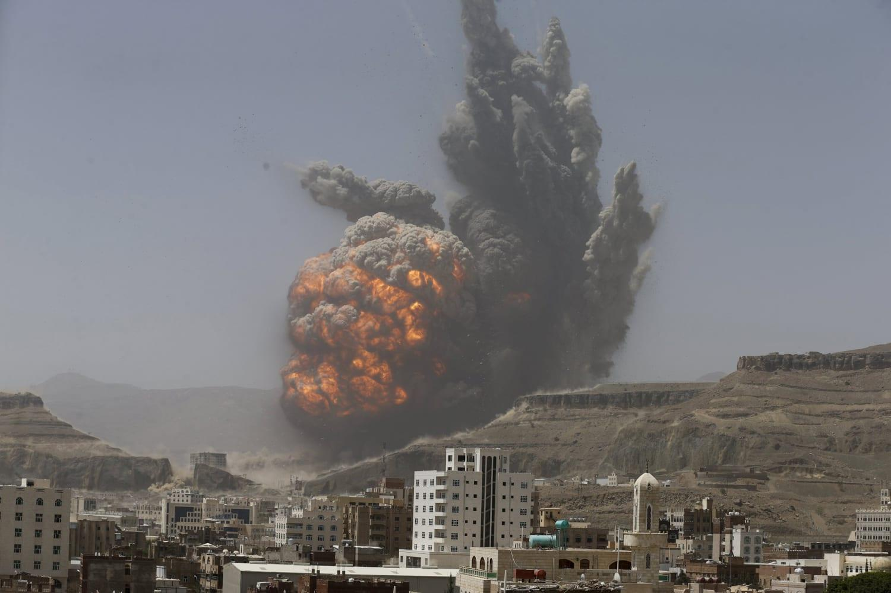
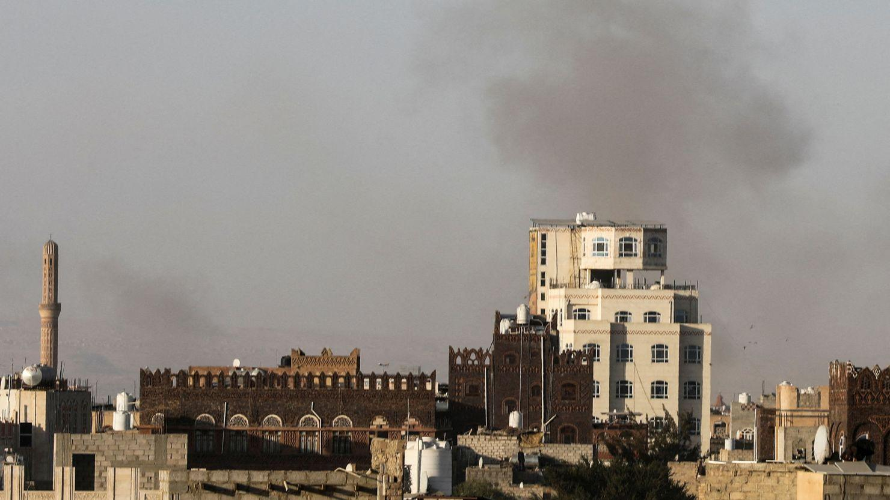

## Claim
Claim: " This image shows the U.S. bombarding Yemen on December 22, 2024 in reprisal after Yemen launched an attack on Israel's capital."

## Actions
```
reverse_search()
image_search("bombing in Yemen")
```

## Evidence
### Evidence from `reverse_search`
The image 

### Evidence from `image_search`
The search results include articles and images related to bombings in Yemen. Stimson.org has an image of a bombing in Yemen (). The Guardian published an article about the US bombing of Yemen (). NBC News published an article about the war in Yemen, which includes an image of an explosion ().

*   [https://www.stimson.org/2024/what-has-us-uk-bombing-campaign-in-yemen-accomplished/](https://www.stimson.org/2024/what-has-us-uk-bombing-campaign-in-yemen-accomplished/)
*   [https://www.theguardian.com/world/2025/apr/02/us-bombing-of-yemen-houthis](https://www.theguardian.com/world/2025/apr/02/us-bombing-of-yemen-houthis)
*   [https://www.nbcnews.com/news/world/yemen-s-war-reaches-1-000-days-u-s-defends-n831386](https://www.nbcnews.com/news/world/yemen-s-war-reaches-1-000-days-u-s-defends-n831386)


## Elaboration
The evidence confirms that the U.S. has been involved in bombing Yemen. However, the provided evidence does not confirm the specific details of the claim, such as the date (December 22, 2024) or the reason for the bombing (reprisal for an attack on Israel's capital).

The image search results show that bombings in Yemen have occurred, and the Guardian article mentions the US bombing of Yemen. However, the exact context of the image in the claim is not verified.

Therefore, the claim is not entirely verifiable based on the provided evidence. More information is needed to confirm the date, the specific events, and the context of the image.


## Actions
```
geolocate()
image_search("Yemen bombing December 2024")
```

## Evidence
### Evidence from `geolocate`
The most likely countries where the image was taken are: {'Palestine': 0.55, 'Israel': 0.3, 'United Arab Emirates': 0.1, 'Jordan': 0.02, 'Albania': 0.0, 'Andorra': 0.0, 'Argentina': 0.0, 'Australia': 0.0, 'Austria': 0.0, 'Bangladesh': 0.0}

### Evidence from `image_search`
CNN published an article on December 26, 2024, about Israeli strikes in Yemen. ([https://edition.cnn.com/2024/12/26/middleeast/israeli-strikes-yemen-sanaa-houthis-intl](https://edition.cnn.com/2024/12/26/middleeast/israeli-strikes-yemen-sanaa-houthis-intl))  The New York Times published an article about the bombing of Yemen in December 2024. ([https://www.nytimes.com/2024/12/26/world/middleeast/israel-yemen-bombs-houthis.html](https://www.nytimes.com/2024/12/26/world/middleeast/israel-yemen-bombs-houthis.html)) 


## Elaboration
The geolocation of the image suggests it was most likely taken in Palestine or Israel. The image search results show that Israeli strikes occurred in Yemen in December 2024, as reported by CNN and The New York Times. This contradicts the claim that the U.S. was responsible for the bombing. The claim also states that the bombing was in reprisal for an attack on Israel's capital, which is not confirmed by the evidence.

Therefore, the claim is **false**.


## Final Judgement
The image's geolocation suggests it was taken in Palestine or Israel, not Yemen. Furthermore, the image search reveals that Israeli strikes, not U.S. strikes, occurred in Yemen in December 2024. The claim also incorrectly attributes the bombing's cause. `false`

### Verdict: FALSE

### Justification
The claim is false. The image's geolocation suggests it was taken in Palestine or Israel, not Yemen. Furthermore, the image search reveals that Israeli strikes, not U.S. strikes, occurred in Yemen in December 2024, as reported by [CNN](https://edition.cnn.com/2024/12/26/middleeast/israeli-strikes-yemen-sanaa-houthis-intl) and [The New York Times](https://www.nytimes.com/2024/12/26/world/middleeast/israel-yemen-bombs-houthis.html). The claim also incorrectly attributes the bombing's cause.
