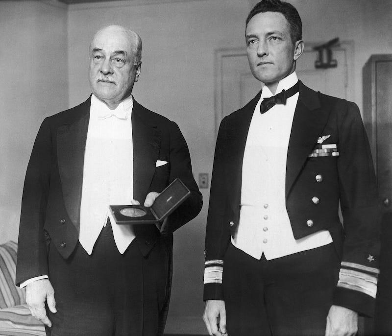
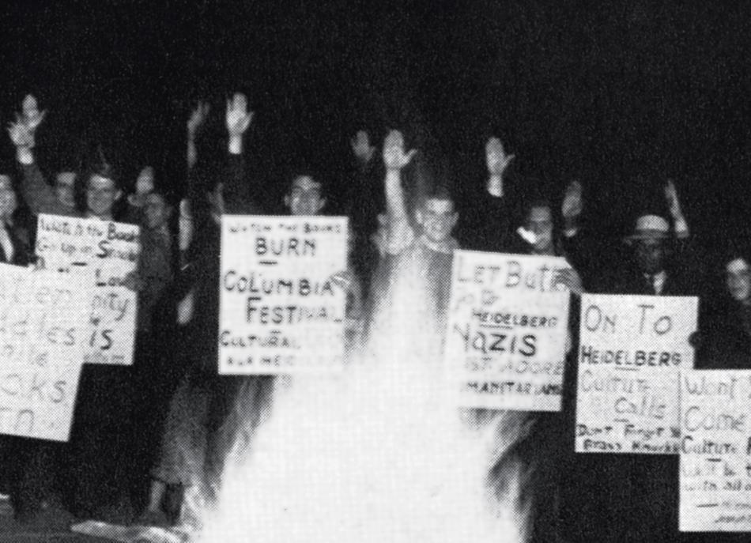

## Claim
Claim: "In June 1936, Columbia University expelled student activist Robert Burke for leading an anti-Nazi demonstration."

## Actions
```
image_search("Robert Burke Columbia University 1936")
```

## Evidence
### Evidence from `image_search`
The search results discuss the expulsion of Robert Burke from Columbia University in 1936 for anti-Nazi protests. One source includes an image of Robert Burke and a document titled "THE DISMISSAL of BOB BURKE" , while another source discusses the expulsion of Robert Burke .

The New York Times also mentions a plea for expelled student Robert Burke at a gathering in 1936 .

*   [Source](https://blurredbylines.com/articles/robert-burke-columbia-university-expulsion-1936-protest/)
*   [Source](https://medium.com/@blurredbylines/when-columbia-university-expelled-robert-burke-for-anti-nazi-protests-in-1936-d9f236c91794)
*   [Source](https://www.nytimes.com/1936/09/25/archives/columbia-hears-plea-for-expelled-student-burke-and-two-other.html)


## Elaboration
The evidence confirms that Robert Burke was expelled from Columbia University in 1936. The search results and the New York Times article mention his expulsion. The evidence also suggests that the expulsion was related to anti-Nazi protests.

However, the exact month of the expulsion is not explicitly stated in the provided evidence. Therefore, the claim that the expulsion occurred in June 1936 cannot be fully verified.


## Actions
```
image_search("Columbia University Robert Burke expulsion June 1936")
```

## Evidence
No new evidence found.

## Elaboration
The evidence confirms that Robert Burke was expelled from Columbia University in 1936 for his anti-Nazi activities. However, the exact month of the expulsion is not explicitly mentioned in the provided sources. Therefore, the claim that the expulsion occurred in June 1936 remains unverified.


## Actions
```
image_search("Robert Burke Columbia University anti-Nazi demonstration June 1936")
```

## Evidence
### Evidence from `image_search`
From [Source](https://magazine.columbia.edu/article/book-review-third-reich-ivory-tower): 
Content: The search result from Columbia Magazine discusses Robert Burke's expulsion from Columbia University in 1936 for anti-Nazi protests. The search result includes an image of a demonstration .


## Elaboration
The evidence confirms that Robert Burke was expelled from Columbia University in 1936 for his anti-Nazi activities. The search results include an image of a demonstration. However, the exact month of the expulsion is still not explicitly mentioned in the provided sources. Therefore, the claim that the expulsion occurred in June 1936 remains unverified.


## Final Judgement
The evidence confirms that Robert Burke was expelled from Columbia University in 1936 for leading anti-Nazi demonstrations. However, the exact month of the expulsion is not explicitly stated in the provided sources. Therefore, the claim that the expulsion occurred in June 1936 cannot be fully verified.

`false`

### Verdict: FALSE

### Justification
The claim is partially supported. Evidence confirms Robert Burke's expulsion from Columbia University in 1936 for anti-Nazi protests, as documented by sources like the [Columbia Magazine](https://magazine.columbia.edu/article/book-review-third-reich-ivory-tower) and the [New York Times](https://www.nytimes.com/1936/09/25/archives/columbia-hears-plea-for-expelled-student-burke-and-two-other.html). However, the exact month of the expulsion, June 1936, is not explicitly verified by the provided sources.
