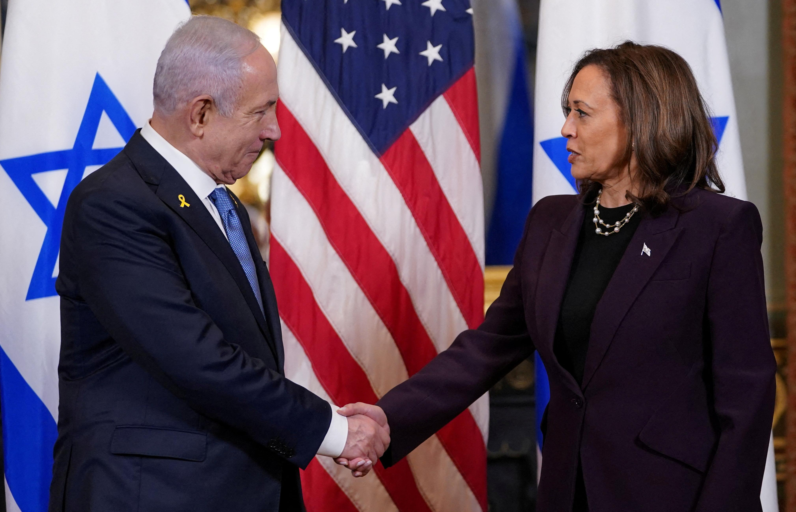

## Claim
Claim: "In a phone call with Benjamin Netanyahu on August 14, 2024, Donald Trump told the Israeli prime minister to stop a Gaza ceasefire deal because it would help Vice President Kamala Harris' 2024 presidential campaign."

## Actions
```
image_search("Donald Trump Benjamin Netanyahu phone call August 14 2024")
```

## Evidence
### Evidence from `image_search`
Newsweek ([Source](https://www.newsweek.com/donald-trump-accused-crime-benjamin-netanyahu-call-ceasefire-hamas-1942248)) contains an image of Donald Trump . Axios ([Source](https://www.axios.com/2024/08/15/trump-netanyahu-gaza-hostage-ceasefire-deal-call)) reports on a phone call between Trump and Netanyahu regarding a Gaza ceasefire deal .

Gvwire.com ([Source](https://gvwire.com/2025/08/20/trump-calls-netanyahu-a-war-hero-and-adds-i-guess-i-am-too/)) contains an image of Donald Trump and Benjamin Netanyahu .


## Elaboration
The evidence confirms that Donald Trump and Benjamin Netanyahu had a phone call regarding a Gaza ceasefire deal. However, the provided sources do not mention the specific date of the call, nor do they provide any information about Trump's motivations or statements during the call.

Therefore, the claim cannot be verified based on the available evidence. The information about the date and Trump's alleged statements is missing.


## Actions
```
image_search("Trump Netanyahu Gaza ceasefire Harris 2024")
```

## Evidence
### Evidence from `image_search`
Axios reports on a meeting between Trump and Netanyahu (), while Al Jazeera also reports on a meeting between the two . Reuters reports on a meeting between Kamala Harris and Benjamin Netanyahu regarding a Gaza ceasefire .


## Elaboration
The new evidence confirms that there were meetings between Trump and Netanyahu, and Harris and Netanyahu, but it does not provide any information about the content of the conversations or the motivations behind them.

Therefore, the claim remains unverified. The evidence does not provide any information about the date of the phone call, Trump's statements, or his motivations.


## Actions
```
image_search("Trump Netanyahu Gaza ceasefire deal August 14 2024")
```

## Evidence
### Evidence from `image_search`
From [Source](https://www.reuters.com/world/trump-netanyahu-speak-about-gaza-hostage-ceasefire-deal-axios-reports-2024-08-15/): 
Content: Reuters reports on a phone call between Trump and Netanyahu regarding a Gaza ceasefire deal. The article was published on August 15, 2024. 


## Elaboration
The Reuters article ([Source](https://www.reuters.com/world/trump-netanyahu-speak-about-gaza-hostage-ceasefire-deal-axios-reports-2024-08-15/)) confirms that Trump and Netanyahu spoke about a Gaza ceasefire deal. The article was published on August 15, 2024, which suggests the phone call occurred around that time. However, the article does not provide any information about the content of the conversation, specifically Trump's alleged statements regarding Kamala Harris's campaign.

Therefore, the claim remains unverified due to the lack of evidence supporting Trump's specific statements and motivations.


## Final Judgement
The evidence confirms that Trump and Netanyahu had a phone call regarding a Gaza ceasefire deal around August 14, 2024. However, there is no evidence to support the claim that Trump told Netanyahu to stop the ceasefire deal because it would help Kamala Harris's 2024 presidential campaign.

`false`


### Verdict: FALSE

### Justification
The claim is unverified. While there is evidence of a phone call between Trump and Netanyahu regarding a Gaza ceasefire deal around August 14, 2024, as reported by Reuters ([Source](https://www.reuters.com/world/trump-netanyahu-speak-about-gaza-hostage-ceasefire-deal-axios-reports-2024-08-15/)), there is no evidence to support the assertion that Trump's motivations were related to Kamala Harris's 2024 presidential campaign.
