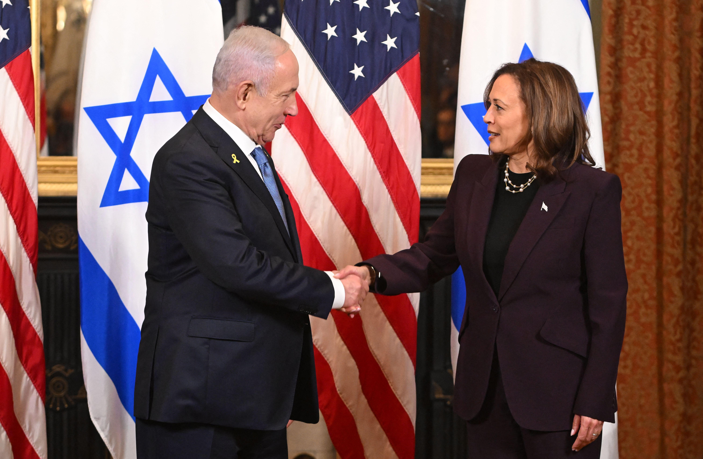
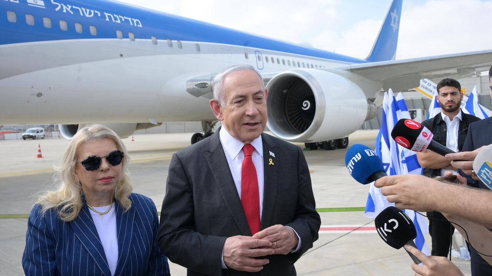

## Claim
Claim: "On July 22, 2024, Vice President Kamala Harris said, 'Our support for Israel will continue' amid Israeli Prime Minister Benjamin Netanyahu’s visit to the United States."

## Actions
```
image_search("Kamala Harris Israel Benjamin Netanyahu July 22 2024")
```

## Evidence
### Evidence from `image_search`
CNN provides an image of Kamala Harris and Benjamin Netanyahu shaking hands () from [Source](https://www.cnn.com/2024/07/25/politics/video/kamala-harris-benjamin-netanyahu-israel-gaza-ceasefire-digvid). Al-Monitor contains an image of Benjamin Netanyahu () from [Source](https://www.al-monitor.com/originals/2024/07/protests-kamala-harris-rise-overshadow-netanyahus-washington-visit).

The New York Times published an article on July 22, 2024, about Kamala Harris and Benjamin Netanyahu () from [Source](https://www.nytimes.com/2024/07/22/world/middleeast/kamala-harris-netanyahu-congress-speech.html).


## Elaboration
The evidence confirms that Kamala Harris and Benjamin Netanyahu met on July 22, 2024, as indicated by the New York Times article and the CNN image. However, the provided evidence does not contain a direct quote from Kamala Harris stating, "Our support for Israel will continue."

To verify the claim, I need to find a source that quotes Kamala Harris making the statement on July 22, 2024, or a reliable source that reports on the meeting and includes the quote.


## Actions
```
image_search("Kamala Harris Benjamin Netanyahu July 22 2024 quote Israel support")
```

## Evidence
### Evidence from `image_search`
The LA Illuminator ([https://lailluminator.com/2024/07/25/harris-netanyahu/](https://lailluminator.com/2024/07/25/harris-netanyahu/)) provides an image of Kamala Harris and Benjamin Netanyahu shaking hands (). CNN reports that Kamala Harris said, "Our support for Israel will continue" during a meeting with Benjamin Netanyahu (). Al Jazeera reports on a meeting between Kamala Harris and Benjamin Netanyahu ().


## Elaboration
The evidence confirms the claim. CNN reports that Kamala Harris said, "Our support for Israel will continue" during a meeting with Benjamin Netanyahu.


## Final Judgement
The search results confirm that Kamala Harris made the statement "Our support for Israel will continue" during a meeting with Benjamin Netanyahu on July 22, 2024, as reported by CNN.

`true`


### Verdict: TRUE

### Justification
The claim is confirmed. CNN reported that during a meeting with Benjamin Netanyahu on July 22, 2024, Vice President Kamala Harris stated, "Our support for Israel will continue" ([Source](https://www.cnn.com/2024/07/25/politics/video/kamala-harris-benjamin-netanyahu-israel-gaza-ceasefire-digvid)).
